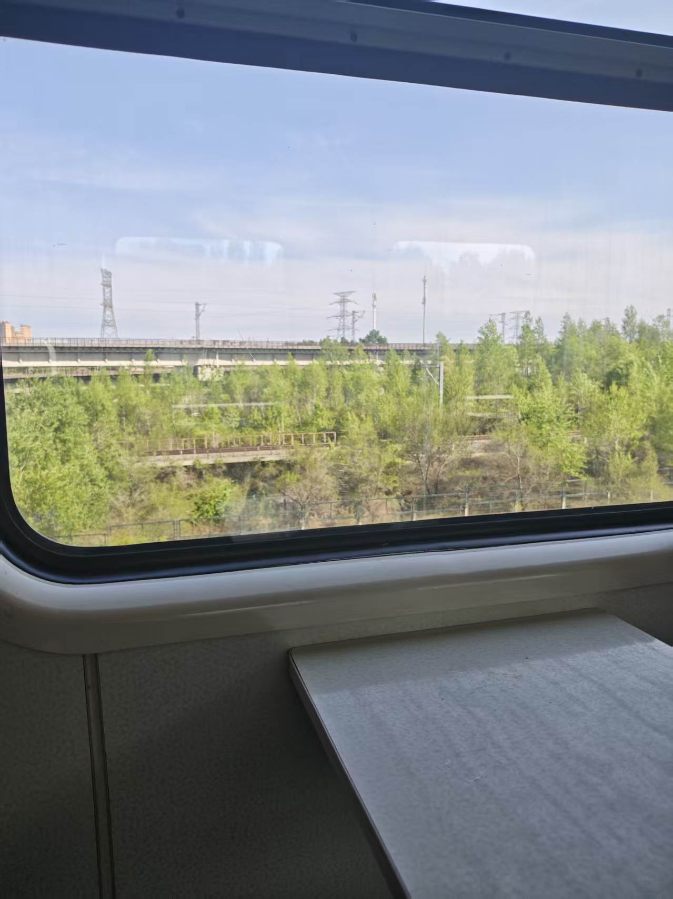
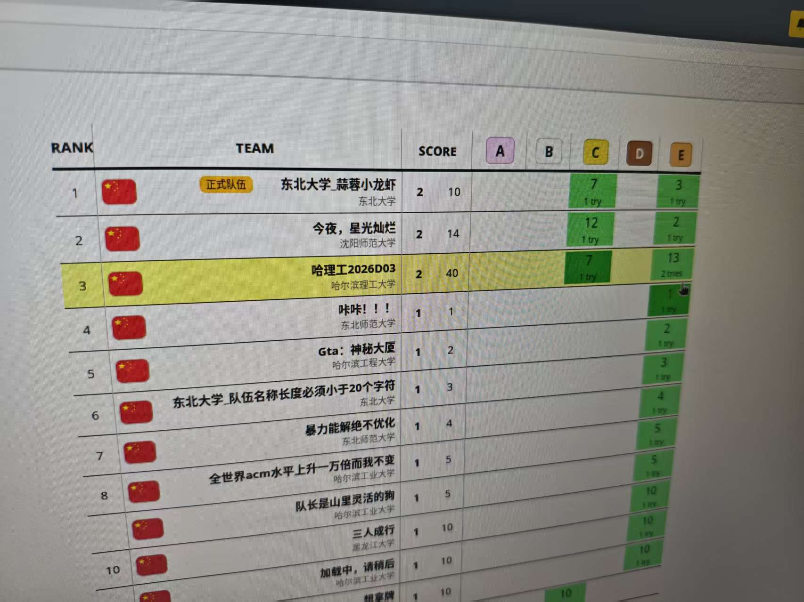

铜首了，倒闭4个小时，感觉心情不是很美妙...

姑且先放一个牌子在这里，剩下的再说吧。

> 2026-05-28 update: 

已经过去快一周啦，复杂的心情应该说平复了很多，虽然还是觉得挺可惜的，但也不至于太难过了。

# 去往长春
我决定和可爱的 [imicola](https://imicola.com/) 宝宝一起坐火车（其实就是我什么都没管，订票订酒店啥的全部给他处理了）。

我们是周四下午出发的，提前了一个多小时从学校坐火车准备去哈尔滨站，结果快到地方了发现是哈尔滨西站，给我笑得。

我说你怎么一点规划没有；他说我有规划的，只是规划错了；我说你怎么是路痴；他说你才知道啊。

好在也不是什么大问题，最后就是打车花更多的价钱去更近的西站。

上车之后我就开始狂笑，他问我怎么了我笑了半天跟他说：
"这个像不像悠和穹回乡下？"

> 是不是，还，蛮像的！

然后都想到这了，在车上就姑且听了那么一路 《飞向遥远的天空》，感觉莫名挺应景的。

我是不知道他怎么想的，但是我确实是在哈尔滨待得有点烦闷，心想我有不得不逃离这个地方的理由。

# 到达长春
到达长春之后，我们就前往23一晚的豪华大酒店下榻了，好像是叫什么 东篱下宾馆 。我一开始还在幻视什么什么寄人篱下，结果 imicola 说 这是采菊东篱下。。

于是我感到十分欣慰，问他你的注意力能不能放在赛时。

这之后我们就去找

# 关于比赛
首先是最为关键的 比赛情况。

热身赛时候，好像是侥幸看了一道没人看的题，获得了一个首杀。

当时非常兴奋啊！觉得自己这辈子应该是有了，然后 imicola 就给我泼冷水，说人家强校都要么不打要么看难题。。

热身最后开了三道题，第四道概率居然不会，，依稀记得高中数学还不错来着，怎么上大学变数学低手了，唉！都是 acm 害的。

总之热身赛结束后，感觉自己状态不错，回到宾馆把那道概率摸索了一下 就准备睡觉了。

结果出于一些神秘的原因 我死活睡不着 就这么耗到了凌晨三点多 第二天早上起来人都恍惚了 
