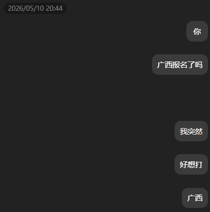

持续更新中...

唉性情了怎么写了这么多！
# 写在前面
银牌力，面基力，认识大佬力，人生的动力找到力！

# 故事的开始
5月10日的傍晚，我做了一个违背祖宗的决定。

大概我还是会心疼钱的，想到可能要跑很远却拿不到什么名次，心里打退堂鼓。

但是我一来有巨大的网瘾，二来经过内心激烈的赛站博弈觉得“还是想去看看啊”，再就是觉得这是跟网友面基的绝佳机会。

于是我赶在截止报名前的 四个小时 像一条疯狗一样向 whalica 提出了询问：

结果这也是个网瘾，一拍即合就答应了。

我一开始是想着要甜蜜双排了 因为好像没有找到合适的第三个人（要能抽出时间打比赛 要能在短时间内联系到）结果还真给 whalica 找来了 yxylx 。。

然后我们三个就赶在 ddl 之前报好了名，whalisa 队正式确立，虽然现在看来由于时间仓促，这个队名好像跟小源没有什么关系，在此致以歉意。

# 漫长的等待
从报名成功到比赛开始，整整等了一个月，感觉时间过得特别慢。

我不是一个很有准备的人（是一个毫无准备的人），但是我满心期待着面基，也期待能不能在弱赛站拿一个生涯首金。

彼时的我对小源缺乏了解，但我知道 whalica 的打a之旅非常不如意，——实则我们 ap 似乎很少有如意的，所以我嘴上没说，心里对于自己下了很高的要求。加上vp去年广西邀 写了一个小时就金牌了 因此颇有一种“打不出金就没脸见人”的感觉。

# 出发桂林

出发前一天晚上我又失眠了。

29 号晚上九点，哈尔滨太平机场。我一个人背着电脑包过了安检，在登机口找了个角落的座位。长这么大第一次因为打比赛坐飞机——以前都是坐火车晃过去，这次距离实在太远了，哈尔滨到桂林没有直达高铁，坐火车的话要在路上耗一整天。虽然机票贵得让我心疼了好几天，但我不想咬咬牙也就买了。

飞机起飞的时候已经快十点了。我坐在靠窗的位置，看着哈尔滨的夜景一点一点缩小，最后变成一片模糊的光点。机舱里很安静，大部分人都在睡觉，但我睡不着。我盯着天花板，脑子里一遍一遍地过题——不是具体的题目，是一种很模糊的焦虑，像有个声音在反复问：你到底准备好了没有。

凌晨零点四十，飞机降落在南昌昌北机场。我需要在这里中转，第二天早上六点的火车去桂林。中间还有五个多小时——这个时间很尴尬，住正经酒店不划算，不住又没地方待。于是我找了个 28 块钱的钟点房。

似乎是上天发力了，床意外的还不错。窗帘是那种遮光很差的白布，外面的路灯透过布照进来，整个房间笼罩在一层昏黄的光里。我把闹钟设到五点半，然后躺在床上，听着走廊里不知道哪传来的脚步声，不知道什么时候睡着的。

闹钟响了。我没睡醒，但是身体自己弹起来了。去火车站的路上，南昌的天刚蒙蒙亮，街上几乎没人。我在便利店买了一个面包和一瓶水，在候车室的椅子上啃着面包，看着电子屏上滚动的车次信息。

南昌到桂林，又是好几个小时。

火车上的时间过得很快——可能是因为我一直在补觉。中间迷迷糊糊醒过一次，窗外已经是一眼看上去就有点闷热的风景了：山多了，水多了，空气看起来都更湿润。我开始盘点我的行李，身份证、耳机盒，还有一本厚厚的来自 imicola 的板子。他问我书真有用吗，我说没用，但是带着安心。

其实这不是安心，是迷信。 

# 热身赛面基

火车终于到了桂林北站。桂林的空气潮湿，黏黏的，但是莫名让人放松。从哈尔滨跑到桂林——跨越了大半个中国，就为了打一场五个小时的比赛。whalica 说直接去热身赛赛场集合吧。我背着包往外走，心里想，终于要面基啦。

紧赶慢赶进了桂电，扫了辆校内的小电驴，开始对着导航摸索着往已经开始热身赛的机房跑

桂电校内的街道给我一种慢悠悠的感觉，可能因为到处都是山水，人走在里面就跟着慢下来了。

但是我有不得不加快速度的理由！

体育馆门口，我才意识到这次比赛有一个特殊之处：这是第一次线下见到那么多平时只在群聊里出现的 ID。

结果进了机房，发现并没有找到两人队，倒是找到了0人队。

一问发现他俩走错了，我说那我就先把签到做了吧。倒也是好事，让别人等我怪不好意思的，我自己的话就无所谓了。

电脑就那回事吧，反正在东北待了两年，已经不得不熟练调教各种系统了，键盘手感也尚在可接受范围内。

热身赛主要是测试环境和找状态。于是我大概打开 cmd 研究了一下比赛机子的环境，把AB过了 想了一会儿C 看到两个人朝我走过来。

whalica 比我想象中高——他是这次面基为数不多让我感觉“比想象中更高”的人，看起来就很靠谱，说话慢条斯理，但你能感觉到他脑子转得飞快；小源斯斯文文的，看着像高中的理科天才，就是带点南方的口音，不过在东北待久了也会怀念南方的口音呢！。——不过就是他俩比网上要稍微收敛一点（收敛许多），搞得我都不好意思发骚了。（

终于见面啦！终于能一起写题啦！我病得不轻。

我们沿着漓江边走了很远。傍晚的桂林有种很特别的氛围——天还没完全黑，远处的山在暮色里变成深蓝色的剪影，路灯一盏一盏地亮起来，倒映在江面上。

我们在江边坐了很久，聊了很多跟比赛无关的东西。聊学校里的破事，聊最近在补什么番，聊群里哪个人的头像最抽象。whalica 说他最近在看一部老番，里面的主角有一个特别强的能力——每次失败之后都能回到过去重新开始。

房间出乎意料地大，两张床加一个加床，三个人挤在这里待一晚上，比宿舍要舒适多了。我们三个把行李大概摆弄了一下，试了试 gxcpc 发的衣服，吐槽了一番，开始了——明日方舟。 

...

到了桂电的校区门口，我才真正体会到什么叫"山沟沟"——校区大是真的大，但周围除了山还是山，进市区要打车二十多分钟。校门口是一条不太宽的路，两边是农田和零零散散的小店，空气里飘着不知道是桂花还是什么植物的味道。
 
进了校园之后这种"与世隔绝"的感觉更强烈了。体育馆在一大片草坪的尽头，周围种满了热带植物，走在路上能听到各种虫叫。我和 whalica 穿过了大半个校园才找到入口。说实话，这种"单机模式"的环境对一个 acmer 来说还挺合适的——没有什么可以分心的东西，除了山就是水，除了刷题就是睡觉。但要是在这里读四年书……我还是尊重桂电的同学。

（此处应有图片：桂电体育馆热身赛现场）

whalica 那边卡了一下，说题目读错了，然后重读之后五分钟写完了。

yxylx 默默在旁边开了第三题，写完提交，AC。我看了一眼他的代码，写得非常干净，是我喜欢的那种风格。

热身赛结束的时候我们大概是前十的位置，但这个参考价值不大——很多强队热身赛就是来睡觉的，或者故意不打满，隐藏实力。

真正让我开心的是面基环节。说起来可能有点矫情，但这次比赛对我最重要的意义不是拿牌子，而是终于见到了猫猫群的人——那些个陪伴了我一年半 acm 生涯的群。呜呜，我能有今天，你们这些坏b 功不可没啊！

热身赛结束后我们在体育馆外面晃悠，眼睛一直在找那些在群里发过自拍的人。猫猫群来了好几个——有的 ID 我对着聊了两年但从来没听过声音，有的是群里经常发题解的潜水大佬。大家见面之后的第一反应出奇一致：先报 ID，然后互相打量三秒，然后同时说"你跟我想象中不一样"。

其中有一个群友，在群里话特别多——对，就是那种每天刷屏几百条的——见了面之后反而很安静。我说："你怎么不说话。"

他说："网上的我和现实的我，是两个不同的实例。"

我说："你这叫多态。"

然后旁边一个群友接了一句："多态是面向对象，我们这是面向基友。"

所有人沉默了一秒。然后爆笑。

还有一个新认识的大佬——墨月，人如其名，有种说不上来的沉稳感。他是另一个学校的，之前不在猫猫群但我早有耳闻。热身赛的时候他坐在我们斜后方的位置，我路过的时候瞄了一眼他的屏幕，他正在用一种我看不太懂的方法解一道图论题。后来吃饭的时候聊起来，发现他说话很直接——不是那种让人不舒服的直接，而是那种你能感觉到他每一句话都是认真想过的直接。

我问他你觉得今天热身赛的题怎么样。他说："太简单，没有参考价值。"

我说那你正赛有信心吗。

他说："没有。"

我说你这属于嘴硬。

他说："这叫实事求是。"

（此处应有图片：热身赛面基合影）

晚上我们三个一起去吃了火锅鸡。whalica 找的一家店，说是桂林本地的同学推荐的。端上来的时候锅里的红油还在咕嘟咕嘟冒着泡，鸡肉切得很大块，泡在辣椒和花椒煮出来的汤里，光看着就开始流口水。

whalica 吃了一口说一般。然后吃了三口，说还行。最后吃了一整碗米饭加半锅鸡，说："这家店还可以。"

然后我们就在火锅鸡店里开始讨论明天比赛的策略。whalica 说他在 cf 上查了参赛名单，有几个队的 rating 很高，但整体水平确实不算魔鬼赛站。yxylx 说我们正常发挥就行，不要给自己太大压力。

我没说话。我心里想的还是那句：vp 一个小时就金牌了，正赛打不出金就太丢人了。

然后我告诉自己：明天，不要输。

回到酒店已经快十点了。我躺在床上翻了一会儿题，然后强迫自己关灯睡觉。这次倒是睡着了，可能是因为白天太累了。

关灯之后房间里很安静，能听到远处漓江的水声。桂林的夜晚比我想象中更慢，更安静。我闭上眼睛，想着明天的比赛，想着那道 vp 时候只用了一个小时就拿到的金，想着 whalica 说的那句"我们输了就是输了，不会重来"。

但我做了一个梦，梦见比赛开始了，我打开第一道题，题目是中文的，但我一个字都看不懂。

然后我就醒了。凌晨四点半。

后来我想了很久才明白那个梦是什么意思——不是看不懂题目，是没准备好。身体醒着，但脑子没有。热身赛打得好不代表正赛也能打好，这个道理我明明知道，但总要在被现实教育之后才能真正接受。

我在黎明中躺到七点，听到小源的动静 意识到该起床啦。我去洗手间用冷水冲了一把脸，镜子里的自己眼睛有点肿。

我们退房，去隔壁的小店吃五块钱一碗的桂林米粉。其实我并没有吃早饭的习惯呢，不过小源说 不吃东西是不是撑不过五个小时。米粉量不多，但是对我这样突然早起的人来说已经足够了。

吃完饭我们打辆车回去桂电。桂林早上的阳光已经很亮了，照在人身上暖洋洋的。路上我看到很多跟我们一起向桂电的人——大多穿着一样的比赛服，有些人背着包，有些人手里还拿着打印的模板资料，边走边看。看到好多人一脸没睡醒的样子，也不知道是紧张；是疲劳；还是打a的都一副半死不活的样子。

我心想：可能所有人昨晚都没睡好，这是不是就公平了。

# 正赛表现

到了机房门口，气氛比昨天热身赛严肃多了。门口排着长队，工作人员说暂时还不能进去。我们三个走到阳台，他俩好像在说什么，但是我好困喵！我什么都听不进去，眼睛要睁不开了。。

差不多还有一分钟比赛就开始了，我们排队进场。

好不容易冲进赛场，键盘还没摸热，三、二、一——比赛开始。

脑子还没很清醒。打开D之后，左看看又看看，没想明白说了啥。看了看G之后又倒回来，突然想到是不是全部切开就行了，然后问 whalica 然后觉得应该是合理的，map存了一下 就过了。

老天保佑啊，这场我前期还是有点用的，qwq...

做完D之后跟榜，发现有过了A，看了一下觉得把次幂分配给最大的数是最为合理的，然后快速幂处理了一下，三分钟写完了。

然后看G，没什么想法于是决定打表，打到一半 whalica 说我看错题了，改正之后发现合法的数字其实一共就十个数，脑子没转过来，在想是不是要拿个前缀和怎么处理一下，结果 whalica 说直接放一个数组里面每次询问时候遍历就行了。

我说那你不是个天才吗，写了写就过了，至此用时十五分钟。

十五分钟，三道题。我左右看了看他俩，大家都很高兴，我心想今天搞不好能成。

但接下来的四个半小时告诉我：开局太顺，往往不是什么好事。

（此处应有图片：正赛即将开始）

F 题，二分图染色。我读完题就觉得是个二分图染色，但一时没想好具体怎么写。yxylx 也看了这道题，他说他有思路。我还在犹豫的时候，他已经在机子上开始写了。

小源打字慢慢的，卡哇伊desune~ 好吧其实看得我怪着急的！因为他打一半我就觉得我能过了，但是事已至此了，直接抢过来不利于团结（嗯。）acm 本来就是团队赛！谁先上手谁先写是基本规则。可能之前占着机子单挑多了，老想抢键盘是不是 也不是什么好事。

——彼时的我不知道的是，这差不多是我今天最后一个"有想法"的题了。。。

小源写了个分层图 跑出来不知道为啥不对，我上去看了看发现他的特判简直是一坨啊！（

总之改了改 if 里面的东西 就过了。

接下来我和 whalica 对着 sb J 题 看了很久很久。

看题的时候我没觉得有什么不对，但是写了几发都wa了，感觉这缺条件那缺条件的，whalica造了数据被我hack了；我提出的结论被whalica否了。

如果只是这样就好了，但是突然地，一种从胃里升起来的恶心感开始提醒我：出事了。

我不知道是吃了什么，也可能是连续奔波了两天、没睡好、再加上比赛紧张——我说不清到底是哪个原因。身体并没有给我解释个中原因。

总之 我跑了一趟厕所。回来的时候，我感觉脑子已经不太清楚了。

我尝试转换思路去看 B 题，看了三遍题意，每一次看完都记不住前面在说什么。

我心跳很快，手心全是汗，胃里翻江倒海。看了看榜，发现一车人都5题了，发现领航者怎么干到特么金牌去了，我有一瞬间心想：今天大概是不能继续了。

我不可能在这个时候跟队友说"我不行了"——队友还在打。whalica 在打，yxylx 在打，整个赛场都在打。我坐不到位子上也要坐到位子上。

我继续尝试跟 whalica 讨论 J 题。讨论了半天，我觉得有个思路，于是wa了一发。改了一版，再交，又 wa。

最后是我们贡献了罚时，而小源天神下凡，跟我说“我这包对的 你交给我写” 上机之后改了一版——过了。

我们欢呼，说小源你简直是源神啊！激动地拍了拍他的肩膀。

接下来比赛的后半段，whalica 和 yxylx 在看 H 题。他们在讨论什么矩阵，我听了一耳朵——听不太懂。在当时那种状态下看长长的板子就像雾里看花。我坐在旁边，继续对着 B 题发呆。

彼时中午刚过，主办方发了午餐——KFC 四件套。我是真的饿了，打开包装袋，汉堡、鸡翅、薯条、可乐，风卷残云全吃了。

a不出题就吃东西吧，，我需要在身体上做点什么来证明自己还活着。！

吃完 KFC 之后感觉稍微好了一点。我有那么几分钟觉得自己又可以了，盯着 B 题试图推一个式子出来。但推到一半发现错了——不是式子错了，是我之前的一个假设错了。推倒重来，又错了。

时间一分一秒地过去。我也不知道他俩写的怎么样了，但是我看那个手速感觉结束之前应该是敲不完了，于是我果断把机子抢过来写我刚刚推的东西。

预想中的奇迹没有发生，最后什么都没开出来。

比赛结束啦，我看着屏幕，脑子里是一片空白。我们过了五道题。十五分钟三道题之后，在后面的四个多小时里只开出了两道。后半场比赛好像跟我没啥关系，我十分难过，是不是每个acmer都经历过这种感觉啊？感觉对不起我的俩队友 对不起任何人。

我靠在椅背上，盯着天花板，叹气，跟他俩说："不知道银牌稳不稳呢.."

金牌线在我们上面，差了两道题。

但是没有如果喵。在任何地方，如果都是最没有用的词。

走出赛场的时候，桂林的阳光好刺眼。我有点恍惚，不是因为输了，是因为身体还没缓过来——连着奔波了两天、没睡好、吃坏肚子、跑了三趟厕所、在赛场上硬撑了五个小时......身体在告诉我一个很简单的道理：你以为你可以撑过去，但有些东西意志力是撑不过去的。

我们顶着烈日往闭幕式场馆走，小源跟我说："你今天已经很不容易了。"

我没回答。我知道他说得对。不是客套，不是安慰。他是真的觉得——在那种状态下，还能坐在那里、还能试着写 B、还能跟他们讨论 J——就已经很不容易了。

我点了点头。

这就是算法竞赛呀。你永远可以找到一万个"如果"，但最后摆在你面前的就只是一个冰冷的榜单。而在这个榜单背后，有你硬撑着写完的每一行代码，有你对着一个因为身体因为心态而推不出来的期望发了三个小时的呆。

不漂亮。但是真实。

找了辆小电驴开到闭幕式场馆旁边，把东西安顿进去之后，我坐在体育馆外面的台阶上坐了一会儿，点了颗烟。我低头看手机，群里已经有其他队在讨论今天的题了——那道卡住我们的题已经被好几个人说"其实不难啊，就是个很裸的xxxx"。

我对这种讨论刚拿到很不耐烦，但是我也知道他们说得对。不是题目难，是我们没有在正确的时间想到正确的方向。五个小时，三个人，十几道题，你必须在正确的时间做出正确的选择。选错了就是选错了，没有重来的机会。

然后我沉默了。cf 上不犯的错误，在赛场上会犯。这就是压力的威力。不是你不会，是你被压力压缩到了容错率最低的状态。

其实这样的结论我早就知道，我从去年十月份网络赛爆0就知道 线上的cf和线下赛是有巨大差别的。

坐回去，看到 whalica 在和 wangzai 和 hsn 互换吧唧，我自然是没准备这么些的，但是凑上去打个招呼交换一下东北人的身份还是不错的（

wangzai长得有点像我大学班长是怎么回事（ hsn头发好长好可爱，我也可以留那么长头发吗。不过我留那么长头发也不会变可爱的，只会被当成怪异的长发男。

他们在聊天，但是我好像还不能完全融入进去，所以在旁边偷听。见到了好多人呀，我真的好开心，我突然觉得这就够了，其实拿不拿金牌也没那么要紧——

这就够了！

至少在这次比赛里，我们每一个人都尽力了。不是完美的尽力，但是真实的尽力。没有逃避，没有摆烂，没有在困难的时候把责任推给队友。我们承担了自己的那部分，甚至承担了一些不属于自己的那部分。

这就够了，我期待着还能有一个银牌，但是恐怕就算没有 我也不会太伤心。

# 滚榜颁奖 & 面基dlc

滚榜是 acm 比赛最有仪式感的环节，也是最残忍的。

所有人在体育馆里坐好，大屏幕上从最后一名开始，一个一个队伍往上跳。每跳一个，下面的队伍名次就往下掉一位。主持人还特别喜欢在关键位置停顿制造悬念，全场人就跟着倒吸一口凉气。

我看到八十多就进入邀请银牌线了，激动地拍 whalica，不知道吓到他没有。他好像注意力不是很集中，有点后知后觉，find the fact 之后我俩一起欢呼。

看着屏幕上"whalisa"三个字，心想：好吧好吧！结果是好的，不白来。

最终成绩，银牌，排名大概在银牌中段的位置。 

（此处应有图片：滚榜大屏幕）

颁奖的时候，站在台上拿银牌的人排了好几排。金牌区的队伍人少，站在最前面，笑得都很开心。我站在银牌队列里，心想：下次我要站在前面那排。

颁奖结束后才是真正的重头戏——面基 dlc。

我们跟猫猫群的群友约了晚饭，一群人在学校门口集合，浩浩荡荡地去找吃的。算了一下，大概凑了十来个来自不同学校的 acmer，大部分是猫猫群的——有些人我对着聊了两年，今天终于坐在一张桌子上吃饭。这家馆子是桂林菜，点了满满一桌子：啤酒鱼、田螺酿、荔浦芋头扣肉、还有几道叫不上名字的当地菜。比赛的时候胃还在闹别扭，但到了饭桌上不知道是饿坏了还是心情放松了，竟然胃口大开。

饭桌上大家聊的当然还是比赛。

有人说今天有道题是原题改编，有人在热身赛就猜到了，有人没猜到。

有人说他今天开场连 WA 了三发，心态直接崩了，后面完全不会写代码了。

有人说他最后三分钟 AC 了一道题，双手离开键盘的时候整个人都在抖，队友拍着他的肩膀说牛逼。

然后大家说到了自己学校的情况：有的学校 acm 氛围好，有专门的训练队和教练；有的学校基本是几个人自己在玩，自生自灭。说到这个大家都沉默了半秒。

我说我们也是自己在玩。

然后一个学长说："其实自己玩也挺好的。自己玩说明你是真的喜欢这个东西，不是因为别人让你做你才做的。"

这句话我一直记着。

吃完饭后大家加了微信，建了群，约了下次比赛再见。虽然知道"下次"不一定是下次，也可能是下辈子——毕竟大家天南海北，除了比赛不太可能聚在一起。

但正是因为有比赛，这种一期一会式的相聚才变得更珍贵。

（此处应有图片：聚餐合影）

yxylx 晚上的火车要先走，我和 whalica 送他到车站。他说今天那道卡住的题他回去一定要写出来。

我说你写出来了群发一下。

他说好。

然后他进了站，背影消失在检票口。whalica 说："他是个好人。"

我说："你这评价也太敷衍了。"

whalica 说："我是认真的。他就是那种很认真的人。"

我想了想，确实。yxylx 全程没说几句话，但每一句都很实在。队伍里需要这样的人。

送走 yxylx 之后，whalica 说他也要走了。他的火车是晚上的，还有几个小时。我们回到酒店，他把东西收拾好。

我说你还真打算把这扇子带回去啊。

他说："这是纪念品。以后写代码写累了就拿出来扇一下，提醒自己在桂林有一个美好的夏天。"

我说现在是春天。

他说："细节不重要。"

我们坐在酒店大堂里等他的时间。他打开笔记本补了几道当天比赛的题，我在旁边看他写。写到那道卡住 yxylx 的题时，他写了大概二十分钟，然后提交——Accepted。他把屏幕转过来给我看，说："其实不难。"

我说："你在马后炮。"

他说："不是马后炮，是在帮 yxylx 验证他的思路是对的。他的 corner case 处理得不对，但大方向没问题。"

我说你回去发给他。

他说当然。

然后他的时间到了。我送他到酒店门口，给他拦了一辆出租车。他把箱子塞进后备箱，转过来跟我说："银牌挺好的。是真的挺好的。你不要一直想着'如果'。"

我说我知道。

他说："不，你不知道。你嘴上说知道，心里还在想。我认识你两年了，你骗不了我。"

我没说话。

他拍了拍我的肩膀，和前一天晚上在江边一样。然后他说："下次比赛见。"

我说："下次比赛见。"

他上了车。车开走了之后，我在酒店门口站了很久。

然后我走回了酒店大堂。前台的小姐姐问我是不是退房，我说再续两晚。她有点奇怪地看了我一眼。

来一趟桂林，不能只记住了体育馆里的键盘声和排行榜上的银牌。whalica 和 yxylx 有他们的火车要赶，有他们要回去面对的事情。但我的火车是后天的。我还有两天时间，不需要跟任何人商量行程，不需要考虑任何人的节奏。

我觉得我需要这两天。不是用来玩的，是用来想一些事情的。

有些事情，只有在一个人走路的时候才能想清楚。

# 后日谈

比赛打完了。whalica 和 yxylx 各自赶火车回去了，走的时候我们在车站道别，whalica 说回去好好刷题，我说你先把你 cf 的分打回来再说我。

然后他们就走了。

我站在桂林北站的广场上，看着他们的背影消失在人海里，忽然不知道接下来该干什么。

其实我的票比他们晚两天。报名的时候就想着：来都来了，不如多待两天逛一逛。但我没想到的是，当真的只剩下我一个人的时候，心里会这么安静。

安静到能听到自己的呼吸。

第一天我一个人去了象鼻山。

没有 whalica 在旁边说山像不像 dp 状态转移图了，也没有人跟我争论哪家店更好吃。我一个人走在景区的石板路上，周围全是游客，热热闹闹的，但我谁也认识。这种感觉很奇怪——明明在人群里，却感觉自己在另一个频道。

象鼻山真的像一头大象在喝水。旁边有个导游在跟游客讲解，说象鼻山是桂林的城徽，已经有几万年的历史了。我心想：这个山在这里站了几万年，看过多少人来来去去，大概不会在意一个刚打完比赛的银牌选手站在这里想什么。

山不会在意，但我会。

（此处应有图片：象鼻山）

我沿着漓江边走了一会儿。水很清，江上有竹筏在漂。我找了个没人的石头坐下来，掏出手机翻了翻昨天比赛的榜单截图——whalisa 排在银牌中段，距离金牌线两道题。我又看了一遍，把手机收起来了。

不是难过，就是一种说不清的感觉。你明明可以做得更好，但你没做到——没休息好，吃坏了肚子，被身体拖垮了。你输给了自己。

水声很轻。

但奇怪的是，在这里，风吹过来带着水草的味道，这个感觉好像被稀释了。可能这就是出来走走的意义吧——不是让你忘记，是让你把这些东西放到更大的坐标系里去。在 OJ 面前一个罚时就是所有，在这些山面前什么都不是。

那天下午我一个人坐船去了阳朔。

船在漓江上漂了两个多小时。两岸的山像画一样展开，一座接一座，形状各异。之前 whalica 说这些山像什么取决于想象力，我现在想的是——如果我的人生是一道算法题，我现在处于哪个阶段？

可能是做完了一道中等难度的题，正在处理状态转移的时候卡住了。

但没关系。

船靠了岸。阳朔的西街比我想象中热闹，到处都是人。我一个人在街上走，看到卖啤酒鱼的饭馆，想起前一天晚上我们一群人吃桂林菜的场景。现在只有我一个人了，但还是坐进去点了一条。

鱼是一样的鱼，味道是一样的味道。但一个人吃，对面座位是空的，安静到你能注意到米饭煮得稍微硬了一点。不是不好吃，是太安静了。我吃完了一整条鱼，喝了两瓶啤酒，回到酒店就睡了。一个人吃饭也没什么不好的。

（此处应有图片：阳朔西街啤酒鱼）

第二天早上我在阳朔租了一辆自行车，沿着十里画廊骑。没有人跟我比赛，没有人催我快一点，没有人说"这叫时间复杂度的优化"。我就慢慢地骑，骑到好看的风景就停下来拍照，骑到累了就找一棵树坐下来喝水。

骑到一个岔路口的时候，导航显示两条路都通向同一个方向，但一条沿着河边，一条穿过田地。我在那站了半天。whalica 不在，没有人在旁边说"随便选一条就行了，选错了我陪你走回来"。

这就是以后的人生了。大部分的选择都只有自己能做，选对了选错了都只有自己走。没人会替你负责，也没人该替你负责。

我选了河边那条，因为吹风比较舒服。

（此处应有图片：十里画廊骑行）

下午去爬了月亮山。这个山很神奇——山体中间有一个巨大的圆形空洞，远远看过去就像一轮月亮挂在山上。爬上去的路很陡，台阶又多又窄，爬到一半我已经在怀疑人生了。这次没有 whalica 在前面催我，也没有人用算法术语嘲讽我的爬行速度。我一个人慢慢爬，累了就停下来靠在栏杆上喘口气。

爬到山顶的时候，汗水把衣服都浸透了。但往下一看——整个阳朔的田园风光铺在眼前，远处的山，近处的田，蜿蜒的路。

风很大，我一个人站在山顶上。周围都是不认识的人，但那一秒钟我不想管任何事。

我忽然想——就算一个人站在这，山下某个地方，有一起并肩作战过的人也在走他们的路。不是一个人也挺好，但一个人的感觉也不错。

值了。

（此处应有图片：月亮山顶俯瞰阳朔）

从阳朔回到桂林市区之后，我又多待了一天。去了西山公园——这个地方不像象鼻山那么出名，游客少得多。我在里面走了很久，沿着石阶一级一级往上爬。路上遇到几个老人在下棋，棋子是石头的，在棋盘上砸出清脆的响声。

我站在旁边看了一会儿。他们在下一种我看不太懂的棋。不是围棋，也不是象棋，可能是本地的一种什么玩法。但那个画面让我觉得安心——有人在安静地下棋，有人在安静地看，有人在安静地走自己的路。

我突然想：其实比赛也是这样。不管你那天打了多少分，拿了什么牌子，比赛结束之后，一切都会恢复成这个样子。山下有人在卖水果，公园里老人在下棋，江边有小孩在玩水。你的世界没有崩塌。只是你想多了。

（此处应有图片：西山公园）

从西山公园出来之后，天色还早。我去了桂林万象城。说来也挺好笑的——大老远跑过来，不继续逛景点，跑来逛商场。万象城里开着空调，有人在喝奶茶，有人在逛优衣库，有人在电影院门口排队。我跟他们一样，也买了一杯奶茶，坐在商场的休息区里发呆。

奶茶很甜。甜到我终于能不去想那些比赛的事了。

最后一天晚上我去看了日月双塔。

一金一银，立在杉湖中间，晚上亮灯之后倒映在水面上，好看得不像真的。我沿着湖走了好几圈，走到腿酸了就在长椅上坐下来。

旁边有一对情侣在拍照，女生让男生蹲下来拍仰角，男生说蹲了你也不显高啊，女生说你说什么。我笑了。

笑完了之后，我忽然想：银牌。

日月双塔一金一银。我也是银牌。

这大概是某种奇怪的缘分吧。我对着水面上的银色倒影看了很久，心想：银色也挺好的。不是最好的，但也不差。

金色会有的。但不是这一次。

这一次，银色就够了。

（此处应有图片：日月双塔夜景）

桂林的行程到这里就算结束了。但我没有直接买回哈尔滨的票。

我买了从桂林去长沙的票。

因为果子在长沙。

果子是猫猫群的另一个群友。跟我不一样，他早就不打比赛了——退役选手，现在已经是个正经的社会人了。但他在群里一直很活跃，经常发一些奇奇怪怪的东西，偶尔也会在半夜跟我讨论某道题的解法。我们聊了快两年，没见过面。

这次从哈尔滨飞了三千公里到南方，不差再多跑一个城市。

于是第二天中午，我坐上了桂林去长沙的火车。

果子在长沙站接我。他看到我的第一句话是："你这脸色确实不太好看。"

我说废话，我刚拉了一天肚子。

然后他带我去吃湖南菜。一家他常去的小馆子，藏在一条巷子里，门脸很小，进去之后别有洞天。点了剁椒鱼头、辣椒炒肉、还有一盘我到现在也叫不上名字的青菜。辣是真辣——跟桂林的辣完全不是一个级别，吃得我满头冒汗，喝了一整瓶冰水。但也是真的好吃。吃完之后感觉整个人都通透了——可能是汗出透了，也可能是肠胃终于被辣醒了。

最震撼的是他还点了两只烧鸡。

我说你点一只就够了。

他说："一只你吃，一只我吃。"

我说你一个人吃一只？

他说："你是不了解我的战斗力。"

他真的一个人吃了一整只。我吃了半只。另外半只打包了，他说让我带上火车吃。

（此处应有图片：长沙湖南菜和两只烧鸡）

吃完饭我们在湘江边散了很久的步。聊了很多——聊他在长沙的工作，聊群里最近在讨论什么题，聊哪些人还在打、哪些人已经退了。他说他退役之后反而更关注比赛了，因为不用打了，可以纯粹地当个看客。

我说我还没到能当看客的阶段。

他说你不用急。你还有时间。

然后他拍了拍我的肩，说："下次比赛，换个城市见。"

我说好。

临走的时候他把那半只烧鸡塞到我包里，说："路上吃。别在火车上饿晕了。"

我笑了。

---

坐在回程的火车上，我睡了一路。也不是累，就是那种事情结束之后突然松懈下来的感觉。

醒来的时候窗外已经是熟悉的风景了，喀斯特地貌变成了平原，好像在提醒我：旅行结束了，该回到现实了。

现实是什么？现实是还要期末考，还要刷题，还要在 cf 上跟人互卡 rating，还要继续在这个没什么人理解你在干什么的圈子里往前走。

但是这一次，感觉不太一样了。

（此处应有图片：回程火车窗外）

以前我一直觉得算法竞赛就是我一个人的事。一个人刷题，一个人熬夜看题解，一个人在群里吐槽今天的 div2 好难，一个人被自己菜哭。

但这次桂林之行让我意识到不是的。

当我看到 whalica 在赛场上为了一个 bug 盯了半小时屏幕，看到 yxylx 写到手指发抖还不肯停，看到同桌吃饭的陌生 acmer 说起自己学校的处境时眼里一闪而过的无奈和倔强——我意识到我们其实是一样的人。

我们分散在不同的城市、不同的学校、不同的背景里，但都在做着同一件事：对着屏幕，对着 OJ，对着那些永远做不完也做不腻的算法题，跟自己较劲。

whalica 在群里说："其实银牌也挺好的。"

我说："你在安慰我还是安慰自己。"

他说："都有吧。"

我说："下次。"

他说："下次。"

就两个字，但我觉得这两个字就够了。

yxylx 在回去之后的第二天果然把那道卡住的题写出来了，在群里发了题解。我点开看了一遍，发现他的思路其实是对的，只是比赛时少了考虑一个 corner case。

我问他："可惜不。"

他说："可惜。"

然后他又说："但这就是比赛。"

确实。这就是比赛。你可以准备得很充分，可以 vp 起来感觉天下无敌，但正赛的不确定性是永远存在的。你永远不知道你会不会失眠，会不会遇到一道刚好戳你死穴的题，会不会在关键时刻犯一个平时绝对不会犯的低级错误。

但这些都不重要。

重要的是你去了，你打了，你见到了那些跟你一样的人，你知道了你不是一个人在走这条路。

这就够了。

回来之后我翻了一下手机相册，发现这次桂林之行的照片比我过去半年加起来都多。有桂林的山，有米粉，有体育馆的赛场，有一群穿着各自校服的 acmer 在月光下大笑。

（此处应有图片：桂林之行合影，设为屏保的那张）

# 最后的最后

所以我在这里写下了这些，好长啊！居然真的写出来了。

Chris 说你这么深情，我心说因为下次比赛之前我需要提醒自己：有一群人在等着你。

写在最后。银牌也好，金牌也好，铜牌也好——牌子不会决定你是谁，你得先知道自己是谁。

这次的、弱赛站的、一堆风波的、银牌，不够好，但也不差。

它告诉我：过去的已经过去了，而你离你想去的地方，还有一段距离。

但也告诉我：你在去的路上。

所以。

下次。

一定。