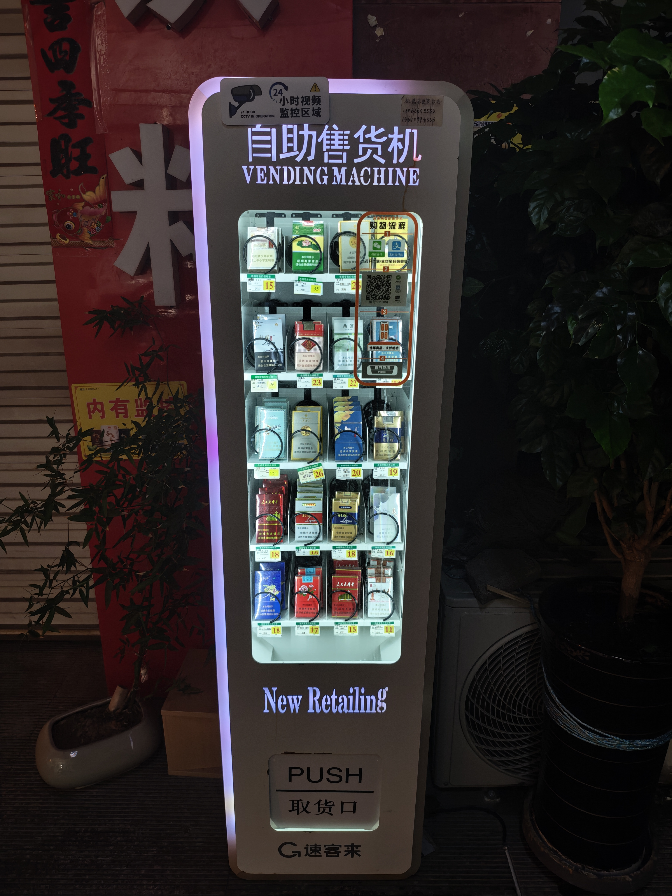
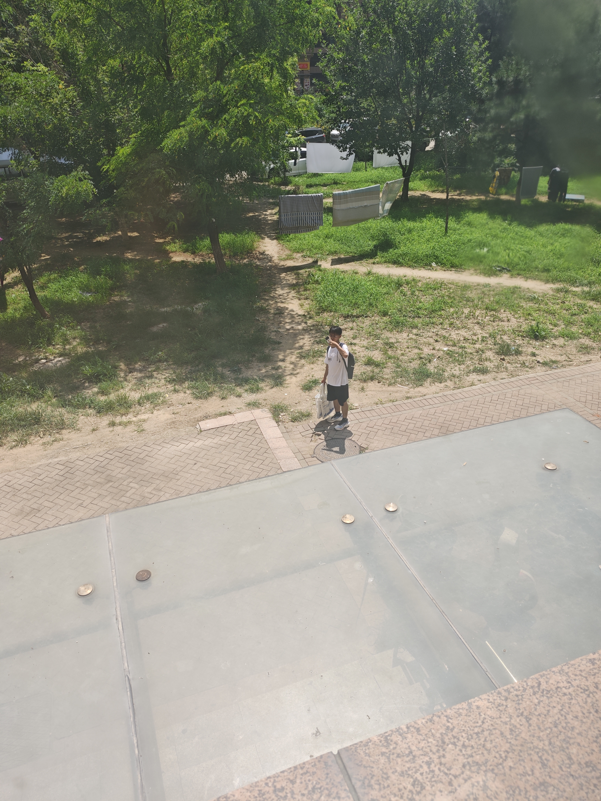
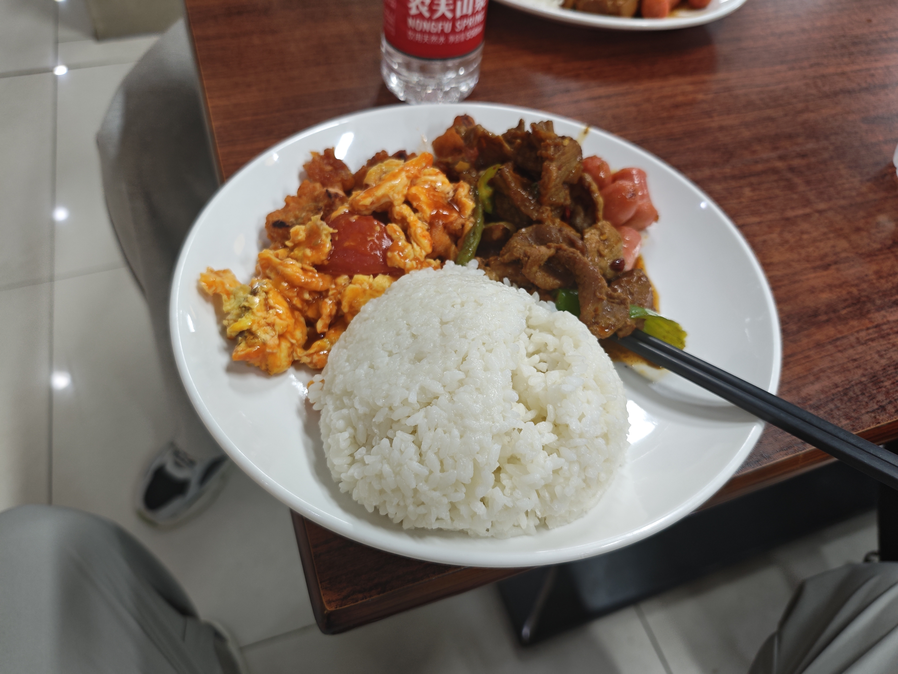
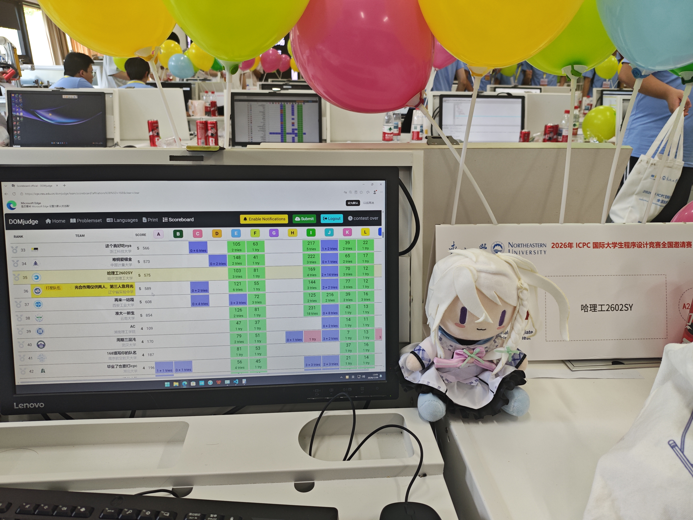
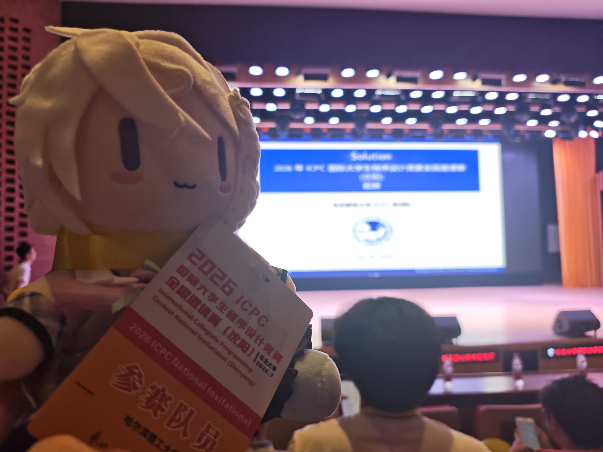
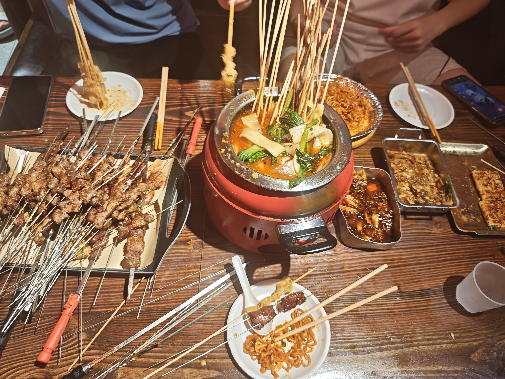
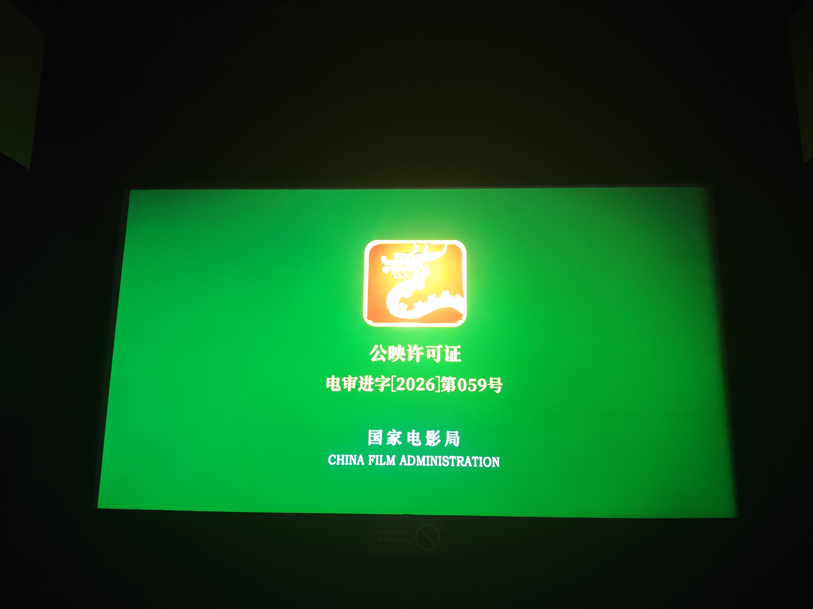
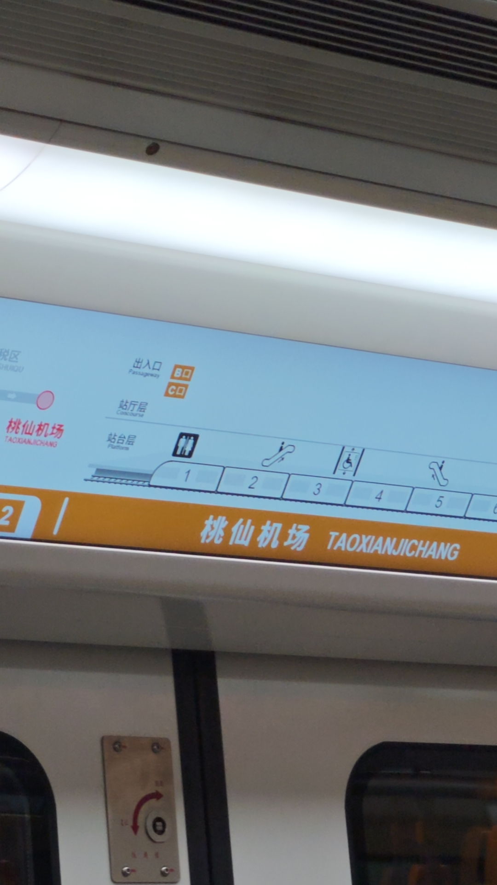

### 前言
##### 和天妹妹一起从深圳飞来沈阳 历经5h

##### 大晚上想吃东西 找售货机找到自助售烟机 难绷

##### 偶遇一只几何造型

##### 东北大学的餐券 这一顿有肉有菜有碳水 仅仅15r

##### 很好看的赛站服，可惜朋友说有登味

### 赛中

全场第一个提交，但是是E题wwq猜了个结论 错了之后才倒回去跟榜看签到。

12min 做出来L 三个人开始集体发呆，直到 70min 才以两发罚时做出来第二道签到K

做出来3题之后还在铁牌区，当时感觉这场打的想哭

好在qxh在我之前开始动脑，把E的总体排序计算改为分别计算每个位置的贡献，这样推导了一会儿发现是一个for循环+一个排序不等式，但是他🍬的看不懂数据范围，我说 $n^{2} logn$ 是肯定可以过的 然后光速写了一发 过了。 此时来到银牌中游 大家重燃希望。

查看I题 qxh发力 约莫猜了两三个结论吧 推导的七七八八了，但是实现上，内层枚举因数的时候发现极端情况下因数可能超过300个 这样会导致超时；

此时我充分发扬多校乱搞的经验，跟他们说 可以考虑循环上界设为 `min(200ll, 因数个数)` 试了一发 过了 此时来到金牌区

如果我们再做一道J 几乎是百分百稳金牌的 这样我们也算是后起之秀了 于是三个人开始一起看J 

我提出 与其计算每一个点可以看到哪些柱子 不如计算每一个柱子可以被多少点看到，这样y轴只有1e5数量级个本质不同的点 维护一个离线区间加的方法是多样的 剩下就是推导每个柱子可以如何被看到 一通推导之后发现是一个类似并查集find的东西 需要不断记录前驱节点 后来才知道其实相当于赛时发明凸包了 但是一时间想的东西太多 没有想到斜率的比较其实应该 统一把分母移上去 这样整个代码里都没有 `double` 了

总之 debug了十几发 也没能成功通过 最后遗憾银牌 rk42 姑且也可以算是银首。

总结来说 客观原因是三个人可能线下没休息好，主观原因是三个人在赛前没有充分讨论好各自的分工，导致在赛中出现了很多重复劳动，以及互相不知道对方在说什么 仍需磨合啊！

### 赛后
##### 其实新海天才是参赛队员

##### acm特有的赛后头像合影

##### 沈阳量大管饱 这一顿把三个人吃死了

##### 半夜看痴迷 看的手脚冰凉

##### 走啦 奔赴下一站
