# 写在前面

> 免责声明：本文仅用于学习和效率优化，不鼓励用于任何违规用途。自动点击有风险，尤其是付款、授权、删除、转账类页面，请务必谨慎。

# 1. GKD 介绍

::github{repo="gkd-kit/gkd"}

GKD 是一个**基于高级选择器和订阅规则的 Android 自动点击工具**。常见用途是减少重复点击流程，比如跳过某些开屏弹窗、关闭已知干扰提醒、做固定场景的一键确认。

通俗来说，GKD 可以让我们跳过各种广告、弹窗、提示，直接点击“同意”、“跳过”、“关闭”等按钮，提升使用体验和效率。包括但不限于 B站 拼多多 :spoiler[甚至还有**运动世界**，非常之好用。] 

GKD 本身核心依赖是无障碍服务，但是为了避免 Android 系统对无障碍权限的限制和误杀，GKD 的一些增强功能（比如更精准的界面元素识别、跨应用操作等）会借助 Shizuku 来调用系统级 API，从而实现更稳定和高效的自动化体验。
 
# 2. 上文提到的一些概念

## 2.1 Root
Root 可以理解为 Android 的最高权限。拿到它之后，你对系统的控制能力会显著增强。

优点是权限足够高，很多操作一把过；代价是安全风险和维护成本一起上来，系统完整性、保修、金融类应用兼容都可能受影响。

作为最强的权限方案，小米厂商对用户的 Root 权限管理也相当严格，若通过正常渠道申请，需要在小米社区提交申请，审核通过后才能获得 Root 权限，可谓十分麻烦。

因此，ADB 和 Shizuku 这两种 "非 Root" 方案就显得非常有吸引力。

## 2.2 ADB
ADB 全称 Android Debug Bridge，本质不是权限工具，而是开发调试桥。

它允许电脑（或无线调试通道）向手机发命令，完成调试、安装、授权、拉日志等操作。你可以把它理解成“官方调试后门”，前提是你主动开启了开发者选项和 USB 调试/无线调试。

ADB 的权限级别介于普通应用和 Root 之间，能执行一些系统级操作，但需要每次重启后重新授权启动服务。它的使用需要通过命令行，而且还要插线，具有一定门槛。
 
## 2.3 Shizuku
Shizuku 是一个中间件，核心功能是把“需要高权限的系统 API 调用”集中到一个后台服务里，再把能力安全地转交给支持它的应用。 它的出现让很多原本需要 Root 权限的功能，在不 Root 的情况下也能实现，能让用户方便地能在一定范围内让应用“借到”系统级能力。

Shizuku 有三种常见启动方式：

1. 通过 Root 启动：最省心，权限高，通常体验最好。
2. 通过连接电脑启动（ADB）：最通用，稳定，但每次重启后也常要重新来一次。
3. 通过无线调试启动（Android 11+）：不用电脑线，但重启后通常需要再次启动。这是我们推荐的方案，兼顾了便利和安全。
  
## 2.4 关系总结

- Root：直接给系统最高权限。
- ADB：提供命令桥接通道。
- Shizuku：通过 Root 或 ADB 把系统调用能力转交给应用。
- GKD：利用无障碍能力 + 规则匹配，在特定条件下执行点击等动作。

# 3. 配置过程

## 3.1 安装 GKD

建议优先从官方渠道安装：
1. https://gkd.li/guide/
2. https://github.com/gkd-kit/gkd/releases

## 3.2 启用无障碍服务

打开软件，勾选第一个选项，点击右上角进入配置。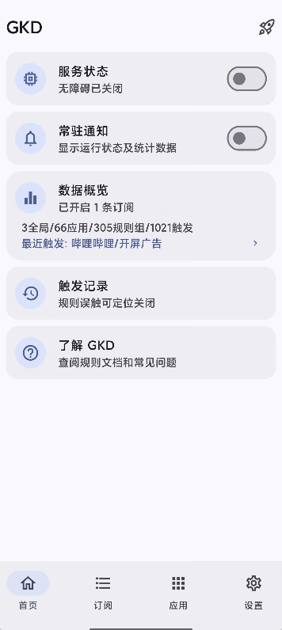

## 3.3 安装并启动 Shizuku 

::github{repo="RikkaApps/Shizuku"}
[Shizuku 官方文档](https://shizuku.rikka.app/zh-hans/guide/setup/)

### A. Root 启动

如果你的设备已 Root，直接在 Shizuku 内点击启动即可。

### B. 无线调试启动（Android 11+）

1. 开启开发者选项。
2. 开启 USB 调试和无线调试。
3. 在 Shizuku 里执行配对（首次）。
4. 完成后点击启动。

1. 打开 Shizuku，点击配对。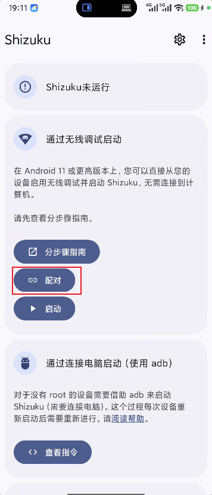
2. 点击 开发者选项，找到无线调试。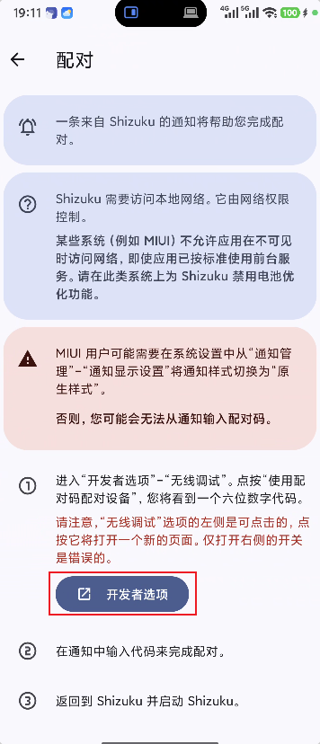
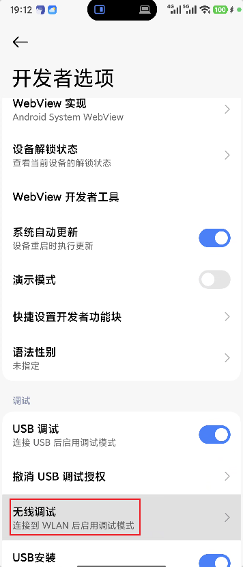
3. 勾选 无线调试，点击 配对设备，输入 Shizuku 给出的配对码。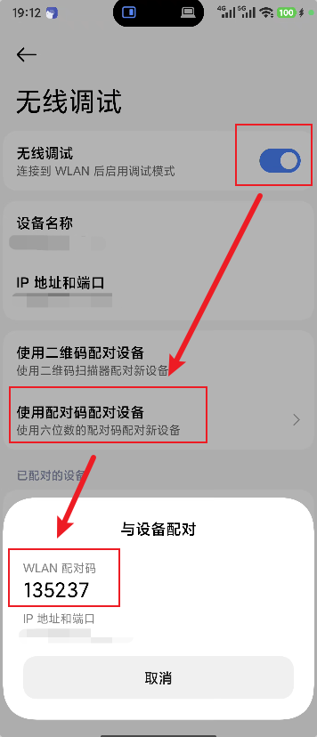
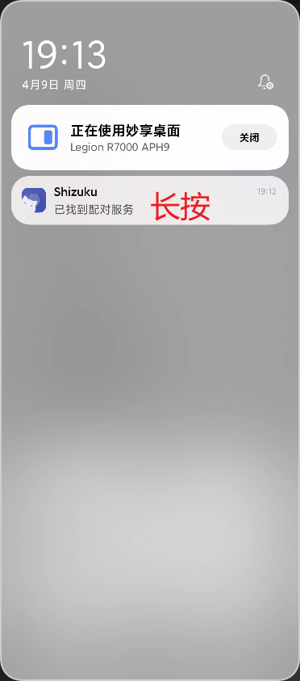
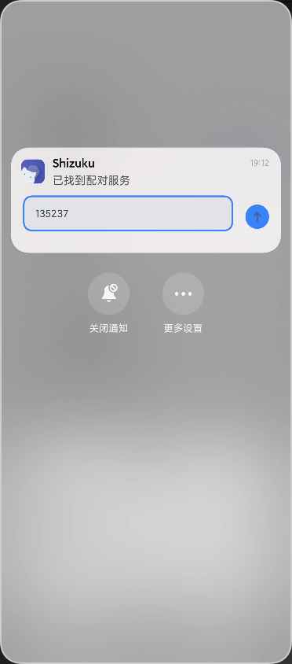
4. 配对成功后，回到 Shizuku 点击启动。
5. 在上方授权 gkd 。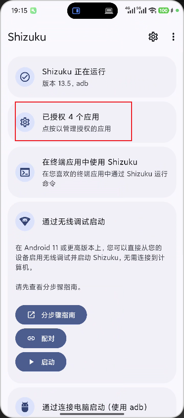
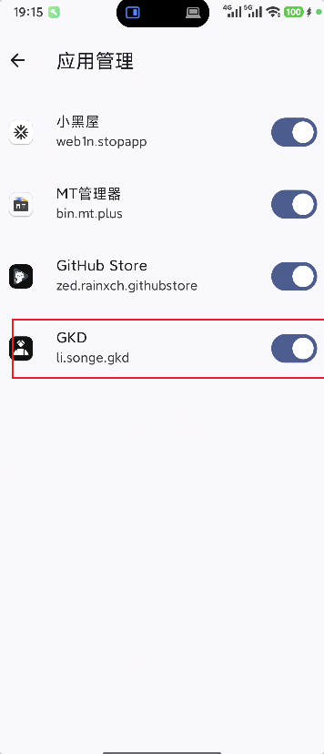


### C. 连接电脑 ADB 启动

1. 电脑安装 platform-tools（ADB）。
2. 手机开启 USB 调试并连接电脑。
3. 执行 adb devices，确认设备状态为 device。
4. 按 Shizuku 页面给出的命令启动服务。

:::note
无线调试/ADB 启动在手机重启后通常需要重新启动，这是系统机制导致的正常现象。
:::

## 3.4 导入订阅规则

```txt
https://raw.githubusercontent.com/AIsouler/GKD_subscription/main/dist/AIsouler_gkd.json5
```

在 GKD 内导入路径一般是：

- 打开 GKD，进入订阅页面，选择添加订阅，粘贴上述 URL。
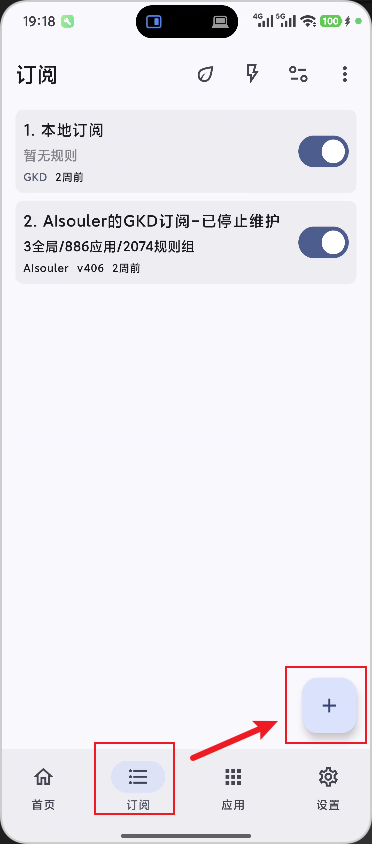
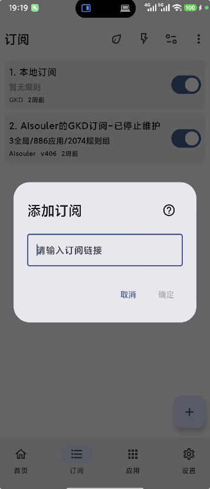
- 保存并拉取更新。

如果看到订阅名称、版本、应用规则列表正常出现，说明导入成功。

## 3.5 配置规则
进入应用界面，逐一调整即可。
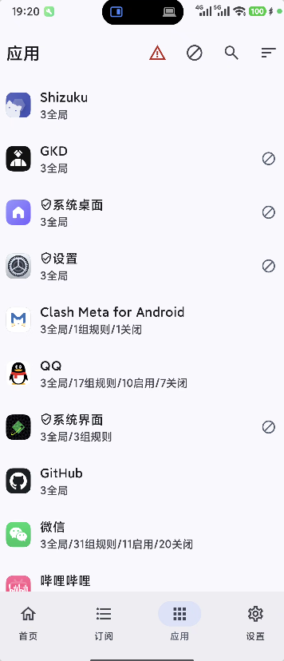

# 4. 注意事项
:::warning
自动点击虽然方便，但也有风险，尤其是涉及到资金、权限、账号安全等敏感操作的页面。为了避免误操作导致的损失，建议在以下场景一律禁用自动点击：
以下场景建议默认禁用：

1. 付款与转账。
2. 删除、卸载、格式化。
3. 系统授权和隐私协议。
4. 账号安全验证。

这些页面宁愿手点，也不要赌自动化“刚好没错”。
:::

大功告成，祝使用愉快。