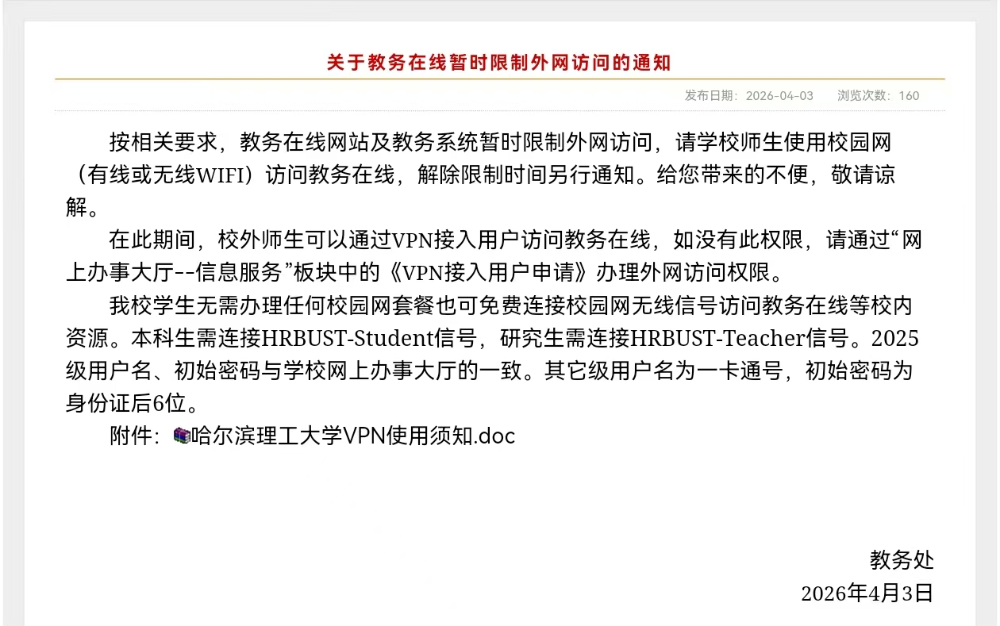
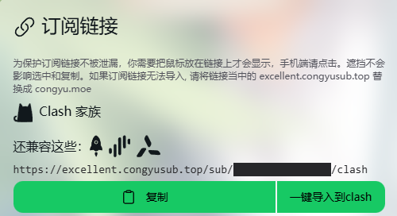
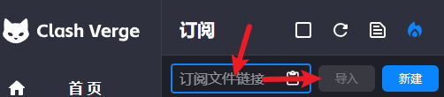

# 写在前面
捣鼓博客的初衷就是想多发一些“经验分享帖”，但是又总会怀疑自己自作多情的搞这么一出 是不是其实无人在意。

但是还是有很多朋友问我这怎么搞那怎么搞，同样的东西解释很多次大概也会心烦。倒不如趁此机会一鼓作气把东西写出来，这样以后别人问起来就可以帅气（吗）地把博客链接甩出去，还能给博客加点浏览量。

看到有人确实需要这些内容，我就觉得写出来也不是白写，活着也不是白活了。

换而言之，如果这篇帖子对你有帮助的话，欢迎多多分享！

# 1. 环境讲解
在进入具体操作之前，我们先来理清几个经常被混淆的概念。虽然它们最终的目的都是让你“科学上网”，但原理和使用体验却大不相同。
## 1. “梯子” (The Ladder)：
“梯子”并不是一个技术术语，而是中文互联网环境下的一个比喻。
- 含义： 泛指一切能够绕过网络限制、访问海外网站的工具。
- 逻辑： 墙（GFW）挡住了去路，所以我们需要一把“梯子”翻过去。无论你用的是 VPN、SSR 还是 Clash，在口语中都可以统称为“找个梯子”。
## 2. VPN (虚拟专用网络)：
VPN 的全称是 `Virtual Private Network` 。
- 初衷：它的设计初衷不是为了“翻墙”，而是为了数据加密。比如出差的员工通过 VPN 安全地连接回公司内网。

> 你哈埋土就需要 VPN 来访问教务在线，不可不谓是、、科学上网的先驱！此处或许应有掌声。
> 
- 特点：全局加密： 开启后，你电脑上所有的网络流量都会经过加密通道。
- 现状：虽然安全，但由于 VPN 的流量特征非常明显，容易被识别封锁，且开启后访问国内网站（如淘宝、百度）速度会变慢。
## 3. 代理 (Proxy) 与协议：
为了避开检测，技术圈开发了更灵活的代理协议（如 Shadowsocks, V2Ray, Trojan 等）。
- 原理： 就像是在你的网络请求外包了一层“普通快递”的纸箱，让防火墙以为你只是在访问普通的海外网页。
- 服务商： 提供这些代理协议访问权限的网站，通常被称为 **“机场”**。
## 4. Clash：全能的“指挥中心”
clash 是 基于规则的软件内代理核心 ...
这个听起来很高端很专业，其实就是一个让订阅服务运行起来的平台。这样的平台当然不止一个，我在此推荐 clash 是因为它全平台通用，界面设计现代，足够方便。
- 核心优势——分流 (Rule-based)： 这是它区别于传统 VPN 的最大优点。Clash 会根据预设规则自动判断：
  - 当你访问 YouTube 时，它自动走加速通道；
  - 当你访问 微信 时，它自动走国内直连，不消耗加速流量。

我们可以用一个形象的比喻来总结：
- “科学上网” 是你的目的；
- “梯子” 是你对这类工具的亲切称呼；
- “机场（订阅服务）” 是为你提供服务的加油站/供应商；
- “Clash” 是一台台配置豪华、带自动导航的赛车。
你把“订阅链接”输入到“Clash”里，就像是给赛车加满了油并设定好了最优路线，然后你就可以畅通无阻地出发了。

# 2. 正式的使用教程
通过上文我们知道，我们需要从 机场 中获得订阅服务，并通过 clash 来使用。

## 1. clash 的安装
### windows
推荐使用 [clash verge rev](https://github.com/clash-verge-rev/clash-verge-rev/releases/tag/v2.4.7)，界面友好，功能齐全，适合大多数用户。

::github{repo="clash-verge-rev/clash-verge-rev"}
### Android
推荐使用 [Clash for Android](https://github.com/clashbk/clash_for_android/releases/tag/2.5.12) 或者可以直接在 google play 上搜索 “Clash” ... 

不过如果可以正常上google play 的话，你可能并不需要这个教程。
### ios
没有用过ios呢...等个有缘人提PR。

## 2. 获取订阅服务
这个帖子仅负责必要的说明，因此 建议大家自行搜索评价稳定的机场，本站没有立场作推荐。

话说，[丛雨宝宝](https://congyu.moe/auth/register?invite=fc84dcfb89)真的很可爱！有懂的吗
## 3. 导入 / 使用
> 下面以 windows 版本的 clash 为例，其他平台的操作大同小异。

完成购买步骤后，我们等待约五分钟，可以看到主页的订阅链接出现。

我们点击复制，把链接粘贴到 clash 的 url 粘贴栏里，保存。

现在，我们开启代理，看到状态栏的小猫从紫色变成橙色，一切就大功告成了！

可以尝试打开 [谷歌](https://www.google.com/)  进行测试。

## 4. 使用建议与避坑
我们应当选择 Rule (规则模式) 实现“国内直连，国外加速”。  

​我们应当选择 日本 / 新加坡 节点： 物理距离近，延迟低，适合刷网页、看视频；适合访问ChatGPT 或某些有严格地区限制的资源。  
​
> 安全提醒： 订阅链接包含你的个人账户信息，千万不要发给别人，否则流量会被蹭光，账号也可能被封。

祝大家在广阔的互联网海洋中愉悦自在。