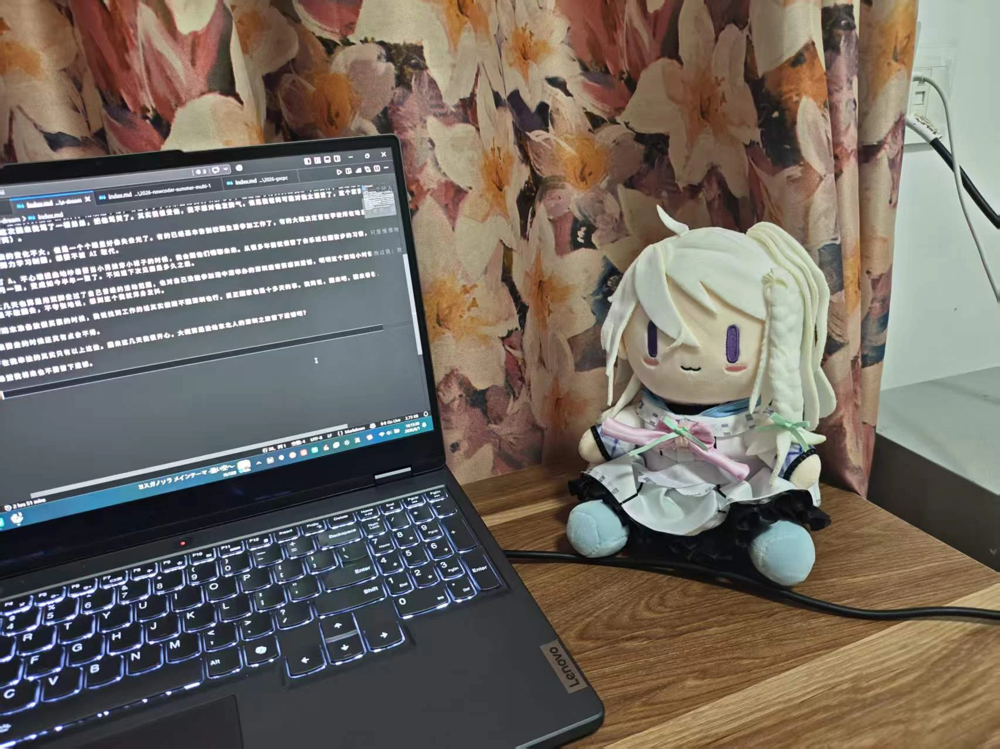

学习，打 A，工作。

上了大学，我离自己从小到大的生活圈子愈发变远了。

这次回来深圳，满打满算十一天。跟爸妈弟弟聊天，跟小学初中的好朋友叙旧，又因为前程之类的事情不得不匆匆离开。

睡在原来属于我、现在属于弟弟的小床上，恍惚间分不清楚这到底是我的家，还是一个陌生的房间。整理东西时候发现抽屉柜子里封存的物件，我只能有模糊的记忆。我不是一个念旧的人吗，为什么竟因为遗忘而感到有点害怕？

爸妈，不想这么说，但是确实老了，也自然地把我当个大人对待。我出门不再需要跟他们报备；爸妈捣鼓电子产品的时候会询问我的意见；在家爸妈知道我要学习，给了我极高的宽容。我每天起床睡觉时间都极其阴间，好几天都跟他们几乎错开，就这样我妈还每天中午给我买两份肠粉打包带回家。

弟弟长大了，但是其实没那么长大。成绩还不错，现在小学学的东西比我们以前难了，但是他考得其实比我那时候要好；但是他很调皮捣蛋，比我那时候要更调皮。这次回来我骂了一顿弟弟，把他骂哭了。其实我很爱他，我不想对他发脾气，但是我爸妈可能对他太溺爱了，这个家需要一个坏人，反正我才回来十天（笑）。

朋友们外表的变化不大，但是一个个眼里好像失去光了。有的已经基本告别校园生活参加工作了，有的大概决定留在学校所在地当小老师，有的放假了还去图书馆努力学习制图，想要不被 AI 取代。

在我不打 A、不心理扭曲地吵着要当小男娘穿小裙子的时候，我会跟他们畅聊未来。从很多年前就保留了去乐城公园散步的习惯，只是慢慢地从几周一聚、几月一聚，变成如今半年一聚了。不知道下次见面是多久之后。

回来这几天也算是用双脚走过了自己曾经的活动范围，也对自己没能参加港中深举办的深圳邀请赛感到遗憾，明明这个赛站小时候抱过我；然而我的高中我还是不敢回去，不夸张地说，想到这个我就浑身发抖。

---

临近期末准备放假买票的时候，我说找到工作的话其实假期不回深圳也行，反正回家也是十多天的事。我妈说，回来吧，回来看看。

结果要走的时候还真有点舍不得。

好在我牵挂的其实只有以上这些。回来这几天我很开心，大概算是没给东北人的深圳之旅留下遗憾吧？

希望我将来也不要留下遗憾。

> 2026-08-01 update:

