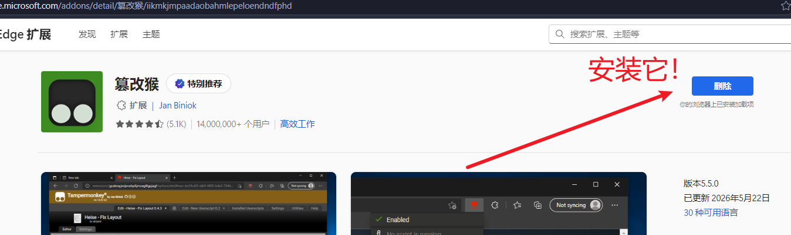
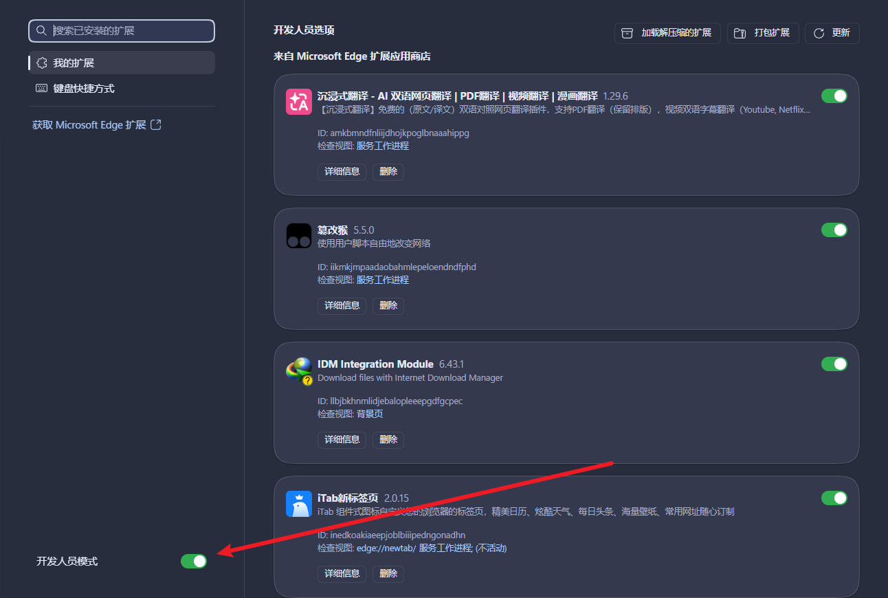
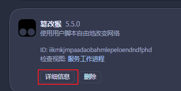
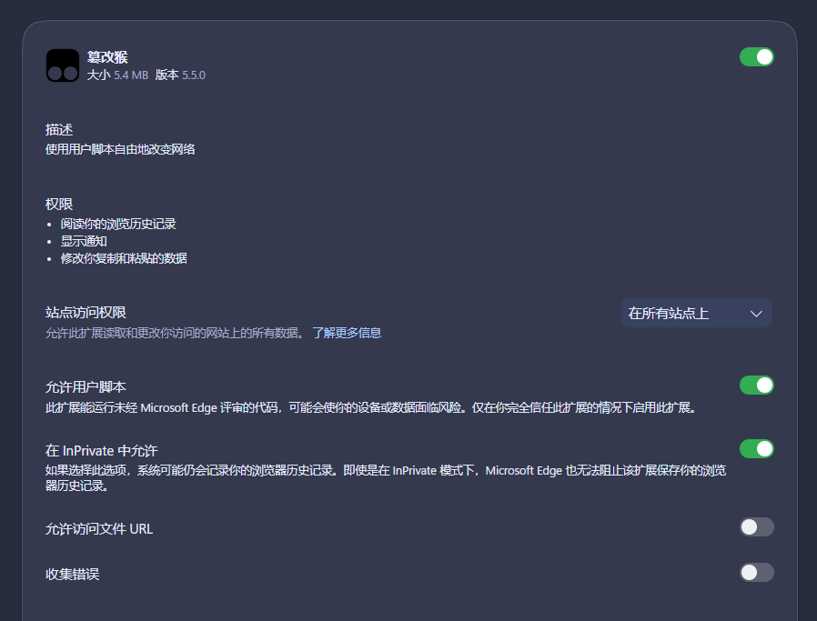
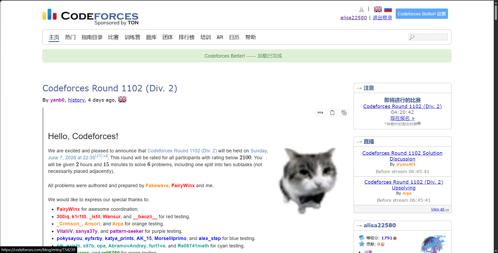
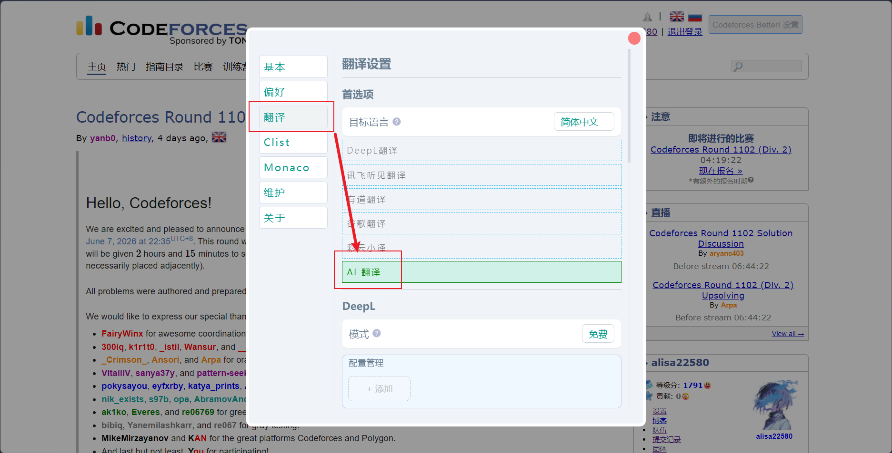
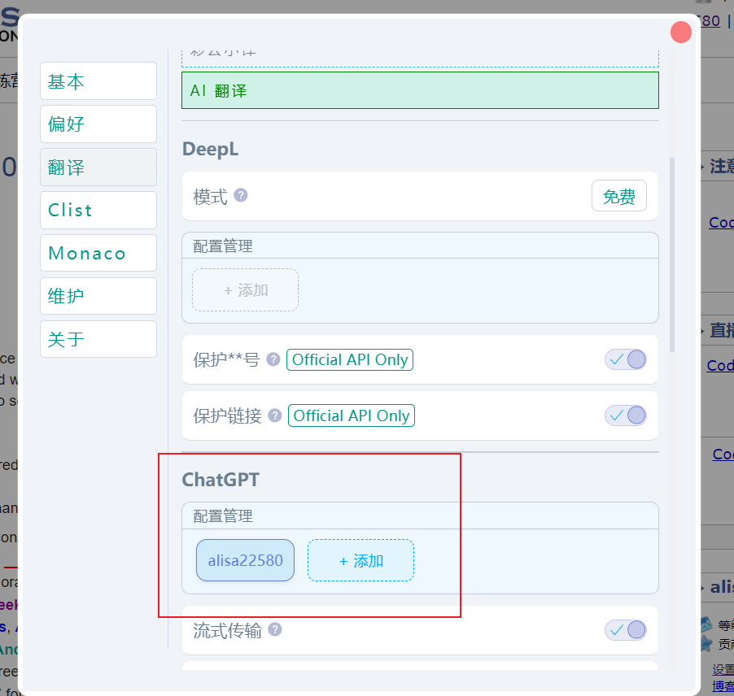
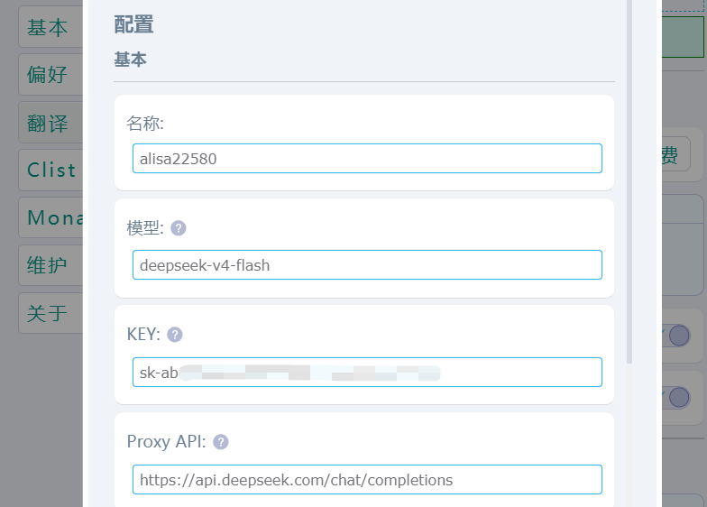
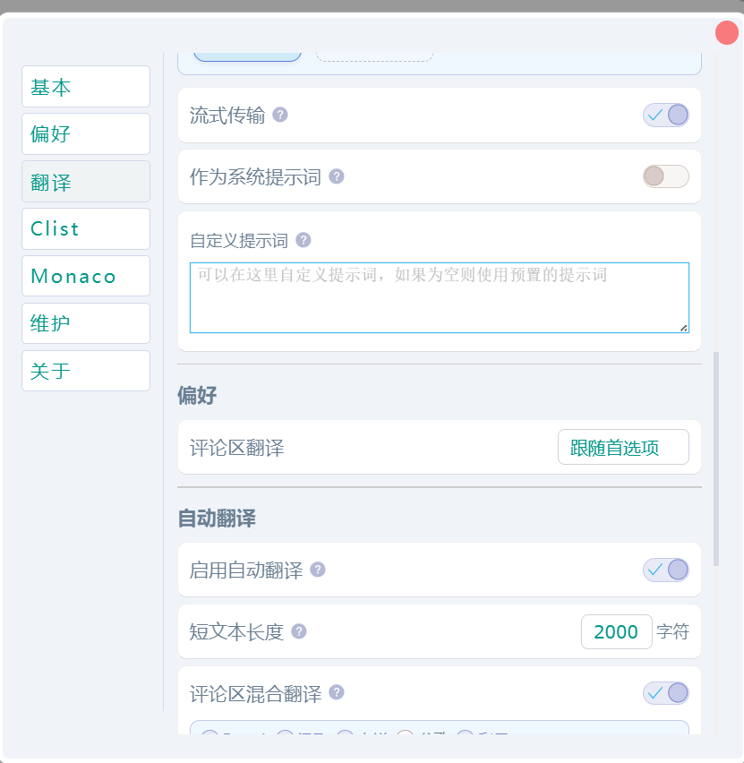

# 写在前面

> 曾经在 b 站发过一个 [简易版本的教程](https://www.bilibili.com/opus/1117176875527962633?spm_id_from=333.1387.0.0)，其内容已经过时。

刷 Codeforces 的时候，传统翻译工具翻译出来的东西，经常把题目里的数学公式和关键信息搞得面目全非，还不如自己硬啃英文。

**CFBetter** 是一个非常好用的 Codeforces 增强插件，它支持多种翻译服务，其中最推荐的就是 **AI 翻译（ChatGPT 兼容接口）** —— 因为 AI 能理解上下文，还能自动识别和保护 LaTeX 公式，翻译质量远超传统机翻。

本文将教你如何**快速配置** CFBetter 的 AI 翻译功能，接入 **DeepSeek V4 Flash** 模型。

# 1. 准备工作

## 1.1 安装油猴脚本

CFBetter 是一个 Tampermonkey 油猴脚本，你需要在浏览器中先安装它。

1. 安装 [Tampermonkey](https://microsoftedge.microsoft.com/addons/detail/%E7%AF%A1%E6%94%B9%E7%8C%B4/iikmkjmpaadaobahmlepeloendndfphd) 浏览器扩展。

2. 进入 [扩展管理](edge://extensions/) 确保 Tampermonkey 已启用，开发人员模式已打开。

3. 点击 篡改猴 的 详细信息， 像我图片那样设置相关权限。

## 1.2 安装 CFBetter 脚本

访问 [cf better 油猴脚本页面](https://greasyfork.org/zh-CN/scripts/465777-codeforces-better), 点击安装按钮，按照提示完成安装即可。

## 1.3 获取 DeepSeek API Key

1. 前往 [DeepSeek 开放平台](https://platform.deepseek.com/) 注册账号。
2. 登录后，点击左侧菜单的 **「API Keys」**
3. 点击 **「创建 API Key」**，输入一个名称（比如 `CFBetter`）
4. 创建后，**立刻复制并保存** API Key（格式为 `sk-xxxx...`，只显示一次）

# 2. 配置 CFBetter 的 AI 翻译

进入 codeforces 主页，应当能看到 cf better 已经加载成功：

## 2.1 打开设置面板

在 Codeforces 任意页面，点击右上角的 **「CodeforcesBetter 设置」** 按钮，打开设置面板。

## 2.2 选择翻译服务

在设置面板中，找到 **「翻译」** 选项，从下拉菜单中选择 **「AI 翻译」**。

## 2.3 添加 DeepSeek 配置

向下滚动，找到 **「ChatGPT」** 区域，点击 **「添加」** 按钮，弹出配置表单。

| 配置项 | 填写内容 |
|--------|---------|
| **名称** | 随意，比如 `DeepSeek V4 Flash` |
| **模型** | `deepseek-v4-flash` |
| **KEY** | 你的 DeepSeek API Key（`sk-xxxx...` 格式） |
| **Proxy API** | `https://api.deepseek.com/chat/completions` |

> 参考如下：
> 

## 2.4 配置自动翻译

向下滚动，像图中一样配置即可。

填写完成后直接关闭，会弹出保存提示，保存即可。

:::warning
完成之后多点几下 确认确实选择了AI翻译；确认确实选择了刚刚自己设置的接口；确认保存了设置！
:::

### 配置参数说明

**关于模型名称：**

| 模型名称 | 说明 | 推荐 |
|----------|------|------|
| `deepseek-v4-flash` | DeepSeek V4 Flash 模型，速度快、便宜 | ✅ 推荐 |
| `deepseek-v4-pro` | DeepSeek V4 Pro 模型，推理能力更强 | 复杂题目可选 |
| `deepseek-chat` | 旧版模型名，对应 V4 Flash 非思考模式（2026/07/24 弃用） | 不推荐 |

**对于翻译场景，`deepseek-v4-flash` 完全够用，不建议使用 `deepseek-v4-pro`，因为翻译不需要复杂推理能力，用 Pro 纯属浪费钱。**

# 3. 使用与测试

配置完成后，在任意 Codeforces 题目页面，点击翻译按钮即可使用 AI 翻译。

- 翻译会自动保留 LaTeX 数学公式不被破坏
- 翻译质量远超 DeepL、Google 等传统翻译工具
- 首次翻译可能需要授权 Tampermonkey 的跨域请求，点击允许即可

## 3.1 推荐的翻译设置

回到 CFBetter 的设置面板，建议进行以下调整：

- **翻译模式**：选择「普通模式」（一次性翻译整个区域，上下文更完整）
- **自动翻译**：可以开启，建议设置短文本阈值为 200 字符
- **历史翻译恢复**：建议开启，避免重复翻译消耗 API 额度

## 3.2 快速切换翻译服务

右键页面上的任意**翻译图标按钮**，可以快速切换翻译服务，不需要每次都打开设置面板。

# 4. 费用估算

DeepSeek V4 Flash 的定价如下（截至 2026 年 6 月）：

| 项目 | 价格 |
|------|------|
| 输入（缓存命中） | 0.02 元 / 百万 tokens |
| 输入（缓存未命中） | 1 元 / 百万 tokens |
| 输出 | 2 元 / 百万 tokens |

实际使用中，翻译一道 Codeforces 题目（包括题目描述、输入输出说明、样例等）大约消耗 500-2000 tokens，折合人民币 **不到 0.01 元**。

也就是说，**充 10 块钱，能翻译上千道题目**，基本等于白嫖。

# 5. 常见问题

## Q: 翻译报错 401 Unauthorized？

检查 API Key 是否正确，确保完整复制了 `sk-` 开头的整个 Key，没有多余空格。

## Q: 翻译报错 402 Payment Required？

你的 DeepSeek 账号余额不足，前往 [DeepSeek 开放平台](https://platform.deepseek.com/) 充值即可。

## Q: 翻译很慢怎么办？

AI 翻译的速度取决于 DeepSeek 服务器的响应时间，通常在 2-5 秒左右。如果经常很慢，可能是网络问题，建议检查网络连接。

## Q: 公式显示异常？

使用 ChatGPT/AI 翻译时，CFBetter 会通过提示词告知 AI 保留 LaTeX 公式，通常不会出现公式被破坏的情况。如果偶尔出现，可以重新翻译一次。

## Q: Tampermonkey 弹出跨域警告？

这是正常现象，因为你在使用自定义 API 地址。点击「允许」或「始终允许」即可。

## Q: 可以用其他 AI 模型吗？

可以！只要模型支持 OpenAI 兼容的 API 格式（`/v1/chat/completions`），都可以使用。例如：
- **OpenAI**：`https://api.openai.com/v1/chat/completions`，模型 `gpt-4o`
- **硅基流动 (SiliconFlow)**：填入对应的 API 地址和模型名
- **其他代理服务**：填入代理商提供的完整 API 地址

只需要修改 **KEY**、**Proxy API** 和 **Model** 三个字段即可。

# 参考

- [OJBetter GitHub 仓库](https://github.com/beijixiaohu/OJBetter)
- [OJBetter 翻译配置 Wiki](https://github.com/beijixiaohu/OJBetter/wiki/%E7%BF%BB%E8%AF%91)
- [DeepSeek 开放平台](https://platform.deepseek.com/)
- [DeepSeek API 定价](https://api-docs.deepseek.com/zh-cn/quick_start/pricing)
