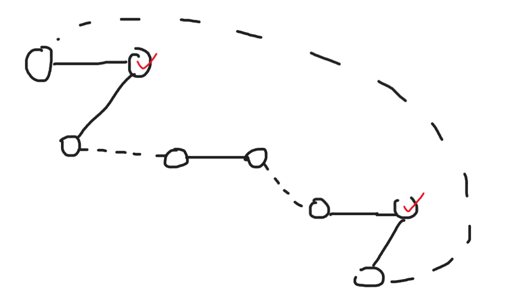
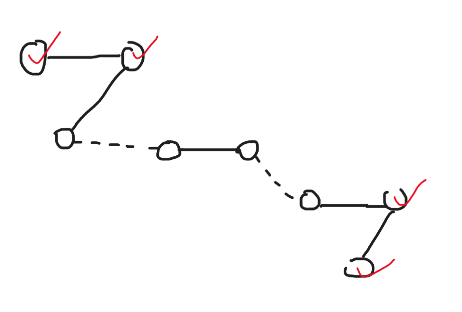
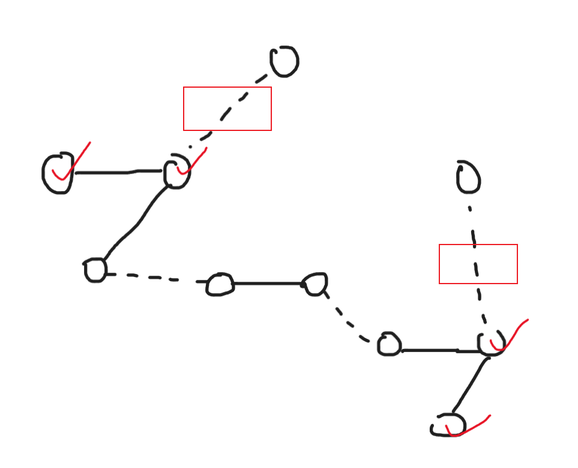
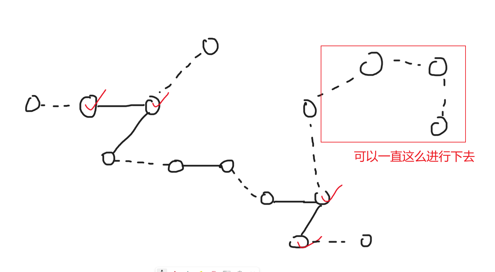
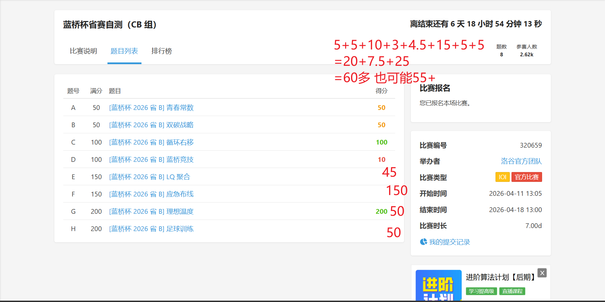

:::tip
补题链接：[蓝桥杯省赛自测 CB](https://www.luogu.com.cn/contest/320659#problems)

代码模板请移步 [蓝桥杯 C++ B 组常用板子](../lanqiao-cpp-b-common/) 或 [我的 github 存储库](https://github.com/2258009564/MYWORK/tree/main/CODES/CPPPROGRAM/%E6%9D%BF%E5%AD%90)
:::

# A. 青春常数（填空）

## 题意简述

给定

$$
N = 2026202520242023
$$

求非负整数对 $(x, y)$ 的个数，满足：

$$
x + y = N,
\quad 0 \le x < y
$$

:::note
数一遍 `x` 的取值范围，`x` 确定后 `y` 就唯一。
:::

## 一眼观察

由 $y = N - x$ 代入 $x < y$：

$$
x < N - x \iff 2x < N
$$

因为 $N$ 是奇数，所以

$$
x = 0, 1, 2, \dots, \frac{N-1}{2}
$$

共

$$
\frac{N+1}{2}
$$

种。

## 最终答案

$$
\boxed{1013101260121012}
$$


---

# B. 双碳战略（填空）

## 题意简述

有 $N=2026$ 盏灯，初始全亮。

- 第奇数次操作：选 $i$，翻转后缀 $[i, N]$。
- 第偶数次操作：选 $i$，翻转前缀 $[1, i]$。

每个状态都可达。定义某状态的最少操作步数，求所有 $2^N$ 个状态最少步数之和，对 $998244353$ 取模。

:::note
神秘的结论题。据说可以推出来...据说。
:::

## 小规模自检

赛时太闲了 手推了 $N=1..5$ 发现都满足：

$$
S(N) = N \cdot 2^{N-1}
$$

例如 $N=5$ 时总和是 $80$，刚好等于 $5\cdot2^4$。

## 最终答案

$$
S(2026) = 2026 \cdot 2^{2025} \bmod 998244353 = \boxed{792264670}
$$


## 代码（计算答案）

```cpp
const int MOD = 998244353;

void solve()
{
	int n = 2026;
	cout << n * ksm(2, n - 1) % MOD;
}

```

---

# C. 循环右移

## 题意简述

长度为 $N$ 的数组 $A$，每个元素满足 $X \le A_i \le Y$。

要求：对任意连续子数组做一次循环右移后，子数组不变。求满足条件的数组个数。

:::note
尝试从最短的子数组开始分析。
:::

## 一眼观察

只看长度为 $2$ 的子数组 $[A_i, A_{i+1}]$：

- 右移后变成 $[A_{i+1}, A_i]$
- 若右移前后相同，则必有 $A_i = A_{i+1}$

对所有 $i$ 成立，就得到全数组所有元素都相等。

## 结论

可选的常值就是区间 $[X, Y]$ 内整数个数：

$$
\max(0ll, Y - X + 1)
$$

与 $N$ 无关。

## 复杂度

每组 $O(1)$。

## code

```cpp
void solve()
{
	int N, X, Y;
	cin >> N >> X >> Y; 
	cout << max(0ll, Y - X + 1);
}
```

---

# D. 蓝桥竞技

## 题意简述

有 $N$ 种位置，第 $i$ 种有 $A_i$ 人。要把所有人分成若干支 5 人队，每队 5 人且位置互不相同。

问是否存在合法分组。

:::note
这是条件判定题，不是构造题。检查两个条件就够：总人数能否整除 5、最大职业人数会不会爆队伍数。

赛时尝试用大根堆模拟分配，满怀信心的出来发现果然过不了。
:::

## 一眼观察

设总人数 $S = \sum A_i$，队伍数 $K = S/5$。

必要条件：

1. $S$ 必须被 5 整除。
2. 任意位置人数不能超过队伍数，即 $\max A_i \le K$。

这两个条件也是充分条件（可由二分图度序列可行性 / Gale-Ryser 结论得到）。

## 复杂度

每组 $O(N)$。

## code

```cpp
void solve()
{
	int N;
	cin >> N;
	int sum = 0, mx = 0;

	for (int i = 0; i < N; i++)
	{
		int x;
		cin >> x;
		sum += x;
		mx = max(mx, x);
	}

	if (sum % 5)
	{
		cout << "F";
		return;
	}

	int K = sum / 5;
	cout << (mx <= K ? "T" : "F");
}
```

# E. LQ 聚合

## 题意简述

长度 $N$ 的字符串，仅含 `L`、`Q`、`?`。把所有 `?` 替换为 `L` 或 `Q`，最大化满足 $i<j$ 且 $s_i='L', s_j='Q'$ 的对数。

:::note
赛时想了半天怎么 DP， 最后针对 $N < 10$ 的情况写了二进制枚举，依旧部分分。
:::

## 一眼观察

最优方案一定是：某个分界点左边的 `?` 尽量当 `L`，右边的 `?` 尽量当 `Q`。

因为假设存在一种最好的构造方案，那么把左侧的 'Q' 和右侧的 'L' 交换 后，结果不会变差。

所以可做「从左到右枚举把多少个 `?` 变成 `L`」的线性扫描。

## 复杂度

$O(N)$。

## code

```cpp
void solve()
{
	int n;
	string s;
	cin >> n >> s;

	int tot = 0;
	for (int i = 0; i < n; i++)
	{
		if (s[i] == 'Q' or s[i] == '?')
		{
			tot++;
		}
	}

	int cur = 0, q = tot;
	for (int i = 0; i < n; i++)
	{
		if (s[i] == 'Q' or s[i] == '?')
		{
			q--;
		}
		else
		{
			cur += q;
		}
	}

	int ans = cur, l = 0;
	q = tot;
	for (int i = 0; i < n; i++)
	{
		if (s[i] == '?')
		{
			q--;
			cur = cur - l + q;
			ans = max(ans, cur);
			l++;
		}
		else if (s[i] == 'L')
		{
			l++;
		}
		else
		{
			q--;
		}
	}

	cout << ans;
}
```
---

# F. 应急布线

## 题意简述

有 $N$ 台电脑、$M$ 条现有网线。现有网络可能分裂成多个连通块。

要加「应急跳线」使全图连通，目标分两层：

1. 新增边数最少。
2. 在满足 1 的前提下，让单台机器接入跳线数的最大值尽量小。

输出这两个值。

:::note
感觉这居然是最简单的一题，该说昨天 DSU 复习对了吗。
:::

## 第一步：最少新增边数

若连通块个数为 $C$，最少新增边数必为：

$$
C-1
$$

## 第二步：最小化最大接入数

设最大接入数为 $D$。

- 若 $C=1$，显然答案是 $0$。
- 若 $C\ge 2$，至少需要 $C-1$ 条新增边，共有 $2(C-1)$ 个端点要挂在机器上。
- 每台机器最多承受 $D$ 个端点，总承载能力是 $N\cdot D$。

所以必要条件：

$$
N\cdot D \ge 2(C-1)
$$

又因为 $C\le N$，可知最优 $D$ 不会超过 $2$。

因此：

- 若 $C=1$，$D=0$。
- 若 $C>1$ 且 $N \ge 2C-2$，$D=1$。
- 否则 $D=2$。

## 赛时
赛时用了别的想法：

对于 `size > 1` 的联通块，彼此先连起来，每一个联通块应当用掉两个点位（用于连接彼此），剩余的度数为0的点位数（红色标点）是 $\sum (size - 2)$ 


然而只需要保证连通性即可，并不需要成环，所以有一条边可以拆开。这样一来 就又多了两个红色标点。


因此剩余的度数为0的点位数实际上是 $\sum (size - 2) + 2$

现在还剩下 `X` 个 `size = 1` 的联通块没有连接。

如果 $X \le \sum (size - 2) + 2$，说明可以把这些孤立点直接插在已有的边上，不会增加最大接入数，此时答案为1;



否则需要额外的边来连接这些孤立点，答案为2。


## 复杂度

并查集近似 $O((N+M)\alpha(N))$。

## code

```cpp
void solve()
{
	int N, M;
	cin >> N >> M;

	DSU dsu(N);
	for (int i = 0; i < M; i++)
	{
		int a, b;
		cin >> a >> b;
		dsu.merge(a, b);
	}

	int C = dsu.getgroups();
	int minEdges = C - 1;
	int minMaxDeg;

	if (C == 1)
	{
		minMaxDeg = 0;
	}
	else if (1ll * N >= 2ll * C - 2)
	{
		minMaxDeg = 1;
	}
	else
	{
		minMaxDeg = 2;
	}

	cout << minEdges << ' ' << minMaxDeg;
}

```

:::warning
- 记得特判 $C=1$ 时第二问是 0，不是 1。

- 不止一个人看错 第二问到底要求什么 求得其实是新增的边 如果加上老边这题就有点不可做了
:::
---
G 和 H 已经不属于我的能力范围了 ... qwq 

虽然说出来很不甘心就是了，但是姑且把 ai 的题解放在这里，有空了补。

---

# G. 理想温度

## 题意简述

给数组 $A,B$，可选一个连续区间 $[l,r]$，给区间每个元素都加同一个整数 $k$。

问操作后最多有多少位置满足 $A_i=B_i$。

:::note
把 `B-A` 当作差值数组 `D`。你选一个区间加 `k`，本质是在区间里“让 `D=k` 的变好，让 `D=0` 的变坏”。
:::

## 转化

定义差值：

$$
D_i = B_i - A_i
$$

原本满足条件的位置是 $D_i=0$，记数量为 `base`。

若选择区间并加 $k$，则区间内：

- 原来 $D_i=k$ 的位置会变成匹配（收益 +1）
- 原来 $D_i=0$ 的位置会被破坏（收益 -1）

所以固定某个 $k\ne0$ 后，问题变成：

在数组上找一段区间，使

$$
\#(D_i=k)-\#(D_i=0)
$$

最大。

## 做法

对每个出现过的非零值 $k$：

1. 收集所有 `D_i = k` 的位置。
2. 用前缀统计零的个数，在线性扫描这些位置时做 Kadane 变体。

总复杂度 $O(n\log n)$（用 map），或哈希近似 $O(n)$。

## code

```cpp
void solve()
{
	int n;
	cin >> n;

	vector<int> a(n), b(n), d(n);
	for (int i = 0; i < n; i++) cin >> a[i];
	for (int i = 0; i < n; i++) cin >> b[i];

	int base = 0, best = 0;
	vector<int> pre0(n + 1, 0);
	map<int, vector<int> > pos;

	for (int i = 0; i < n; i++)
	{
		d[i] = b[i] - a[i];
		pre0[i + 1] = pre0[i] + (d[i] == 0 ? 1 : 0);
		if (d[i] == 0)
		{
			base++;
		}
		else
		{
			pos[d[i]].push_back(i);
		}
	}

	for (auto it = pos.begin(); it != pos.end(); it++)
	{
		const vector<int>& v = it->second;
		int cur = 0;
		for (int j = 0; j < (int)v.size(); j++)
		{
			if (j == 0)
			{
				cur = max(0, cur) + 1;
			}
			else
			{
				int l = v[j - 1] + 1;
				int r = v[j] - 1;
				int z = pre0[r + 1] - pre0[l];
				cur -= z;
				cur = max(0, cur) + 1;
			}
			best = max(best, cur);
		}
	}

	cout << base + best;
}
```
---

# H. 足球训练

## 题意简述

有 $n$ 名队员，第 $i$ 名初始实力 $a_i$、天赋 $b_i$。

给总训练天数 $m$，分配 $k_i$（非负整数，和为 $m$）后，最大化：

$$
\prod_{i=1}^{n} (a_i + k_i b_i)
$$

输出最大值对 $998244353$ 取模。

:::note
这题本质是边际收益递减，直接一天一天贪心会超时，所以要做“二分水位 + 堆补尾巴”。
:::

## 核心思想

把目标取对数，变成：

$$
\max \sum_i \ln(a_i + k_i b_i)
$$

这是离散凹优化。每给某人再加 1 天的边际收益为：

$$
\Delta_i(k)=\ln(a_i+(k+1)b_i)-\ln(a_i+kb_i)
$$

随 $k$ 递减。

所以可用「参数二分 + 少量堆补差」：

1. 二分一个阈值，先算每人应分配的大致天数。
2. 为避免浮点误差导致超发，先保守减一点。
3. 剩余少量天数用优先队列按当前最大边际收益补齐。

## 复杂度

- 二分约 80 轮，每轮 $O(n)$。
- 补差阶段设剩余为 `rem`，复杂度 $O((n+rem)\log n)$。

实践上可过本题范围。

## code

```cpp

const int MOD = 998244353;

struct Node
{
	double gain;
	int id;
	bool operator<(const Node& other) const
	{
		return gain < other.gain; // 大根堆
	}
};

void solve()
{
	int n;
	int m;
	cin >> n >> m;

	vector<int> a(n), b(n);
	for (int i = 0; i < n; i++) cin >> a[i] >> b[i];

	double L = 0.0, R = 2e14;
	for (int it = 0; it < 80; it++)
	{
		double mid = (L + R) * 0.5;
		int cnt = 0;

		for (int i = 0; i < n; i++)
		{
			if (mid * (double)b[i] >= (double)a[i])
			{
				int k = (int)(mid - (double)a[i] / (double)b[i]) + 1;
				cnt += k;
				if (cnt > m + 1000000LL) break; // 防溢出保护
			}
		}

		if (cnt >= m) R = mid;
		else L = mid;
	}

	vector<int> k(n, 0);
	int used = 0;

	for (int i = 0; i < n; i++)
	{
		if (L * (double)b[i] >= (double)a[i])
		{
			int x = (int)(L - (double)a[i] / (double)b[i]) + 1;
			x = max(0LL, x - 5);
			k[i] = x;
			used += x;
		}
	}

	priority_queue<Node> pq;
	for (int i = 0; i < n; i++)
	{
		double g = (double)b[i] / (double)(a[i] + k[i] * b[i]);
		pq.push((Node){g, i});
	}

	while (used < m)
	{
		Node cur = pq.top();
		pq.pop();

		int id = cur.id;
		++k[id];
		++used;

		double g = (double)b[id] / (double)(a[id] + k[id] * b[id]);
		pq.push((Node){g, id});
	}

	int ans = 1;
	for (int i = 0; i < n; i++)
	{
		int val = (a[i] % MOD + (k[i] % MOD) * (b[i] % MOD)) % MOD;
		ans = (ans * val) % MOD;
	}

	cout << ans;
}
```

## 易错点

- 直接贪心一天一天分配会超时（$m$ 可到 $10^9$）。
- 结果取模在最后乘法阶段做；$a_i + k_i b_i$ 先转成模意义即可。
- 该题实现对浮点精度较敏感，建议自测多组随机数据做稳定性检查。

---

# 总结
我的分数大概是这么多（也可能再低一点吧。其实打的，相当一般啊，感觉就是零基础 / 半吊子 + DSU 板子熟练使用者


我曾经对 cf 有巨大的偏见，觉得它 "除了 guessing 什么都练不到" 但是这次的 B 题 居然被我手搓出规律了，在此我必须承认 cf 大人的强大，我将一直拥护 cf 。

当然黑龙江的 b 组 其实没啥含金量 约等于校内竞争了。但是我再怎么说也是训了那么久，打成这样终归不是很满意，心有不甘 