# 写在前面

这篇教程是给第一次接触浏览器扩展、或者第一次折腾划词翻译的朋友准备的，可以作为「SelectEcho」的快速上手指南。

::github{repo="2258009564/SelectEcho"}

如果对你有帮助的话，欢迎在 GitHub 上给项目点个 star，或者把教程分享给需要的朋友！如果你在使用过程中遇到任何问题，也欢迎在 GitHub 上提交 issue，我会尽快回复。

# 1. SelectEcho 是什么

`SelectEcho` 是一个基于 `Chrome`/`Edge` 的浏览器扩展，核心体验是：

1. 网页里选中文本。
2. 松开左键。
3. 在选区附近弹出翻译面板。

也就是划词翻译啦！

## 效果展示：

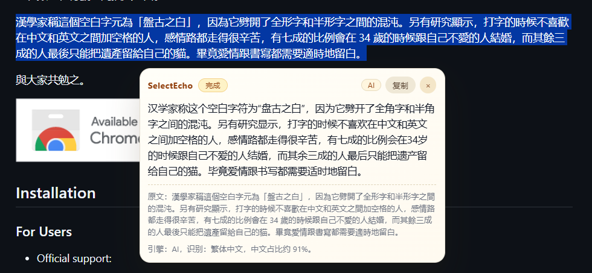
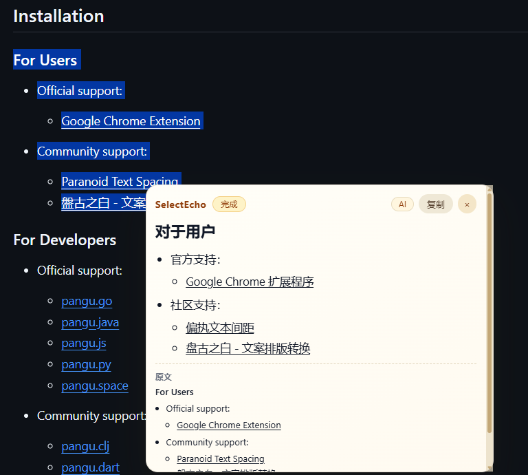

# 2. 使用前准备

## 2.1 浏览器要求

本项目当前定位是 Manifest V3 扩展，推荐环境：

1. Chrome 最新稳定版。
2. Edge 最新稳定版。

> Firefox 和 Safari 暂不在主支持范围内。

## 2.2 网络与权限认知

扩展会用到：

1. `storage`：保存你的配置。
2. Google 翻译接口域名权限。
3. 百度翻译接口域名权限。

> 这不是在读你的浏览历史，而是扩展正常工作需要的最小权限集合。

## 2.3 获取项目文件

你可以任选一种方式。

### 方式 A：下载 Release 压缩包（最省事）

1. 打开 SelectEcho Release 页面。
2. 下载最新 `SelectEcho.zip`。
3. 解压到一个你方便记住的目录。

最新版本下载：[最新稳定包直链](https://github.com/2258009564/SelectEcho/releases/latest/download/SelectEcho.zip)

### 方式 B：Git 克隆（适合后续更新）

```bash
git clone https://github.com/2258009564/SelectEcho.git
cd SelectEcho
```

# 3. 安装到 Chrome / Edge

下面流程对 Chrome 和 Edge 都通用，只是扩展管理页地址不一样：

1. Chrome：`chrome://extensions`
2. Edge：`edge://extensions`

我将以 Edge 为例说明安装步骤：

1. 复制上面的对应地址，打开扩展管理页。

2. 打开右上角「开发者模式」。

3. 点击「加载已解压的扩展程序」。
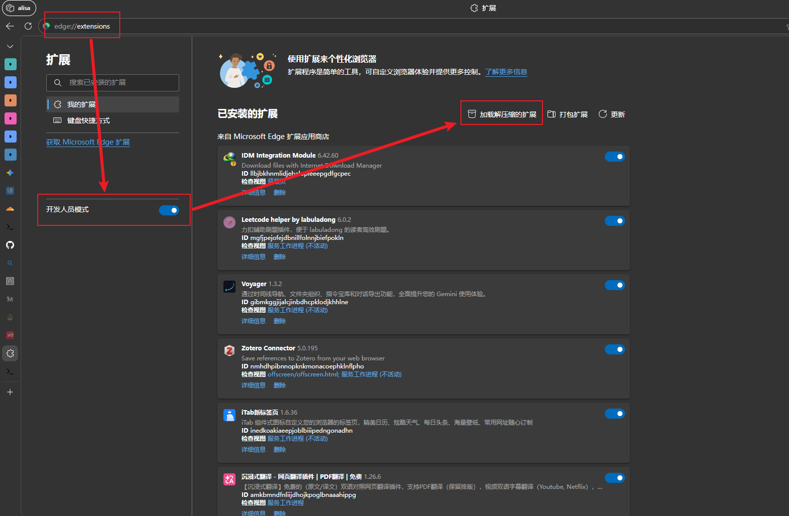

4. 选择你刚才解压/克隆的 `SelectEcho` 文件夹。
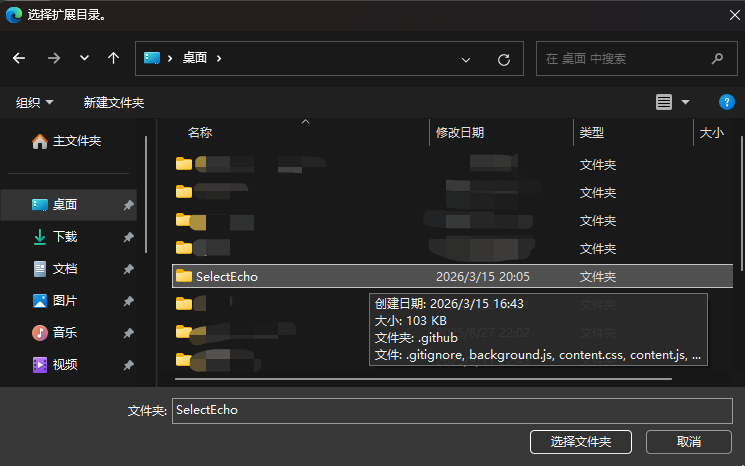

5. 确认扩展出现在列表中，状态为启用。
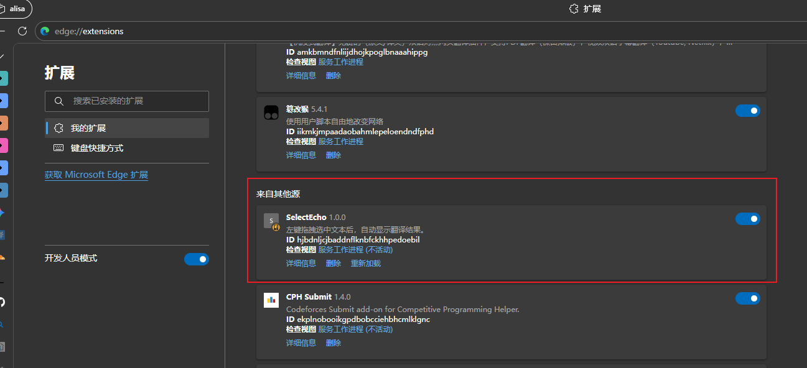

如果您 *有* [科学上网工具](https://congyu.moe/auth/register?invite=fc84dcfb89)，那么安装完成后，Google 翻译引擎应该能直接使用；如果没有，请跟着我继续往下看设置页配置百度翻译凭证的部分。

> 上面，似乎！有些奇怪的东西可以点击...

# 4. 配置百度翻译凭证（可选）

1. 打开 [百度翻译开放平台](https://fanyi-api.baidu.com/)，点击 管理控制台。
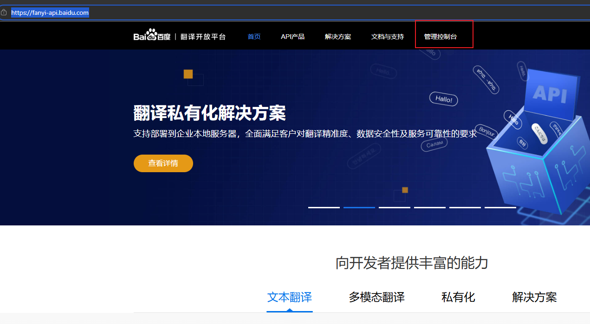

2. 在 总览处 注册成为 个人开发者。
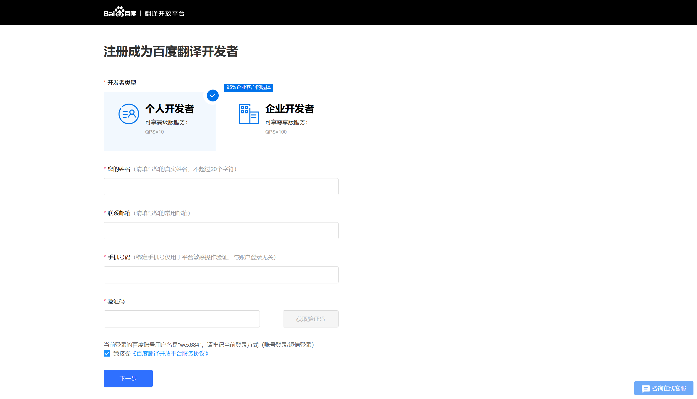

3. 启用 通用文本翻译 服务。
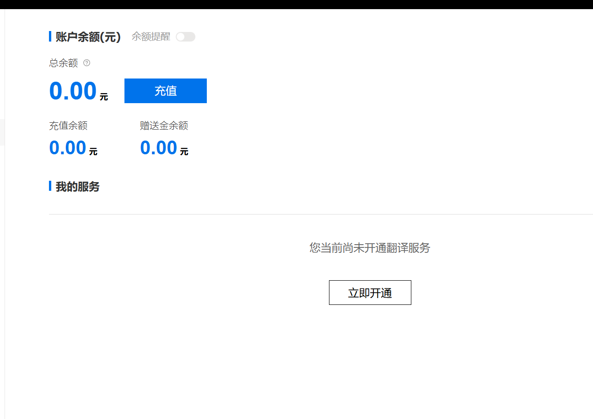
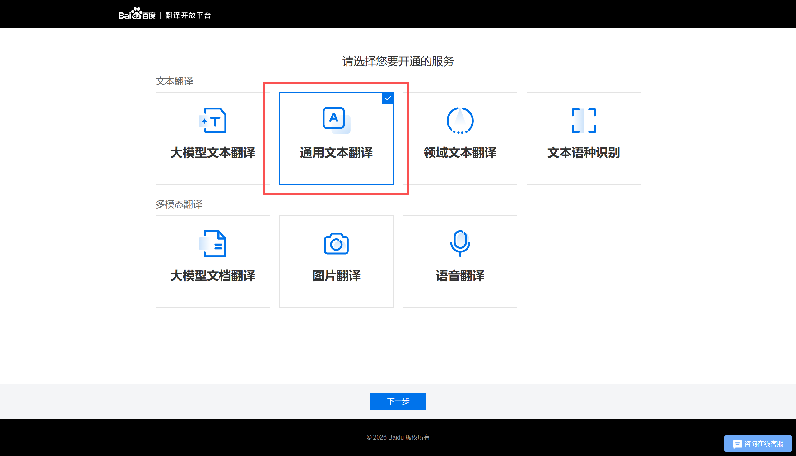

选择高级版即可，应用名称填写 「SelectEcho」，其他选项按需填写。
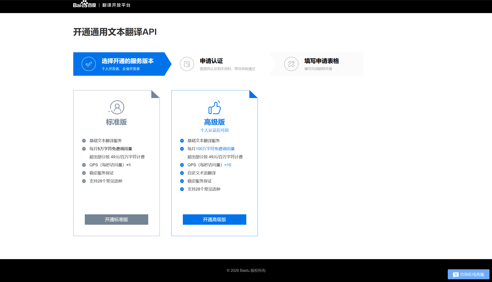

4. 创建完成后，在 开发者信息 处，找到 APP ID 和 密钥，复制到 SelectEcho 设置页对应输入框里。
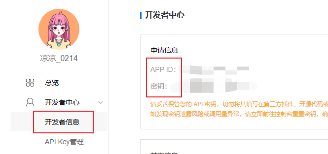

5. 打开设置页， 填写相关配置。

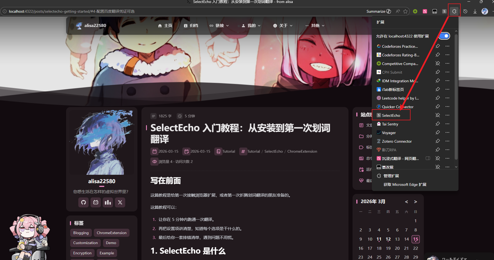

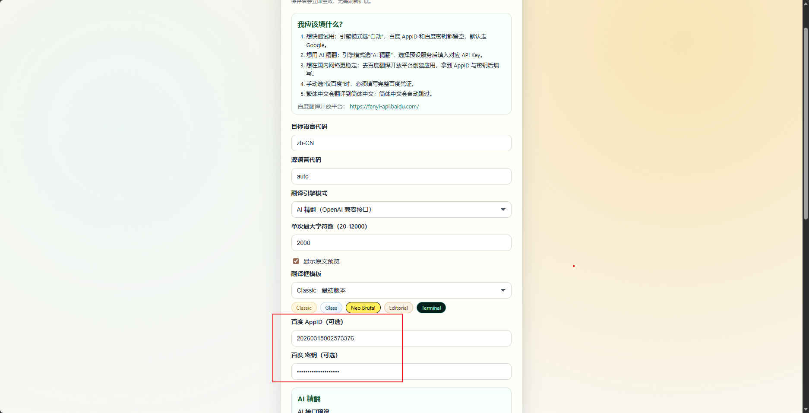

# 5. 配置

我们先追求「成功一次」，不要一上来就深挖所有参数。

## 5.1 选择测试页面

建议先用这些页面测试：

1. GitHub [en-README](https://github.com/2258009564/SelectEcho/blob/main/README_EN.md)。
2. [Wikipedia](https://wikimediafoundation.org/) 英文页面。
3. 纯文本技术文档页。

不建议第一站就去复杂 Web App（例如富交互编辑器页面），避免把问题混在一起。

## 5.2 触发动作

1. 在页面中用左键选中一段英文文本（至少 2 个字符）。
2. 松开左键。
3. 等待面板弹出。

你应该看到：

1. 译文内容。
2. 引擎状态（Google 或 Baidu）。
3. 可关闭按钮和复制按钮。

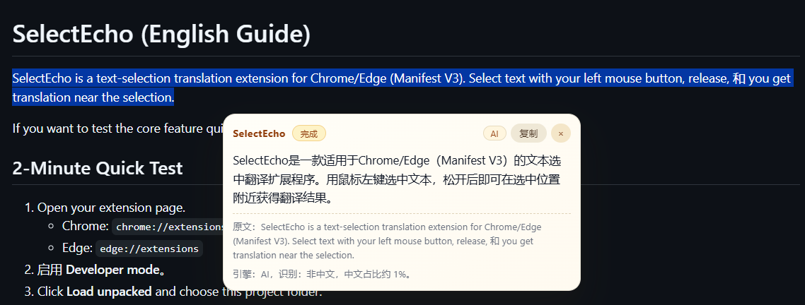
 
# 5. 设置页

打开设置页的方式：扩展图标 -> 选项（Options）。


下面是最常见配置项：

| 配置项 | 默认值 | 你要知道什么 |
| --- | --- | --- |
| `sourceLang` | `auto` | 源语言自动识别，绝大多数情况别改。 |
| `targetLang` | `zh-CN` | 目标语言，入门阶段建议保持简体中文。 |
| `engineMode` | `auto` | 核心开关：自动 / 仅百度 / 仅 Google。 |
| `maxChars` | `2000` | 单次翻译字符上限，太大可能更慢。 |
| `showSourceText` | `true` | 是否显示原文预览，嫌面板高可以关。 |
| `panelTheme` | `classic` | 翻译框样式主题，不影响翻译质量。 |
| `baiduAppId` | 空 | 百度凭证 App ID。 |
| `baiduAppKey` | 空 | 百度凭证密钥，和 App ID 成对使用。 |

# 6. 常见问题排查

## 6.1 安装成功但划词没反应

排查顺序：

1. 是否真的启用了扩展。
2. 是否在普通网页（不是受限页面）测试。
3. 是否用左键选中后松开。
4. 选区是否至少 2 个字符。

## 6.2 一直提示超时

先看你当前模式：

1. `google` 或 `auto`（无百度凭证）时，网络条件不稳定更容易超时。
2. 你可以切到 `baidu` 并填好凭证测试。

## 6.3 百度报错（例如凭证相关错误）

1. 检查 AppID 和 AppKey 是否都填写。
2. 检查是否有前后空格。
3. 保存后刷新测试页再试。

## 6.4 在输入框里为什么不触发
这是设计行为。`input`、`textarea`、可编辑区域默认不触发，避免干扰正常输入。


# 7. 进阶使用建议

## 7.1 配置 AI 翻译
等待更新中...

# 结语

到这里，你已经成功安装并使用了 SelectEcho 进行划词翻译。希望这个工具能成为你日常浏览和学习的好帮手！如果你有任何问题或者建议，欢迎在 GitHub 上提交 issue 或者参与讨论。祝你翻译愉快！