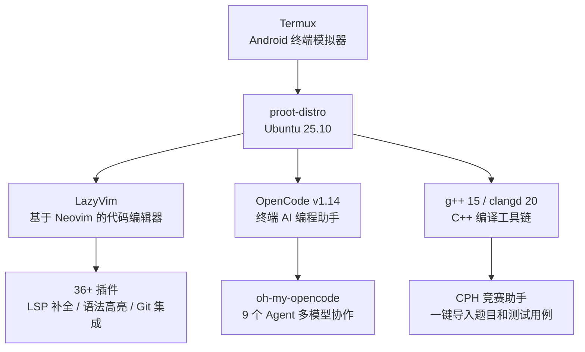

# 写在前面

在此之前，我在 android系统 上折腾开发环境这件事上也走了不少弯路。

最早是用 Termux 原生环境凑合，装个 Python 写点脚本就完了。后来发现 Termux 的包太旧、很多工具装不上，就开始折腾 proot-distro 装 Ubuntu。再后来觉得光有终端不够，得有个好用的编辑器，又折腾了 Vim → Neovim → LazyVim。最近又入了 AI 编程的坑，开始用 OpenCode。

折腾了一圈下来，现在这套环境我自己是比较满意的。写这篇文章的目的和搭建博客一样——把折腾过程记录下来，一方面给自己留个备份，另一方面如果有人也想在 android系统 上搞开发，可以直接参考。

# 1. 信息工作流总览

在正式开始之前，先来看看我们最终要搭建的环境长什么样，以及每个组件分别负责什么。理解了整体架构，后面的每一步操作你都会知道"这一步在干什么"。

## 1.1 整体架构



整个环境的工作方式是这样的：

1. **打开 Termux** → 自动进入 tmux（终端分屏工具）
2. **输入 `ubuntu`** → 登录 Ubuntu 25.10（完整的 Linux 环境）
3. **输入 `nvim`** → 打开 LazyVim（代码编辑器，有补全、高亮、Git 等功能）
4. **输入 `opencode`** → 启动 AI 编程助手（可以帮你写代码、调试、搜索文档）

这些工具在 tmux 里可以同时运行——左边写代码，右边让 AI 帮你分析问题。

## 1.2 每个组件是什么、为什么选它

### Termux

**是什么**：Termux 是一个 Android 终端模拟器。简单说，它让你在 android系统 上获得一个类似 Linux 命令行的环境——你可以输入命令、安装软件包、运行脚本。Android 本身基于 Linux 内核，但普通用户接触不到命令行。Termux 相当于在 Android 上打开了一扇通往 Linux 的门。

**为什么选它**：它是 Android 上唯一成熟的终端方案。虽然还有一些替代品（比如 UserLAnd、Andronix），但 Termux 有几个不可替代的优势：

- **包管理完善**：自带 `pkg` 包管理器，可以安装 Python、Node.js、Git、gcc 等数百个软件包
- **社区活跃**：遇到问题基本都能找到解决方案
- **和 proot-distro 配合最好**：proot-distro 是 Termux 官方维护的 Linux 发行版管理器

**从哪里下载**：F-Droid 或 GitHub Releases。**不要用 Google Play 版**——Google Play 上的版本已经停止更新很久了，缺少很多新功能和安全补丁。F-Droid 是一个专注于自由/开源软件的 Android 应用商店，Termux 在上面保持最新版本。如果你不方便安装 F-Droid 客户端，也可以直接去 GitHub Releases 页面下载 APK 文件。

> **下载地址**：
> - F-Droid：https://f-droid.org/packages/com.termux/
> - GitHub：https://github.com/termux/termux-app/releases （下载 `arm64-v8a` 版本的 APK，这是目前绝大多数 android系统 的架构）

### proot-distro + Ubuntu

**是什么**：proot-distro 是 Termux 官方的 Linux 发行版管理器，能在 Termux 里运行完整的 Ubuntu 系统。

**为什么不用 Termux 原生环境**：Termux 虽然提供了命令行，但它**不是完整的 Linux 发行版**。具体来说：

- 文件系统结构不同（Termux 用 `/data/data/com.termux/files/usr` 而不是标准的 `/usr`）
- 很多软件包版本太旧或者根本没有（比如 clangd 就装不了最新版）
- 编译工具链不完整（没有完整的 `build-essential`）
- proot-distro 安装的 Ubuntu 和电脑上的 Ubuntu 体验基本一致，你在电脑上怎么用 Ubuntu，在 android系统 上就怎么用

**proot 和虚拟机的区别**：这是一个很多人会混淆的概念。虚拟机（Virtual Machine）模拟一整套硬件环境——CPU、内存、磁盘，然后在上面运行一个完整的操作系统。这种方式非常消耗资源，在 android系统 上基本不可行。

proot 的工作方式完全不同。它只做了一层**路径翻译**：让 Ubuntu 里的程序以为自己运行在标准的 Linux 文件系统上（比如 `/usr/bin`、`/etc`），但实际上这些路径被翻译成了 Termux 可以访问的位置。没有硬件模拟，性能开销极小。

打个比方：虚拟机是"在一个城市里再造一个城市"，proot 是"给路牌贴上另一个城市名字的贴纸"。

当然，proot 也有局限性——因为它不模拟硬件，某些需要特殊内核功能的高级操作可能不支持（比如 Docker 就跑不了）。但对于日常开发和竞赛编程来说，完全够用。

### LazyVim

**是什么**：基于 Neovim 的代码编辑器预配置框架，装好就有代码补全、文件搜索、语法高亮、Git 集成等功能。

**编辑器演进史**：

```
vi (1976)          Unix 上最古老的终端编辑器，几乎所有 Unix/Linux 系统都自带
  ↓
Vim (1991)         vi 的增强版（Vi IMproved），功能更强但学习曲线陡峭
  ↓
Neovim (2015)      Vim 的现代化重写，支持 Lua 脚本、异步操作、更好的插件生态
  ↓
LazyVim (2023)     基于 Neovim 的预配置框架，装好即用的 IDE 体验
```

这条演进链上每一步都在解决上一步的痛点：

- **Vim 解决了 vi 的功能问题**：语法高亮、多级撤销、插件系统
- **Neovim 解决了 Vim 的架构问题**：用 Lua 替代 VimScript（更快、更现代），支持异步操作（Vim 里执行外部命令会卡住整个编辑器），内嵌终端模拟器
- **LazyVim 解决了 Neovim 的配置问题**：Neovim 默认配置非常简陋——没有文件树、没有代码补全、没有状态栏。想要让它好用，需要自己安装配置几十个插件。LazyVim 帮你搞定了这些，开箱就有 80% 的 VS Code 功能

**为什么不用 VS Code**：VS Code 需要图形界面， android系统 上跑不了。Neovim/LazyVim 在终端里运行，完美适配我们的场景。而且 Neovim 的键盘操作效率远高于鼠标操作 :spoiler[（存疑]。

### OpenCode

**是什么**：一个终端里的 AI 编程助手，类似于 Cursor / Copilot，但运行在终端中。你可以把它理解成"终端版的 ChatGPT，但它能看到你的代码、帮你修改代码、搜索文档、分析 bug"。

**为什么选它**：
- 完全在终端里运行，不依赖图形界面，在 Termux proot 环境下完美工作
- 支持多 Agent 协作（搜索文档、分析代码、架构咨询等可以并行）
- 通过 oh-my-opencode 社区插件可以接入多种 AI 模型（包括国产的智谱、通义等）

### 编译工具链

**g++ 15**：GCC C++ 编译器，支持 C++23 标准。你写的 C++ 代码需要经过编译才能运行，g++ 就是做这件事的。版本 15 支持几乎所有的现代 C++ 特性。

**clangd 20**：C/C++ 语言服务器，给 LazyVim 提供代码补全、错误检查、跳转定义等 IDE 功能。

> **什么是语言服务器（LSP）？** 
>传统 IDE（比如 VS Code、CLion）的代码分析功能是内置的——编辑器自己分析代码、提供补全。但这意味着每支持一种语言，编辑器就要写一套分析逻辑，非常低效。
>
> LSP（Language Server Protocol）改变了这个模式：它把"分析代码"这件事独立出来，交给一个专门的程序（语言服务器，比如 clangd 就是 C/C++ 的语言服务器）。编辑器通过统一的协议（LSP）和语言服务器通信。这样，任何支持 LSP 的编辑器都能获得任何语言的支持——只要那个语言有对应的语言服务器。
>
> 在我们的环境里：clangd 负责分析 C++ 代码 → 通过 LSP 协议告诉 LazyVim → LazyVim 显示补全菜单、错误提示、跳转定义。

## 1.3 最终环境版本信息

```
系统：Ubuntu 25.10 (Questing Quokka) aarch64（proot-distro）
内核：Linux 6.17.0-PRoot-Distro
编辑器：Neovim v0.12.1 + LazyVim
AI 助手：OpenCode v1.14.28 + oh-my-opencode
编译器：g++ (Ubuntu 15.2.0) 15.2.0
语言服务器：Ubuntu clangd version 20.1.8
Python：3.13.7
Git：2.51.0
tmux：3.5a
```

---

# 2. Termux 安装与配置

## 2.1 安装 Termux

从以下任一渠道下载（**不要用 Google Play 版**）：

- **F-Droid**：https://f-droid.org/packages/com.termux/
- **GitHub Releases**：https://github.com/termux/termux-app/releases （下载 `arm64-v8a` 版本的 APK）

安装后打开 Termux，你会看到一个黑色的命令行界面。这就是你的终端了。

**第一步：更新包管理器**。Termux 自带一个叫 `pkg` 的包管理器（类似 Ubuntu 的 `apt`），用来安装、更新、卸载软件。和 android系统 应用商店一个道理——先用之前要更新一下软件列表：

```bash
pkg update && pkg upgrade -y
```

- `pkg update`：从服务器获取最新的软件包列表（不实际安装任何东西，只是更新"有哪些软件可以装"的信息）
- `pkg upgrade`：升级所有已安装的软件包到最新版本
- `-y`：自动确认，不用你一个个按回车
- `&&`：前一个命令成功后才执行后一个命令

> **Termux 的文件系统在哪？** Termux 的所有文件都在 Android 的私有数据目录下，具体路径是 `/data/data/com.termux/files/`。其中：
> - `home/` → 用户主目录（`~` 指向这里），路径是 `/data/data/com.termux/files/home`
> - `usr/` → 系统程序和库文件，相当于标准 Linux 的 `/usr`
>
> 这个目录结构意味着 Termux 不需要 root 权限——它完全在自己的沙盒里运行。但这也意味着它和标准 Linux 的路径不完全一样，某些软件会出问题。这就是为什么我们需要 proot-distro 来提供一个标准化的 Linux 环境。

## 2.2 安装基础工具

```bash
pkg install -y proot-distro git
```

- **`proot-distro`**：Termux 官方的 Linux 发行版管理器。它的工作原理是：下载一个 Linux 发行版的根文件系统（rootfs），然后用 proot 技术让这个文件系统在 Termux 里运行起来。支持 Ubuntu、Debian、Arch Linux、Alpine 等多种发行版，我们选 Ubuntu 是因为它生态最好、资料最多。
- **`git`**：版本控制工具。后面安装 LazyVim 插件时，lazy.nvim 会用 git 从 GitHub 下载插件代码。没有 git，整个插件系统都跑不起来。

## 2.3 Termux 配置

Termux 的配置文件位于 `~/.termux/termux.properties`。`~` 在 Termux 里代表 `/data/data/com.termux/files/home`。`.termux` 目录默认可能不存在，需要手动创建：

```bash
mkdir -p ~/.termux
```

然后创建或编辑配置文件：

```properties
# 允许外部应用调用 Termux 执行命令
# 开启后可以在 LazyVim 里用 termux-open 命令通过 Android 默认应用打开文件
# 比如在 Neovim 里打开一个 PDF，可以直接用 Android 的 PDF 阅读器查看
allow-external-apps = true
```

修改后运行 `termux-reload-settings` 让配置生效。这个命令告诉 Termux 重新读取配置文件，不需要重启 App。

## 2.4 Termux 宿主环境的 bashrc

在 Termux **宿主环境**（不是 Ubuntu 里面）的 `~/.bashrc` 中，我们需要配置两个东西：快捷登录 Ubuntu 的别名，以及自动启动 tmux。

`.bashrc` 是 bash Shell 的配置文件。每次打开新的终端窗口（或者 Termux 启动时），bash 会自动读取并执行这个文件里的所有命令。所以我们可以把想要"每次打开终端自动执行"的命令放在这里。

```bash
# 快捷登录 Ubuntu
alias ubuntu='proot-distro login ubuntu'

# 自动启动 tmux
[[ -z $TMUX ]] && exec tmux
```

逐行解释：

- **`alias ubuntu='proot-distro login ubuntu'`**：`alias` 是 bash 的内置命令，用来创建命令别名。这条命令的意思是：以后输入 `ubuntu`，就等于输入 `proot-distro login ubuntu`。省去了每次都要打一长串命令的麻烦。

- **`[[ -z $TMUX ]] && exec tmux`**：这是一条条件执行命令。
  - `[[ -z $TMUX ]]` 检查环境变量 `$TMUX` 是否为空。在 tmux 里运行时，这个变量会被自动设置为 tmux 的 socket 路径，所以不为空。不在 tmux 里时，这个变量不存在，为空。
  - `&&` 表示"前面条件成立时才执行后面"。
  - `exec tmux` 启动 tmux，并且用 tmux 进程**替换**当前 Shell 进程（`exec` 的作用）。这样退出 tmux 时就会直接退出 Termux，而不是回到原始 Shell。
  - 整句的意思：如果不在 tmux 里，就自动启动 tmux。

这样每次打开 Termux 就自动进入 tmux，输入 `ubuntu` 就进入 Ubuntu 环境。

---

# 3. Ubuntu 环境配置

## 3.1 安装 Ubuntu

```bash
proot-distro install ubuntu
```

这条命令做了这几件事：

1. 从 GitHub 下载 Ubuntu 的根文件系统压缩包（rootfs，大约 100-200MB）
2. 解压到 `/data/data/com.termux/files/usr/var/lib/proot-distro/installed-rootfs/ubuntu/`
3. 做一些初始化配置（设置用户、时区等）

安装完成后登录：

```bash
ubuntu
```

（因为我们在 Termux 的 `.bashrc` 里设置了 `alias ubuntu='proot-distro login ubuntu'`，所以直接输入 `ubuntu` 就行。）

命令提示符变成 `root@localhost:~#` 就说明进入了 Ubuntu。注意这里的 `root` 是超级用户——在 proot 环境下你始终是 root，因为 proot 没有真正的用户权限隔离。

验证一下：

```bash
$ cat /etc/os-release
PRETTY_NAME="Ubuntu 25.10"
VERSION="25.10 (Questing Quokka)"
```

`cat` 命令用来查看文件内容。`/etc/os-release` 是 Linux 系统存储版本信息的标准位置。

> **proot 里的路径映射**：在 proot Ubuntu 里，你看到的路径是标准的 Linux 路径（`/root`、`/usr/bin` 等）。但实际上这些路径被映射到了 Termux 的存储空间里。比如你在 Ubuntu 里的 `/root/hello.cpp`，在 Android 系统看来实际路径是 `/data/data/com.termux/files/usr/var/lib/proot-distro/installed-rootfs/ubuntu/root/hello.cpp`。这个映射关系在后面配置 LazyVim 的 Termux 专属快捷键时会用到。

## 3.2 更新系统

```bash
apt update && apt upgrade -y
```

和 Termux 的 `pkg update` 类似，`apt`（Advanced Package Tool）是 Ubuntu 的包管理器。

- `apt update`：从 Ubuntu 官方服务器获取最新的软件包列表
- `apt upgrade`：升级所有已安装的软件包
- `-y`：自动确认

## 3.3 安装开发工具

```bash
apt install -y \
    build-essential \
    g++ \
    gcc \
    clangd \
    git \
    curl \
    wget \
    python3 \
    python3-pip \
    tmux \
    neovim
```

这里每个包都有它的用途，有些可能不是显而易见的，我来详细解释：

| 包名 | 作用 | 详细说明 |
|------|------|---------|
| `build-essential` | 编译基础工具集 | 这是一个元包（meta package），安装它会自动安装 `make`、`gcc`、`g++`、`dpkg-dev` 等编译 C/C++ 程序必需的工具。不装这个的话，很多第三方软件编译时会报错找不到编译器 |
| `g++` | C++ 编译器 | GNU C++ 编译器，把 C++ 源代码翻译成可执行程序。支持 C++23 标准。虽然 `build-essential` 会装一个版本的 g++，但显式声明确保版本正确 |
| `gcc` | C 编译器 | GNU C 编译器。某些工具的编译过程需要 C 编译器 |
| `clangd` | C/C++ 语言服务器 | 提供代码补全、错误检查、跳转定义、代码重命名等 IDE 功能。这是我们整个开发环境的核心——没有它，LazyVim 就只是个文本编辑器，不会有任何智能提示 |
| `git` | 版本控制工具 | lazy.nvim 用 git 下载插件；你自己做项目管理也需要它 |
| `curl` / `wget` | 命令行下载工具 | 后面安装 OpenCode、下载脚本时都会用到。两个功能类似但各有优势，都装上没错 |
| `python3` | Python 解释器 | 很多 Neovim 插件依赖 Python（比如部分 Treesitter 功能） |
| `python3-pip` | Python 包管理器 | 安装 Python 第三方库用的 |
| `tmux` | 终端复用器 | 在 Ubuntu 里面也需要 tmux（虽然 Termux 宿主环境已经有了，但 Ubuntu 里的 tmux 是独立的） |
| `neovim` | 代码编辑器 | LazyVim 的运行基础。LazyVim 不是独立的程序，它是一组 Neovim 配置文件 |

## 3.4 安装增强工具（可选但推荐）

这些工具不是必需的，但能显著改善日常使用体验。每一个都是某个传统 Linux 工具的现代化替代品——更快、更好看、功能更强。

```bash
apt install -y \
    bat \
    eza \
    fzf \
    fd-find \
    ripgrep \
    jq \
    nala \
    fastfetch \
    glow
```

| 工具 | 作用 | 替代了什么 | 举个例子 |
|------|------|-----------|---------|
| `bat` | 带语法高亮和行号的文件查看器 | `cat` | `bat main.cpp` 会显示带行号和语法高亮的代码 |
| `eza` | 带图标和颜色的文件列表 | `ls` | `eza` 显示文件时会用不同颜色区分类型，目录带 `/` 标记 |
| `fzf` | 模糊搜索工具 | — | 在历史命令中搜索、在文件中搜索，不用记精确名字 |
| `fd-find` | 更快更友好的文件搜索 | `find` | `fd "\.cpp$"` 找所有 C++ 文件，比 `find -name "*.cpp"` 快得多 |
| `ripgrep` | 更快的文本内容搜索 | `grep` | `rg "solve"` 搜索所有文件中包含 `solve` 的行 |
| `jq` | JSON 数据处理 | — | 后面查看 OpenCode 配置时可以用 `jq` 格式化 JSON |
| `nala` | 更好看的 apt 前端 | `apt` | `nala install xxx` 比 `apt install xxx` 显示更清晰 |
| `fastfetch` | 显示系统信息面板 | `neofetch` | 终端里显示系统 logo 和版本信息 |
| `glow` | 终端 Markdown 渲染 | — | `glow README.md` 在终端里渲染 Markdown |

> **为什么 Ubuntu 里有些工具名字不一样？** 比如 `fd-find` 装上之后命令叫 `fdfind`，`bat` 装上之后叫 `batcat`。这是因为 Ubuntu 仓库里这些名字已经被其他软件占了。我们在 bashrc 里用 `alias` 把它们改回熟悉的名字。

## 3.5 验证安装

安装完所有工具后，验证一下每个关键工具是否安装成功：

```bash
g++ --version       # 期望输出：g++ (Ubuntu 15.2.0) 15.2.0
clangd --version    # 期望输出：Ubuntu clangd version 20.1.8
git --version       # 期望输出：git version 2.51.0
python3 --version   # 期望输出：Python 3.13.7
nvim --version      # 期望输出：NVIM v0.12.1
```

版本号不完全一样也没关系，只要能正常输出版本信息就说明安装成功了。如果某个命令报 `command not found`，说明那个包没装上，重新运行 `apt install` 即可。

## 3.6 Shell 配置详解（~/.bashrc）

> **什么是 `.bashrc`？** bash 是 Ubuntu 默认的命令行程序（Shell），`.bashrc` 是它的配置文件。每次打开新的命令行窗口，bash 会自动读取并执行这个文件里的所有命令。你可以把它理解成 bash 的"启动脚本"——你希望每次打开终端时自动生效的设置，都写在这里。

```bash
nano ~/.bashrc
```

`nano` 是一个简单易用的终端文本编辑器。打开后可以直接编辑，`Ctrl+O` 保存，`Ctrl+X` 退出。当然你也可以用后面装好的 Neovim (`nvim ~/.bashrc`)，但 nano 更适合新手。

下面是我的完整 `~/.bashrc`，逐段讲解。

### 历史记录优化

```bash
# 去除重复的历史命令
export HISTCONTROL=ignoredups:erasedups
# 历史记录最多保存 10000 条
export HISTSIZE=10000
# 历史文件最多保存 20000 条
export HISTFILESIZE=20000
# 多个终端窗口的历史记录合并（而不是互相覆盖）
shopt -s histappend
# 每次显示命令提示符前，自动保存和刷新历史记录
PROMPT_COMMAND="history -a; history -c; history -r;$PROMPT_COMMAND"
```

默认情况下 bash 的历史记录非常简陋——只保存 500 条、多终端会互相覆盖。这些配置让历史更好用：

- **`HISTCONTROL=ignoredups:erasedups`**：`ignoredups` 表示连续重复的命令只记录一次（比如你连按三次 `ls`，只记一次）。`erasedups` 表示即使不连续的重复命令也只保留最新的那次。
- **`HISTSIZE=10000`**：当前会话在内存里保存的历史命令条数。默认 500 太少了，经常找不到之前用过的命令。
- **`HISTFILESIZE=20000`**：写入磁盘文件 `~/.bash_history` 的最大条数。
- **`shopt -s histappend`**：`shopt` 是 bash 的内置命令，用来设置 Shell 可选行为（Shell Options）。`-s` 表示开启，`histappend` 是选项名——开启后，退出 Shell 时历史记录会**追加**到文件末尾而不是覆盖文件。这是多终端历史合并的关键。
- **`PROMPT_COMMAND`**：这是 bash 的一个特殊变量。它的值会在每次显示命令提示符之前执行。我们设置的值做了三件事：
  - `history -a`：把当前会话的新命令追加到历史文件
  - `history -c`：清空内存中的历史
  - `history -r`：从历史文件重新读取
  - 效果：每个终端窗口都能看到其他窗口输入过的命令，实时同步

### 基础环境变量

```bash
# 默认编辑器设为 micro（一个简单好用的终端编辑器）
export EDITOR=micro
export VISUAL=micro
# 开启 256 色支持（让终端能显示更多颜色）
export TERM=xterm-256color
# 把 ~/.local/bin 目录加入命令搜索路径
export PATH="$HOME/.local/bin:$PATH"
```

> **什么是环境变量？** 环境变量是操作系统级别的"全局设置"，所有程序都能读取。你可以用 `echo $变量名` 查看当前值，比如 `echo $PATH`。
>
> `PATH` 是最重要的环境变量之一。它是一串用冒号分隔的目录路径，告诉系统"当用户输入一个命令时，去哪些目录找这个命令对应的程序"。比如你输入 `g++`，系统会依次搜索 PATH 里的每个目录，直到找到 `g++` 这个可执行文件。
>
> `$HOME` 代表用户主目录，在 Ubuntu proot 里是 `/root`。

- **`EDITOR` / `VISUAL`**：有些程序（比如 git commit）需要调用编辑器让你输入文本，这两个变量指定默认编辑器。`micro` 是一个类似 Windows 记事本操作的终端编辑器——可以用方向键移动、可以用 Ctrl+C/V 复制粘贴，对新手很友好。
- **`TERM=xterm-256color`**：告诉终端模拟器支持 256 种颜色。很多程序（比如 LazyVim、bat、eza）会用不同颜色显示信息，需要这个设置才能正确显示。
- **`PATH="$HOME/.local/bin:$PATH"`**：把 `~/.local/bin` 加到 PATH 的最前面。有些用户级程序（比如 pip 安装的 Python 工具）会装在这个目录下，不加 PATH 的话系统找不到它们。`$PATH` 在这里引用原有的 PATH 值，所以不是替换而是追加。

### 彩色命令提示符（带 Git 分支显示）

```bash
# 定义一个函数：获取当前 git 仓库的分支名
__ps1_git_branch() {
  local branch
  branch=$(git symbolic-ref --short HEAD 2>/dev/null)
  if [ -n "$branch" ]; then
    echo " ($branch)"
  fi
}
# root 用户：红色提示符
if [ "$(id -u)" -eq 0 ]; then
  PS1='\[\033[1;31m\][\u@\h \w]$( __ps1_git_branch )\[\033[0m\]# '
else
  PS1='\[\033[1;32m\][\u@\h \w]$( __ps1_git_branch )\[\033[0m\]$ '
fi
```

这段配置做了两件事：定义一个获取 Git 分支名的函数，然后根据用户身份设置不同颜色的提示符。

**`__ps1_git_branch` 函数**：

- `git symbolic-ref --short HEAD`：获取当前 Git 仓库的分支名。`HEAD` 是 Git 的一个指针，指向当前所在的提交。`symbolic-ref` 让它输出分支名而不是提交哈希。`2>/dev/null` 把错误信息丢弃（不在 Git 仓库里时这个命令会报错，但我们不需要看到错误）。
- `if [ -n "$branch" ]`：如果 `branch` 变量非空（即在 Git 仓库里），就输出 ` (分支名)`。注意前面的空格。

**`PS1` 变量**：

`PS1`（Prompt String One）是 bash 的提示符格式变量。它定义了你在终端里看到的 `[root@localhost ~/project] (main)#` 这行文字。

里面的特殊转义序列：

| 转义 | 含义 | 示例 |
|------|------|------|
| `\u` | 当前用户名 | `root` |
| `\h` | 主机名 | `localhost` |
| `\w` | 当前目录（完整路径，`~` 代替主目录） | `~/project` |
| `\[\033[1;31m\]` | 开始红色加粗 | — |
| `\[\033[1;32m\]` | 开始绿色加粗 | — |
| `\[\033[0m\]` | 恢复默认颜色 | — |
| `$( __ps1_git_branch )` | 命令替换：执行函数并插入输出 | ` (main)` |
| `#` 或 `$` | root 用户显示 `#`，普通用户显示 `$` | — |

`$(id -u)` 返回当前用户的数字 ID。root 的 ID 是 0。所以 `if [ "$(id -u)" -eq 0 ]` 判断当前是否为 root——是则用红色提示符（醒目，提醒你正在用超级权限），否则用绿色。

### 实用别名

```bash
# 文件列表（用 eza 替代 ls）
alias ls='eza --icons=auto'
alias ll='eza -la --icons=auto --group-directories-first'
alias la='eza -a --icons=auto'
alias lt='eza --tree --icons=auto --level=2'

# 文件查看（用 bat 替代 cat）
alias cat='batcat --style=plain'
alias bat='batcat'

# 搜索高亮
alias grep='grep --color=auto'
alias fgrep='fgrep --color=auto'
alias egrep='egrep --color=auto'

# 显示优化
alias df='df -h'       # 磁盘用量用人类可读格式
alias du='du -h'       # 文件大小用人类可读格式
alias free='free -h'   # 内存用量用人类可读格式

# 快捷键
alias cls='clear'
alias ..='cd ..'
alias ...='cd ../..'
alias h='history'
alias ports='ss -tlnp'
alias path='echo $PATH | tr ":" "\n"'

# 包管理（用 nala 替代 apt）
alias update='nala update && nala upgrade -y'
alias install='nala install -y'
alias remove='nala remove -y'
alias search='nala search'
alias show='nala show'
alias nala-history='nala history'

# 工具别名
alias vim='micro'
alias vi='micro'
alias nd='nano'
alias f='fzf'
alias rg='ripgrep'
alias fd='fdfind'
alias ff='fastfetch'
alias j='jq'
alias md='glow -p -w 80'
alias weather='curl wttr.in'

# 安全别名（防止手滑删东西）
alias rm='rm -I'
alias cp='cp -i'
alias mv='mv -i'
```

> **什么是别名（alias）？** 就是给长命令起一个短名字。比如 `alias ls='eza --icons=auto'` 之后，输入 `ls` 实际运行的是 `eza --icons=auto`。别名只在当前会话生效——但因为写在 `.bashrc` 里，每次开终端都会自动设置，所以等同于永久生效。

几个值得注意的别名：

- **`alias cat='batcat --style=plain'`**：把 `cat` 命令重定向到 `batcat`（Ubuntu 里 bat 的实际命令名）。`--style=plain` 让 bat 不显示行号和边框，保持和 cat 一样的简洁输出。如果你想看带行号的版本，用 `bat 文件名`。
- **`alias rm='rm -I'`**：Linux 的 `rm` 删除文件后**无法恢复**（没有回收站）。`-I` 参数会在删除超过 4 个文件或递归删除时要求确认。比 `-i`（每次都确认）安静，但比裸 `rm` 安全。
- **`alias cp='cp -i'` 和 `alias mv='mv -i'`**：`-i` 表示如果目标文件已存在，覆盖前会询问确认。
- **`alias weather='curl wttr.in'`**：一个有趣的别名——在终端里看天气预报。`wttr.in` 是一个返回天气预报文本的网站。

### fzf 集成

```bash
# 如果安装了 fzf，启用它的 shell 集成
if command -v fzf &>/dev/null; then
  eval "$(fzf --bash)"
fi
```

这段代码做了两件事：

1. **检查 fzf 是否安装**：`command -v fzf` 会在 PATH 中查找 `fzf` 命令，找不到则返回空。`&>/dev/null` 把输出和错误都丢弃。`if` 判断命令是否执行成功（找到返回 0，即真）。
2. **启用 shell 集成**：`eval "$(fzf --bash)"` 这个模式在 Linux 配置中非常常见。`fzf --bash` 会输出一段 bash 代码（定义快捷键绑定和补全函数），`$()` 是命令替换——把输出捕获为字符串，然后 `eval` 执行这段代码。效果是注册了两个快捷键：
   - **`Ctrl+R`**：模糊搜索历史命令。输入关键字就能找到之前用过的命令
   - **`Ctrl+T`**：模糊搜索当前目录下的文件路径，选中后插入到命令行

### 登录静音

```bash
export MOTD_SHOWN=plop
```

`MOTD`（Message of the Day）是 Linux 系统在登录时显示的欢迎信息和系统公告。在 proot 环境下这些信息没什么用，设置这个变量告诉系统"已经显示过了"，跳过这些输出。

## 3.7 tmux 终端复用器配置

### 什么是 tmux？

tmux（Terminal Multiplexer，终端复用器）是一个极其重要的工具，尤其在 android系统 上。它提供三个核心能力：

1. **分屏**：一个终端窗口里同时显示多个面板。 android系统 屏幕小，分屏让你左边写代码右边看输出
2. **后台运行**：关掉终端窗口（或者切到别的 App）后程序还在跑。这对 android系统 尤其重要——Android 可能随时杀掉后台 App，tmux 会保护你的工作不会丢失
3. **多窗口**：创建多个"标签页"，在 nvim、终端、opencode 之间快速切换

### tmux 基本概念

tmux 的层级结构是这样的：

```
┌─────────────────────────────────────────┐
│ tmux 会话 (Session)                      │
│ ┌─────────────────┬───────────────────┐ │
│ │ 窗口 0          │ 窗口 1            │ │
│ │ ┌──────┬──────┐ │                   │ │
│ │ │窗格 1│窗格 2│ │  窗格 3           │ │
│ │ │ nvim │终端   │ │  opencode        │ │
│ │ └──────┴──────┘ │                   │ │
│ └─────────────────┴───────────────────┘ │
└─────────────────────────────────────────┘
```

- **会话 (Session)**：tmux 的最外层容器。一个会话可以包含多个窗口。会话可以"分离"（detach）——即使你关掉终端，会话仍在后台运行，下次可以重新连接
- **窗口 (Window)**：会话里的"标签页"。每个窗口占满整个终端屏幕，可以在窗口之间切换
- **窗格 (Pane)**：窗口里的一个分屏区域。一个窗口可以分成多个窗格，每个窗格运行独立的程序

在我的日常使用中，典型布局是：窗口 0 里左右分屏，左边跑 LazyVim 写代码，右边跑 OpenCode 做 AI 辅助。

### 完整配置（~/.tmux.conf）

tmux 的配置文件是 `~/.tmux.conf`：

```bash
# 鼠标支持（滑动选中、右键粘贴、拖动调整窗格大小）
set -g mouse on

# Alt+方向键：交换窗格位置
bind-key -n M-Left swap-pane -s '{left-of}'
bind-key -n M-Right swap-pane -s '{right-of}'
bind-key -n M-Up swap-pane -s '{up-of}'
bind-key -n M-Down swap-pane -s '{down-of}'

# Alt+h/j/k/l：切换窗格焦点（不用按 prefix 键）
bind-key -n M-h select-pane -L
bind-key -n M-l select-pane -R
bind-key -n M-k select-pane -U
bind-key -n M-j select-pane -D
```

**逐行解释**：

- **`set -g mouse on`**：`-g` 表示全局设置（对所有 tmux 会话生效）。开启鼠标支持后可以点击切换窗格、滑动滚动、拖动调整窗格大小。** android系统 上必须开**——没有鼠标你没法方便地操作窗格。
- **`bind-key -n M-h select-pane -L`**：
  - `bind-key`：绑定快捷键
  - `-n`：不需要先按 tmux 的 prefix 键（默认 `Ctrl+B`），直接按就行
  - `M-h`：`M` 代表 Meta 键（大多数键盘上是 `Alt`），所以是 `Alt+H`
  - `select-pane -L`：选择左边的窗格。`-L`/`-R`/`-U`/`-D` 分别是左/右/上/下
  - `hjkl` 是 Vim 风格的方向键：h=左、j=下、k=上、l=右。这是 Vim 用户的标准约定
- **`swap-pane`**：交换两个窗格的位置。比如 `swap-pane -s '{left-of}'` 把当前窗格和左边的窗格交换位置。这在调整布局时很有用。

### tmux 常用操作速查

| 操作 | 快捷键 | 说明 |
|------|--------|------|
| 左右分屏 | `Ctrl+B` 然后 `%` | 左右分出两个窗格 |
| 上下分屏 | `Ctrl+B` 然后 `"` | 上下分出两个窗格 |
| 切换窗格 | `Alt+h/j/k/l` | 我配置的，直接切换 |
| 交换窗格 | `Alt+方向键` | 直接交换 |
| 关闭窗格 | `Ctrl+B` 然后 `x` | 会问你是否确认 |
| 新建窗口 | `Ctrl+B` 然后 `c` | 创建新标签页 |
| 切换窗口 | `Ctrl+B` 然后 `0-9` | 切换到编号为 0-9 的窗口 |
| 退出保持后台 | `Ctrl+B` 然后 `d` | 程序继续在后台运行 |
| 恢复后台会话 | `tmux attach` | 重新连接 |

> **`Ctrl+B` 是 tmux 的 prefix 键**：tmux 的快捷键都需要先按 `Ctrl+B`，松开，再按下一个键。这是为了防止和其他程序的快捷键冲突。但我配置的 `Alt+hjkl` 和 `Alt+方向键` 用了 `-n` 参数，所以不需要按 prefix，直接按就行。

## 3.8 PATH 配置（~/.profile）

```bash
# 加载 .bashrc
if [ "$BASH" ]; then
  if [ -f ~/.bashrc ]; then
    . ~/.bashrc
  fi
fi

# 把 OpenCode 的安装目录加到 PATH 最前面
export PATH=/root/.opencode/bin:$PATH
```

`.profile` 和 `.bashrc` 的区别：

- **`.profile`**：只在**登录时**执行一次。适合放环境变量、PATH 设置等不需要重复执行的配置
- **`.bashrc`**：每次打开**新的 bash 窗口**都会执行。适合放别名、函数、提示符等需要每次生效的配置

把 PATH 设置放在 `.profile` 里更合适，因为只需要设一次。后面安装的 OpenCode 会放在 `/root/.opencode/bin/`，加了 PATH 后在任何位置输入 `opencode` 就能启动。

---

# 4. OpenCode AI 编程助手

## 4.1 安装

```bash
mkdir -p ~/.opencode/bin
curl -fsSL https://opencode.ai/install.sh | bash -s -- --install-dir ~/.opencode/bin
```

逐个参数解释：

- `mkdir -p`：创建目录（`-p` 表示如果父目录不存在也自动创建，如果目录已存在不报错）
- `curl -fsSL`：
  - `-f`：失败时不输出 HTML 错误页面（只返回错误码）
  - `-s`：静默模式，不显示下载进度条
  - `-S`：配合 `-s` 使用，发生错误时仍然显示错误信息
  - `-L`：跟随 HTTP 重定向（如果下载地址变了，自动跳到新地址）
- `| bash`：管道符 `|` 把 curl 下载的脚本内容传给 bash 执行
- `--install-dir ~/.opencode/bin`：传给安装脚本的参数，指定安装目录

> **安全提示**：`curl ... | bash` 这种模式会直接执行从网络下载的脚本。如果你不放心，可以先下载脚本查看内容再执行：`curl -fsSL https://opencode.ai/install.sh -o install.sh && cat install.sh && bash install.sh --install-dir ~/.opencode/bin`

验证安装：

```bash
$ opencode --version
1.14.28
```

## 4.2 主配置文件

配置文件位于 `~/.opencode/opencode.jsonc`：

```jsonc
{
  // JSON Schema，让编辑器提供自动补全
  "$schema": "https://opencode.ai/config.json",

  // 加载的插件列表
  "plugin": [
    "oh-my-opencode"  // 社区增强插件，提供多 Agent 能力
  ],

  // 模式配置
  "mode": {
    "build": {
      // build 模式的系统提示词
      "prompt": "你必须始终使用中文（简体中文）回复用户。所有解释、总结、提问、回答、代码注释说明都必须用中文书写。代码本身保持英文。"
    }
  }
}
```

逐个字段解释：

- **`"$schema"`**：JSON Schema 是一个用来描述 JSON 数据结构的规范。设置这个 URL 后，支持 JSON Schema 的编辑器（包括 LazyVim）会在你编辑这个文件时提供自动补全和语法检查——输入 `"` 时会提示你可以写哪些字段。
- **`"plugin": ["oh-my-opencode"]`**：插件列表。`oh-my-opencode` 是一个社区开发的增强插件，它为 OpenCode 添加了多个专门的 AI Agent（后面会详细介绍），让它们能并行协作处理复杂任务。没有这个插件，OpenCode 只有一个基础的聊天功能。
- **`"mode.build.prompt"`**：系统提示词（System Prompt）。`build` 是 OpenCode 的主要工作模式，这段提示词会在每次对话开始时发送给 AI，设定它的行为准则。我们要求它用中文回复，代码保持英文。

> **什么是 .jsonc？** `.jsonc` 是 JSON with Comments（允许写 `//` 注释的 JSON）。标准 JSON 不允许注释，但很多配置文件需要注释来解释设置项。OpenCode 支持这种格式，LazyVim 的很多配置文件也支持。

## 4.3 Agent 配置

oh-my-opencode 的配置文件在 `~/.config/opencode/oh-my-openagent.json`：

```json
{
  "$schema": "https://raw.githubusercontent.com/code-yeongyu/oh-my-opencode/master/assets/oh-my-opencode.schema.json",
  "google_auth": true,
  "agents": {
    "sisyphus": {
      "model": "zhipuai-coding-plan/glm-5-turbo"
    },
    "librarian": {
      "model": "zhipuai-coding-plan/glm-4.7"
    },
    "explore": {
      "model": "zhipuai-coding-plan/glm-4.7"
    },
    "oracle": {
      "model": "zhipuai-coding-plan/glm-4.7"
    },
    "frontend-ui-ux-engineer": {
      "model": "zhipuai-coding-plan/glm-4.7"
    },
    "document-writer": {
      "model": "zhipuai-coding-plan/glm-3.7"
    },
    "multimodal-looker": {
      "model": "zhipuai-coding-plan/glm-4.7"
    },
    "atlas": {
      "model": "zhipuai-coding-plan/glm-4.7"
    },
    "Hephaestus": {
      "model": "zhipuai-coding-plan/glm-4.7"
    }
  }
}
```

**`google_auth: true`**：启用 Google 认证。某些 AI 模型提供商需要 OAuth 认证才能使用。

### 每个 Agent 的职责

OpenCode 的 Agent 系统就像一个开发团队，每个 Agent 有自己的专长：

| Agent | 职责 | 比喻 | 什么时候会用到 |
|-------|------|------|--------------|
| **sisyphus** | 总指挥，理解需求、拆分任务、协调其他 Agent | 项目经理 | 你提出一个复杂需求时，它负责分析并分配给合适的 Agent |
| **librarian** | 搜索外部文档、查找开源项目示例 | 图书管理员 | "React 的 useEffect 怎么用？"、"帮我找个 JWT 认证的实现示例" |
| **explore** | 搜索本地代码库，找函数、模式、文件 | 代码助手 | "这个项目里 auth 中间件在哪？"、"找所有使用 useState 的地方" |
| **oracle** | 回答复杂架构设计问题、疑难 bug 分析 | 资深技术顾问 | "这个性能问题怎么优化？"、"这两个架构方案哪个更好？" |
| **frontend-ui-ux-engineer** | 前端 UI/UX 开发 | 前端工程师 | 写 CSS、调布局、做动画 |
| **document-writer** | 写文档、写文章 | 文档编辑 | 写 README、API 文档、技术博客 |
| **multimodal-looker** | 分析图片和 PDF 文件 | 能看图的分析师 | 发一张截图让它分析 bug，或上传 PDF 提取信息 |
| **atlas** / **Hephaestus** | 通用任务处理 | 全能助手 | 其他 Agent 不够用时顶上 |

### 模型选择策略

| 模型 | 用途 | 为什么 |
|------|------|--------|
| `glm-5-turbo` | 主 Agent（sisyphus） | 最强，用于最复杂的编排任务 |
| `glm-4.7` | 大部分 Agent | 能力够用，速度快 |
| `glm-3.7` | 文档写作 | 不需要最强模型，省成本 |

> **为什么用智谱的模型？** 智谱 AI 是国内大模型厂商，中文能力强、对个人开发者有免费额度、API 稳定。`zhipuai-coding-plan` 是智谱专门为编程任务优化的模型系列。当然你也可以换成 OpenAI（gpt-4）、Anthropic（claude-sonnet）等——只需要改模型名即可。

## 4.4 启动和使用

```bash
cd ~/my-project    # 进入项目目录（先创建目录：mkdir -p ~/my-project）
opencode           # 启动
```

OpenCode 启动后会显示一个 TUI（Text User Interface，文本用户界面）——虽然没有图形界面，但用 Unicode 字符画出了窗口、按钮等元素。

**基本操作**：

- **输入问题**：直接打字然后回车，AI 会回复
- **查看帮助**：输入 `/help`，显示所有可用的斜杠命令
- **切换 Agent**：输入 `/agent`，显示 Agent 列表，可以指定用哪个 Agent 回答
- **发送文件**：可以用 `@文件名` 的方式让 AI 查看指定文件
- **退出**：`Ctrl+C` 或输入 `/exit`

**典型使用场景**：

1. **让 AI 帮你写代码**："帮我写一个 C++ 快速排序函数"
2. **调试**："这段代码运行时输出了 -1，帮我看看哪里有问题"，然后把代码贴过去
3. **学习**："C++ 中的 move 语义是什么意思？举个简单的例子"
4. **项目级操作**：在项目目录下启动 OpenCode，它能自动读取项目结构，回答关于项目的问题

---

# 5. LazyVim 代码编辑器

## 5.1 安装

### 第一步：备份旧配置

如果你之前用过 Neovim（或者不确定有没有），先备份一下旧配置，避免冲突：

```bash
mv ~/.config/nvim ~/.config/nvim.bak 2>/dev/null
mv ~/.local/share/nvim ~/.local/share/nvim.bak 2>/dev/null
```

- `mv`：移动/重命名文件。这里用来把旧目录改名备份
- `2>/dev/null`：如果目录不存在，`mv` 会报错，这个写法把错误信息丢弃，不显示在屏幕上
- `~/.config/nvim`：Neovim 的配置目录
- `~/.local/share/nvim`：Neovim 的数据目录（插件、状态文件等存在这里）

### 第二步：克隆 LazyVim 模板

```bash
git clone https://github.com/LazyVim/starter ~/.config/nvim
```

LazyVim 提供了一个 starter 模板仓库，包含了基本的目录结构和入口文件。`git clone` 会把远程仓库的代码下载到本地指定的目录。

### 第三步：去掉模板的 git 历史

```bash
rm -rf ~/.config/nvim/.git
```

模板仓库自带的 `.git` 目录是 LazyVim 项目的版本历史，我们不需要它。删掉后这个目录就变成你自己的配置了，不会被 LazyVim 的更新覆盖。

### 第四步：首次启动

```bash
nvim
```

第一次启动时，lazy.nvim（插件管理器）会自动下载所有预设插件。你会看到一个面板显示正在下载的插件，等所有插件显示 ✅ 后按 `q` 关闭面板。

> 如果下载慢（国内网络常见问题）：
>
> 方法一：配置 git 代理镜像
> ```bash
> git config --global url."https://ghfast.top/https://github.com/".insteadOf "https://github.com/"
> ```
>
> 方法二：在 lazy.nvim 面板（输入 `:Lazy` 打开）里按 `U` 手动更新失败的插件
>
> 方法三：多试几次。网络不稳定时有些插件会下载失败，再开一次 nvim 会自动重试

## 5.2 启用功能模块

LazyVim 通过「extras」机制添加语言支持——不需要手动安装和配置插件，只需要在面板里勾选就行。

在 Neovim 里按 `Ctrl+Shift+P`（或输入 `:LazyExtras`）打开 extras 面板，选中后按 `x` 启用。

我启用的 extras 记录在 `lazyvim.json` 中：

```json
{
  "extras": [
    "lazyvim.plugins.extras.lang.clangd",    // C/C++ 语言支持
    "lazyvim.plugins.extras.lang.markdown"    // Markdown 支持
  ]
}
```

- **`lang.clangd`**：自动配置 clangd LSP（语言服务器）、安装 C/C++ Treesitter 解析器（语法高亮）。启用后打开 C++ 文件就有代码补全、错误提示、跳转定义等功能。
- **`lang.markdown`**：Markdown 预览、实时渲染、语法高亮。写博客、写文档时很有用。

## 5.3 目录结构

安装完成后，LazyVim 的配置目录结构如下：

```
~/.config/nvim/
├── init.lua                    ← 入口（require("config.lazy")）
├── lua/
│   ├── config/
│   │   ├── lazy.lua            ← 插件管理器设置
│   │   ├── options.lua         ← 编辑器选项
│   │   ├── keymaps.lua         ← 快捷键
│   │   ├── autocmds.lua        ← 自动命令
│   │   └── performance.lua     ← 大文件性能优化
│   └── plugins/
│       ├── clangd.lua           ← C++ LSP 配置
│       ├── completion.lua       ← 补全引擎配置
│       ├── cph.lua              ← 竞赛编程助手
│       ├── cpp-snippets.lua     ← C++ 代码片段
│       ├── markdown.lua         ← Markdown 增强
│       └── disable-marksman.lua ← 禁用占内存的 LSP
├── lazyvim.json                ← extras 记录
├── lazy-lock.json              ← 插件版本锁定
└── stylua.toml                 ← Lua 格式化配置
```

这个目录结构的含义：

- `lua/config/` 目录下的文件控制编辑器的**行为**（选项、快捷键、自动命令等）
- `lua/plugins/` 目录下的文件每个对应一个或一组**插件**的配置。lazy.nvim 会自动扫描这个目录下的所有 `.lua` 文件
- `lazy-lock.json` 记录每个插件的精确 git commit hash，保证每次启动版本一致

## 5.4 入口文件（init.lua）

```lua
-- bootstrap lazy.nvim, LazyVim and your plugins
require("config.lazy")
```

就一行。`require()` 是 Lua 的模块加载函数，`"config.lazy"` 对应文件 `lua/config/lazy.lua`。Neovim 的 Lua 运行时会自动在 `lua/` 目录下查找模块。所有初始化逻辑都从 `lazy.lua` 开始。

## 5.5 LazyVim 基本操作速查

在深入配置文件之前，先了解一下 LazyVim 的日常操作。如果你之前用过 VS Code，这里的概念大部分是对应的。

### 模式

Neovim/Vim 和普通编辑器最大的区别是**模式（Mode）**。普通编辑器只有一种模式——打开就输入文字。Neovim 有多种模式，每种模式下按键的功能不同：

| 模式 | 进入方式 | 按键行为 | 用途 |
|------|---------|---------|------|
| **普通模式 (Normal)** | 默认模式 / 按 `Esc` | 按键是命令（`dd` 删行、`yy` 复制行） | 浏览代码、执行命令 |
| **插入模式 (Insert)** | 按 `i` / `a` / `o` | 按键输入文字 | 输入代码 |
| **可视模式 (Visual)** | 按 `v` / `V` / `Ctrl+V` | 按键选择文本 | 选中一段文字后操作 |
| **命令模式 (Command)** | 按 `:` | 输入命令并回车执行 | 保存(`:w`)、退出(`:q`)、搜索替换等 |

**最重要的规则**：当你不知道自己在什么模式时，按 `Esc` 回到普通模式。

### LazyVim Leader 键

LazyVim 中大量快捷键以 **Leader 键** 开头。Leader 键默认是**空格键**。所以当你看到 `<leader>ff`，意思是"先按空格，再按两次 f"。

### 最常用操作

| 操作 | 快捷键 | 说明 |
|------|--------|------|
| 保存文件 | `:w` 或 `Ctrl+S` | write 的缩写 |
| 退出文件 | `:q` | quit 的缩写。未保存会提示 |
| 强制退出 | `:q!` | 不保存直接退出 |
| 搜索文件 | `<leader>ff` 或 `Ctrl+P` | Space → f → f，模糊搜索文件名 |
| 全局搜索文字 | `<leader>fg` 或 `Ctrl+Shift+F` | 在所有文件中搜索指定文字 |
| 打开文件树 | `<leader>e` | 左侧显示文件浏览器 |
| 切换 Buffer | `<Tab>` / `<S-Tab>` | 在打开的文件之间切换 |
| 关闭 Buffer | `<leader>bd` | 关闭当前文件 |
| 代码补全 | 自动弹出 / `Ctrl+N` | 输入时自动提示，用方向键选择，回车确认 |
| 跳转到定义 | `gd` | go to definition，光标跳到函数/变量的定义处 |
| 查看引用 | `gr` | go to references，显示所有使用这个函数/变量的地方 |
| 查看悬浮文档 | `K` | Shift+K，显示光标下函数的文档 |
| 重命名符号 | `<leader>cr` | 安全地重命名变量/函数（所有引用处同步修改） |
| 搜索命令 | `<leader>:` 或 `Ctrl+Shift+P` | 类似 VS Code 的命令面板 |
| 撤销 | `u` | 普通模式下按 u |
| 重做 | `Ctrl+R` | 撤销的撤销 |

### 插件管理

| 操作 | 命令 | 说明 |
|------|------|------|
| 打开插件面板 | `:Lazy` | 查看、更新、卸载插件 |
| 更新所有插件 | `:Lazy` 然后按 `U` | Update all |
| 同步插件 | `:Lazy` 然后按 `S` | Sync（安装缺失的、删除多余的） |
| 查看插件状态 | `:Lazy` 然后按 `L` | 显示插件详细信息 |

## 5.6 插件管理器引导（lua/config/lazy.lua）

这个文件是 LazyVim 的启动核心——它负责确保插件管理器（lazy.nvim）已安装，然后加载所有插件。

```lua
local lazypath = vim.fn.stdpath("data") .. "/lazy/lazy.nvim"
if not (vim.uv or vim.loop).fs_stat(lazypath) then
  local lazyrepo = "https://github.com/folke/lazy.nvim.git"
  local out = vim.fn.system({ "git", "clone", "--filter=blob:none", "--branch=stable", lazyrepo, lazypath })
  if vim.v.shell_error ~= 0 then
    vim.api.nvim_echo({
      { "Failed to clone lazy.nvim:\n", "ErrorMsg" },
      { out, "WarningMsg" },
      { "\nPress any key to exit..." },
    }, true, {})
    vim.fn.getchar()
    os.exit(1)
  end
end
vim.opt.rtp:prepend(lazypath)

require("lazy").setup({
  spec = {
    { "LazyVim/LazyVim", import = "lazyvim.plugins" },
    { import = "plugins" },
  },
  defaults = {
    lazy = false,
    version = false,
  },
  install = { colorscheme = { "tokyonight", "habamax" } },
  checker = {
    enabled = true,
    notify = false,
  },
  performance = {
    rtp = {
      disabled_plugins = {
        "gzip", "tarPlugin", "tohtml", "tutor", "zipPlugin",
      },
    },
  },
})
```

逐段解析：

**第一段：自动安装 lazy.nvim**

```lua
local lazypath = vim.fn.stdpath("data") .. "/lazy/lazy.nvim"
```

- `vim.fn.stdpath("data")`：返回 Neovim 的数据目录，通常是 `~/.local/share/nvim`
- `..`：Lua 的字符串拼接运算符
- `lazypath` 的值就是 `~/.local/share/nvim/lazy/lazy.nvim`

```lua
if not (vim.uv or vim.loop).fs_stat(lazypath) then
```

- `vim.uv`（Neovim 0.10+）或 `vim.loop`（旧版）是 Neovim 内置的 libuv 绑定，提供文件系统操作
- `fs_stat(lazypath)` 检查路径是否存在。如果不存在（返回 nil），说明 lazy.nvim 还没安装，需要克隆

```lua
local out = vim.fn.system({ "git", "clone", "--filter=blob:none", "--branch=stable", lazyrepo, lazypath })
```

- `vim.fn.system()`：执行外部命令并捕获输出
- `--filter=blob:none`：Git 的部分克隆选项，不下载文件内容，只下载 commit 历史（大大减小下载量）
- `--branch=stable`：只克隆稳定分支

**第二段：`require("lazy").setup({ ... })`**

这是 lazy.nvim 的主配置。关键参数：

- **`spec`**：插件列表。这里用了 `import` 语法——`import = "lazyvim.plugins"` 让 lazy.nvim 加载 LazyVim 框架自带的所有插件配置，`import = "plugins"` 让它加载 `lua/plugins/` 目录下我们自定义的配置文件。加载顺序很重要：先加载 LazyVim 预设（提供基础功能），再加载自定义配置（可以覆盖预设）。
- **`defaults.lazy = false`**：自定义插件不延迟加载。延迟加载可以加快启动速度，但可能导致某些功能第一次使用时卡顿。
- **`defaults.version = false`**：始终使用最新 git commit，而不是锁定到某个版本号。适合个人配置，因为可以随时获取最新功能。
- **`checker.enabled = true`**：自动检查插件更新。`notify = false` 不弹通知，避免打扰。
- **`performance.rtp.disabled_plugins`**：禁用 Neovim 内置的不需要的插件。`gzip`、`tarPlugin`、`zipPlugin` 是文件压缩相关插件（我们用不到），`tutor` 是内置教程（我们不需要），`tohtml` 是把代码转 HTML 的功能。禁用它们可以加快启动速度。

## 5.7 编辑器选项（lua/config/options.lua）

这个文件设置 Neovim 的各种行为选项。每个选项都经过仔细选择，这里解释为什么选这些值：

```lua
-- 缩进：Tab 显示为 4 个空格宽，按 Tab 插入空格
vim.opt.tabstop = 4
vim.opt.shiftwidth = 4
vim.opt.expandtab = true
```

- `tabstop`：Tab 字符在屏幕上显示为几个空格宽。设为 4 是 C++ 的惯例（Python 用 4，Go 用 8，Lua 用 2）
- `shiftwidth`：自动缩进时的缩进宽度（`>>` 和 `<<` 操作的距离）。和 tabstop 保持一致
- `expandtab`：按 Tab 键时插入空格而不是 Tab 字符。空格在不同编辑器里显示一致，Tab 可能被解释为不同宽度

```lua
-- 行号：绝对行号 + 相对行号（方便 5j/3k 跳转）
vim.opt.number = true
vim.opt.relativenumber = true
vim.opt.cursorline = true       -- 高亮当前行
vim.opt.signcolumn = "auto"     -- 自动显示 sign column（诊断图标区域）
```

- `number + relativenumber`：同时显示绝对行号和相对行号。当前行显示绝对行号（如 `42`），其他行显示相对当前行的偏移量（如 `5` 表示在当前行下方 5 行）。这样做的好处是你可以一眼看出"要往下跳 5 行"，然后输入 `5j` 就跳过去了
- `cursorline`：在当前行画一条水平线，方便在长代码中定位光标
- `signcolumn = "auto"`：sign column 是行号左边的区域，用来显示诊断图标（错误红色 ✗、警告黄色 ⚠ 等）。`"auto"` 表示有诊断信息时才显示，避免浪费空间

```lua
-- 滚动：光标距屏幕边缘至少 8 行
vim.opt.scrolloff = 8
vim.opt.sidescrolloff = 8
```

- `scrolloff = 8`：当你移动光标到屏幕底部时，不是光标到了最底行才滚动，而是保持光标上下至少有 8 行的缓冲区。这样你编辑代码时能看到上下文的 8 行，而不是紧贴屏幕边缘。设为 8 是一个比较好的平衡——太小（0-2）你会看不到上下文，太大（20+）会浪费屏幕空间（ android系统 屏幕本来就不大）
- `sidescrolloff`：水平方向的同样设置

```lua
-- 搜索
vim.opt.hlsearch = true         -- 高亮搜索结果
vim.opt.incsearch = true        -- 增量搜索
vim.opt.ignorecase = true       -- 忽略大小写
vim.opt.smartcase = true        -- 但有大写字母时区分
```

- `hlsearch`：搜索完成后，所有匹配的文本保持高亮，方便你看到有几处匹配
- `incsearch`：你每输入一个字符，就实时显示当前匹配的位置（不需要按回车）
- `ignorecase + smartcase`：这两个组合起来实现"智能大小写"。如果你搜 `hello`，匹配 `hello`、`Hello`、`HELLO`；但如果你搜 `Hello`（包含大写），只匹配 `Hello`。这是一个非常实用的设置

```lua
-- 显示
vim.opt.wrap = false            -- 不自动换行
vim.opt.termguicolors = true    -- 真彩色支持
vim.opt.mouse = "a"             -- 鼠标支持（ android系统 必备！）
```

- `wrap = false`：代码行超出屏幕宽度时不自动换行，而是可以水平滚动。写代码时换行会打乱缩进结构，不利于阅读。如果一行太长，用方向键左右滚动查看
- `termguicolors`：启用 24 位真彩色。现代终端都支持，开启后颜色显示更丰富准确
- `mouse = "a"`：在所有模式下启用鼠标。 android系统 上这个必须开——你可以用触摸来移动光标、滑动滚动、点击切换窗口

```lua
-- 编辑体验
vim.opt.clipboard = "unnamedplus"   -- 系统剪贴板同步（proot 下可能报错，报错就注释掉）
vim.opt.confirm = true              -- 退出未保存文件时弹确认框
vim.opt.updatetime = 1000           -- Swap 写入间隔
vim.opt.timeoutlen = 1000           -- 快捷键序列等待时间
vim.opt.redrawtime = 1500           -- 重绘超时（防大文件卡顿）
```

- `clipboard = "unnamedplus"`：让 Neovim 的默认寄存器（`""`）和系统剪贴板同步。意思是你在 Neovim 里复制的内容，可以在其他 App 里粘贴；反过来也一样。**注意**：proot 环境下系统剪贴板可能不可用，如果报错就把这行注释掉
- `confirm = true`：退出有未保存修改的文件时，弹出确认对话框而不是直接拒绝。防止手滑丢失工作
- `updatetime = 1000`：Neovim 每隔多少毫秒写入 swap 文件（用于崩溃恢复）并触发 `CursorHold` 事件。1000ms（1秒）是一个平衡值——太快会消耗 CPU，太慢会延迟诊断信息的刷新
- `timeoutlen = 1000`：按键序列的超时时间。比如你按了 `<leader>`（空格），如果在 1000ms 内没有按下一个键，这次按键就被取消。太短会导致按组合键时来不及，太长会让单独按键有延迟
- `redrawtime = 1500`：屏幕重绘的最大时间（毫秒）。超过这个时间就停止重绘，防止打开大文件时卡死

```lua
-- 格式化
vim.opt.formatexpr = "v:lua.vim.lsp.formatexpr()"
vim.opt.formatoptions = "jcroql"
```

- `formatexpr`：告诉 Neovim 用 LSP 的格式化功能来处理自动换行和文本排版。`v:lua.vim.lsp.formatexpr()` 是 Neovim 内置的表达式，调用当前文件对应的语言服务器进行格式化
- `formatoptions`：控制自动格式化的行为。每个字母代表一个选项：
  - `j`：删除注释行时自动合并
  - `c`：注释自动换行（超过 textwidth 时）
  - `r`：按回车时自动插入注释前缀（`//`）
  - `o`：按 o/O 新建行时自动插入注释前缀
  - `q`：允许 `gq` 命令格式化注释
  - `l`：如果一行已经在 maxlength 以内，不自动换行

## 5.8 快捷键配置（lua/config/keymaps.lua）

快捷键配置分为几个部分，每个部分解决一个具体的使用痛点。

### 插入模式增强

```lua
-- Ctrl+Enter 在下方插入新行
vim.keymap.set("i", "<C-CR>", "<C-o>o", { desc = "New line below" })

-- Ctrl+/ 注释当前行（插入模式里直接注释）
vim.keymap.set("i", "<C-/>", "<Esc>gcc i", { remap = true, desc = "Comment line" })
vim.keymap.set("i", "<C-_>", "<Esc>gcc i", { remap = true, desc = "Comment line" })
```

- **`vim.keymap.set(模式, 快捷键, 动作, 选项)`**：Neovim 的快捷键设置 API
  - 第一个参数 `"i"` 表示只在插入模式生效（`"n"` = 普通模式，`"v"` = 可视模式）
  - `<C-CR>` 表示 Ctrl+Enter，`<C-/>` 表示 Ctrl+/
  - `<C-o>o`：`<C-o>` 在插入模式下临时执行一个普通模式命令，`o` 是在下方新建一行并进入插入模式。组合起来：Ctrl+Enter 在当前行下方新建一行，不用退出插入模式
- **两个注释快捷键**：因为某些终端里 `Ctrl+/` 被识别为 `Ctrl/_`（终端实现的差异），两个都绑上确保兼容
- **`remap = true`**：允许这个快捷键触发其他已定义的快捷键（`gcc` 是 LazyVim 注释插件定义的快捷键，需要 `remap = true` 才能在这里调用）

### Termux 专属：在 Android 应用中打开文件

```lua
local PROOT_PREFIX = "/data/data/com.termux/files/usr/var/lib/proot-distro/installed-rootfs/ubuntu"
vim.keymap.set("n", "<leader>o", function()
    vim.cmd("write")
    local proot_path = vim.fn.expand("%:p")
    local real_path = PROOT_PREFIX .. proot_path
    vim.fn.system("/data/data/com.termux/files/usr/bin/termux-open " .. vim.fn.shellescape(real_path))
end, { desc = "Open current file in Android app" })
```

这段代码解决了一个 proot 环境特有的问题：proot 里的路径和 Android 系统看到的路径不一样。

- `PROOT_PREFIX`：proot 文件系统在 Android 里的真实路径前缀
- `vim.fn.expand("%:p")`：获取当前文件的绝对路径（在 proot 里是 `/root/hello.cpp`）
- 拼接后得到 Android 系统能看到的真实路径
- `termux-open`：Termux 提供的命令，用 Android 默认应用打开文件。比如打开 `.cpp` 文件会用文本编辑器，打开 `.png` 会用图片查看器

这样 `<leader>o`（空格+o）就可以用 Android 原生应用打开当前文件了。

### C++ 编译运行命令

```lua
-- :Run 快速编译运行
vim.api.nvim_create_user_command("Run", function()
    local file = vim.fn.expand("%:p")
    local output = file:gsub("%.cpp$", "") or file:gsub("%.c$", "") or "a.out"
    vim.cmd("write")
    vim.cmd("split | terminal g++ -std=c++23 -O2 -o " .. vim.fn.shellescape(output)
        .. " " .. vim.fn.shellescape(file) .. " && " .. vim.fn.shellescape(output))
    vim.cmd("startinsert")
end, { desc = "Compile & run C++" })

-- :RunWarn 带全部警告编译运行
vim.api.nvim_create_user_command("RunWarn", function()
    local file = vim.fn.expand("%:p")
    local output = file:gsub("%.cpp$", "") or file:gsub("%.c$", "") or "a.out"
    vim.cmd("write")
    vim.cmd("split | terminal g++ -std=c++23 -O2 -Wall -Wextra -o "
        .. vim.fn.shellescape(output) .. " " .. vim.fn.shellescape(file)
        .. " && " .. vim.fn.shellescape(output))
    vim.cmd("startinsert")
end, { desc = "Compile with warnings & run" })

-- :Compile 只编译，错误送入 quickfix 列表
vim.api.nvim_create_user_command("Compile", function()
    local file = vim.fn.expand("%:p")
    local output = file:gsub("%.cpp$", "") or file:gsub("%.c$", "") or "a.out"
    vim.cmd("write")
    local cmd = "g++ -std=c++23 -O2 -Wall -Wextra -o "
        .. vim.fn.shellescape(output) .. " " .. vim.fn.shellescape(file) .. " 2>&1"
    local result = vim.fn.system(cmd)
    if result ~= "" then
        vim.fn.setqflist({}, " ", {
            title = "Compile Errors",
            lines = vim.split(result, "\n"),
            efm = "%f:%l:%c: %m",
        })
        vim.cmd("copen")
    else
        vim.fn.setqflist({})
        vim.cmd("cclose")
        vim.print("Compiled OK: " .. output)
    end
end, { desc = "Compile only (errors → quickfix)" })
```

**`vim.api.nvim_create_user_command`**：创建自定义命令。第一个参数是命令名（不带冒号），第二个是回调函数，第三个是选项。

代码逻辑说明：

- `vim.fn.expand("%:p")`：`%` 代表当前文件名，`:p` 展开为完整路径
- `file:gsub("%.cpp$", "")`：Lua 字符串操作，去掉 `.cpp` 后缀得到输出文件名。比如 `test.cpp` → `test`
- `vim.cmd("write")`：先保存文件再编译，防止编译旧版本
- `vim.cmd("split | terminal ...")`：水平分屏并打开终端，在终端里运行编译+执行命令
- `vim.cmd("startinsert")`：自动进入插入模式，这样可以直接在终端里输入测试数据

**`:Compile` 的 quickfix 机制**：

- `2>&1`：把标准错误重定向到标准输出，这样编译错误和警告都会被捕获
- `vim.fn.setqflist(...)`：把错误信息解析后放入 quickfix 列表
- `efm = "%f:%l:%c: %m"`：error format——告诉 Neovim 怎么解析 g++ 的错误输出。`%f`=文件名、`%l`=行号、`%c`=列号、`%m`=错误信息
- `vim.cmd("copen")`：打开 quickfix 窗口

三个命令的使用场景：

| 命令 | 编译选项 | 错误处理 | 场景 |
|------|---------|---------|------|
| `:Run` | `-std=c++23 -O2` | 终端直接看 | 比赛时快速测试 |
| `:RunWarn` | `-std=c++23 -O2 -Wall -Wextra` | 终端直接看 | 日常开发 |
| `:Compile` | `-std=c++23 -O2 -Wall -Wextra` | 错误进 quickfix | 编译出错时逐条跳转修复 |

> **编译选项解释**：
> - `-std=c++23`：使用 C++23 标准。C++ 每几年发布一个新标准（C++11、C++14、C++17、C++20、C++23），新标准有更多特性
> - `-O2`：优化级别 2。编译器会优化生成的机器码，让程序运行更快。竞赛必须加，日常开发也建议加
> - `-Wall -Wextra`：开启所有常见警告。帮你发现潜在的 bug（比如未使用的变量、类型转换问题）

### VSCode 风格快捷键

```lua
vim.keymap.set("n", "<C-p>", "<cmd>Telescope find_files<cr>", { desc = "Find files" })
vim.keymap.set("n", "<C-S-p>", "<cmd>Telescope commands<cr>", { desc = "Command palette" })
vim.keymap.set("n", "<C-S-f>", "<cmd>Telescope live_grep<cr>", { desc = "Find in files" })
vim.keymap.set("n", "<C-`>", "<cmd>ToggleTerm<cr>", { desc = "Toggle terminal" })
vim.keymap.set("n", "<C-Tab>", "<cmd>BufferLineCycleNext<cr>", { desc = "Next buffer" })
vim.keymap.set("n", "<C-S-Tab>", "<cmd>BufferLineCyclePrev<cr>", { desc = "Previous buffer" })
vim.keymap.set("n", "<C-w>", "<cmd>BufferLinePickClose<cr>", { desc = "Close buffer" })
vim.keymap.set("n", "<A-1>", "<cmd>BufferLineGoToBuffer 1<cr>", { desc = "Go to buffer 1" })
vim.keymap.set("n", "<A-2>", "<cmd>BufferLineGoToBuffer 2<cr>", { desc = "Go to buffer 2" })
vim.keymap.set("n", "<A-3>", "<cmd>BufferLineGoToBuffer 3<cr>", { desc = "Go to buffer 3" })
vim.keymap.set("n", "<A-4>", "<cmd>BufferLineGoToBuffer 4<cr>", { desc = "Go to buffer 4" })
vim.keymap.set("n", "<A-5>", "<cmd>BufferLineGoToBuffer 5<cr>", { desc = "Go to buffer 5" })
```

完全对标 VS Code 的快捷键习惯，降低从 VS Code 迁移过来的学习成本：

- `Ctrl+P`：快速打开文件（VS Code 里也是这个）
- `Ctrl+Shift+P`：命令面板（VS Code 里也是这个）
- `Ctrl+Shift+F`：全局搜索（VS Code 里也是这个）
- `Ctrl+Tab`：切换文件（Buffer）
- `Alt+1~5`：跳转到第 N 个打开的文件

`<cmd>...<cr>` 是 Neovim 的写法，等于在命令模式输入命令并回车执行。`<cr>` 代表 Carriage Return（回车键）。

## 5.9 自动命令（lua/config/autocmds.lua）

自动命令（autocmd）是 Neovim 的事件响应机制——当某个事件发生时（比如打开文件、保存文件、LSP 连接），自动执行指定的代码。你可以把它理解成"编辑器的自动化脚本"。

Neovim 内置了几十种事件，这里用到的几个：

| 事件名 | 什么时候触发 | 我们用它做什么 |
|--------|------------|--------------|
| `LspAttach` | 语言服务器连接到 Buffer 时 | 注册保存前格式化 |
| `BufWritePre` | 文件保存之前 | 执行格式化 |
| `FileType` | 文件类型被识别出来时 | 为 C++ 文件注册专属快捷键 |
| `BufNewFile` | 创建新文件时 | 自动插入 C++ 模板 |
| `BufReadPost` | 文件读取完成后 | 检测大文件 |

### 保存时自动格式化

```lua
vim.api.nvim_create_autocmd("LspAttach", {
    callback = function(args)
        local client = vim.lsp.get_client_by_id(args.data.client_id)
        if client and client:supports_method("textDocument/formatting") then
            vim.api.nvim_create_autocmd("BufWritePre", {
                buffer = args.buf,
                once = true,
                callback = function()
                    pcall(vim.lsp.buf.format, { bufnr = args.buf, async = false })
                end,
            })
        end
    end,
})
```

这段代码的设计逻辑：

1. **`LspAttach` 事件**：当 LSP（比如 clangd）成功连接到当前文件时触发。不是所有语言服务器都支持格式化，所以需要先检查
2. **检查格式化能力**：`client:supports_method("textDocument/formatting")` 查询语言服务器是否支持格式化
3. **注册 `BufWritePre`**：在文件保存前执行格式化。`buffer = args.buf` 表示只对当前文件生效，`once = true` 表示每次 LSP 连接只注册一次
4. **`pcall`**：Protected Call（保护调用）。即使格式化过程出错也不会影响保存操作。比如 clangd 崩溃了，你的文件还是能正常保存

### C++ 文件专属快捷键

```lua
local function qf_compile(flags)
    local file = vim.fn.expand("%:p")
    local out = file:gsub("%.cpp$", "") .. ".out"
    local cmd = string.format("g++ -std=c++20 -O2 %s -o %s %s 2>&1", flags, out, file)
    local output = vim.fn.system(cmd)
    if vim.v.shell_error ~= 0 then
        vim.fn.setqflist({}, " ", {
            title = "Compile Errors",
            lines = vim.split(output, "\n"),
            efm = "%f:%l:%c: %m",
        })
        vim.cmd("copen")
    else
        vim.fn.setqflist({})
        vim.cmd("cclose")
        vim.print("Compiled OK: " .. out)
    end
    return vim.v.shell_error == 0
end

local function cpp_compile_and_run(flags)
    qf_compile(flags)
    local file = vim.fn.expand("%:p")
    local out = file:gsub("%.cpp$", "") .. ".out"
    vim.cmd("split | terminal " .. vim.fn.shellescape(out))
    vim.cmd("startinsert")
end

vim.api.nvim_create_autocmd("FileType", {
    pattern = "cpp",
    callback = function()
        vim.keymap.set("n", "<leader>cr", function() cpp_compile_and_run("") end,
            { buffer = true, desc = "Compile & Run" })
        vim.keymap.set("n", "<leader>cw", function() cpp_compile_and_run("-Wall -Wextra") end,
            { buffer = true, desc = "Compile (warnings) & Run" })
        vim.keymap.set("n", "<leader>cb", function() qf_compile("-Wall -Wextra") end,
            { buffer = true, desc = "Compile only (quickfix)" })
    end,
})
```

**设计要点**：

- **`FileType` + `pattern = "cpp"`**：只有打开 C++ 文件时才注册这些快捷键。编辑 Python、Markdown 等其他文件时不会有这些快捷键
- **`{ buffer = true }`**：快捷键只对当前 Buffer（文件）生效。这意味着如果你同时打开了一个 `.cpp` 和一个 `.py`，快捷键只在 `.cpp` 那个窗口里有效
- **`<leader>cr`**：Space → c → r（Compile & Run 的首字母）。好记

### 新建 .cpp 文件自动插入模板

```lua
vim.api.nvim_create_autocmd("BufNewFile", {
    pattern = "*.cpp",
    callback = function()
        local lines = {
            "#include <bits/stdc++.h>",
            "using namespace std;",
            "#define int long long",
            "#define endl '\\n'",
            "#define all(x) begin(x), end(x)",
            "",
            "void solve() {",
            "    ",
            "}",
            "",
            "signed main() {",
            "    cin.tie(0)->sync_with_stdio(0);",
            "    cout << fixed << setprecision(2);",
            "    int tt = 1;",
            "    // cin >> tt;",
            "    while (tt--) {",
            "        solve();",
            "        cout << endl;",
            "    }",
            "}",
        }
        vim.api.nvim_buf_set_lines(0, 0, 0, false, lines)
        vim.cmd("normal! 9G")  -- 光标跳到 solve() 函数体内
    end,
})
```

逐行解释模板内容：

- **`#include <bits/stdc++.h>`**：GCC 特有的头文件，包含了整个 C++ 标准库。不是标准 C++，但竞赛中几乎人人都用——省去了记住 `#include <vector>`、`#include <algorithm>` 等每个头文件的麻烦
- **`#define int long long`**：把 `int` 重定义为 `long long`（64 位整数）。竞赛中经常需要处理大数，用 `int` 可能溢出。注意 `main` 的返回类型改成了 `signed` 而不是 `int`，因为 `int` 已经被重定义了
- **`#define endl '\\n'`**：把 `endl` 替换为 `'\n'`。`endl` 每次都会刷新缓冲区，很慢；`'\n'` 不会
- **`cin.tie(0)->sync_with_stdio(0)`**：取消 cin/cout 和 stdio 的同步，加速输入输出。竞赛必备
- **`cout << fixed << setprecision(2)`**：浮点数输出保留 2 位小数
- **`int tt = 1; // cin >> tt;`**：多组测试数据。默认单组，需要多组时取消注释 `cin >> tt`
- **`vim.cmd("normal! 9G")`**：`9G` 是 Vim 命令，跳到第 9 行。正好是 `solve()` 函数体内的空行，可以立即开始写代码

## 5.10 大文件性能优化（lua/config/performance.lua）

proot 环境下性能本来就弱一些（因为 proot 的路径翻译有额外开销），大文件如果不优化会很卡。

```lua
local MAX_LINES = 5000

vim.api.nvim_create_autocmd("BufReadPost", {
  callback = function(args)
    local lines = vim.api.nvim_buf_line_count(args.buf)
    if lines > MAX_LINES then
      vim.b[args.buf].large_buf = true
      vim.api.nvim_set_option_value("syntax", "OFF", { buf = args.buf })
      vim.api.nvim_set_option_value("spell", false, { buf = args.buf })
      vim.api.nvim_set_option_value("cursorline", false, { win = 0 })
    else
      vim.b[args.buf].large_buf = false
    end
  end,
})
```

**为什么 5000 行？** 语法高亮需要解析整个文件，这是最耗性能的操作。在我的 proot 环境下，5000 行左右的 C++ 文件开始出现明显延迟。这个阈值可以根据你的设备性能调整——如果感觉卡就调低（比如 3000），不卡就调高。

**具体优化措施**：
- 关闭语法高亮（最大的性能消耗）
- 关闭拼写检查（次要消耗）
- 关闭行高亮（光标所在行变色）
- 标记 `large_buf` 变量，其他插件可以检查这个变量来跳过大文件的耗性能操作

## 5.11 clangd LSP 配置（lua/plugins/clangd.lua）

clangd 是 C/C++ 的语言服务器，这是整个编辑器智能功能的来源。配置它需要考虑 proot 环境的特殊限制。

```lua
return {
  {
    "neovim/nvim-lspconfig",
    opts = {
      servers = {
        clangd = {
          mason = false,
          cmd = {
            "clangd",
            "--header-insertion=never",
            "--completion-style=detailed",
            "--fallback-style=llvm",
            "--pch-storage=memory",
          },
          init_options = {
            clangdFileStatus = true,
            usePlaceholders = true,
            completeUnimported = false,
            semanticHighlighting = false,
            inlayHints = {
              enabled = false,
              parameterNames = true,
              deducedTypes = true,
              designators = true,
            },
          },
        },
      },
    },
  },
  {
    "neovim/nvim-lspconfig",
    opts = function(_, opts)
      if not opts.inlay_hints then opts.inlay_hints = {} end
      opts.inlay_hints.enabled = false
    end,
  },
  {
    "neovim/nvim-lspconfig",
    opts = function(_, opts)
      if not opts.codelens then opts.codelens = {} end
      opts.codelens.enabled = true
    end,
  },
}
```

**LazyVim 插件配置格式**：每个 `lua/plugins/` 下的文件都要 `return` 一个表（table）。表里的每个元素是一个插件规范。多个插件规范可以修改同一个插件——lazy.nvim 会自动合并它们的 `opts`。

**关键设计决策**（每个都有原因）：

- **`mason = false`**：Mason 是 Neovim 的包管理器，可以自动下载安装 LSP。但在 proot + aarch64 环境下，Mason 下载的预编译二进制可能架构不兼容（Mason 主要支持 x86_64）。所以用 `apt install clangd` 安装系统版本更稳定，然后告诉 lazy.nvim "不要让 Mason 管 clangd"。
- **`--header-insertion=never`**：clangd 默认会在你使用某个函数时自动在文件头部插入对应的 `#include`。听起来很方便，但实践中它经常插错位置或者插入不需要的头文件，反而搞乱代码。手动管理 `#include` 更靠谱。
- **`--completion-style=detailed`**：补全时显示完整的信息（包括参数类型、返回类型）。默认的 `bundled` 模式更简洁，但对 C++ 来说详细模式更有用——你能看到函数需要什么参数。
- **`--pch-storage=memory`**：预编译头文件（Precompiled Header）是加速编译的机制。默认 clangd 会把预编译头写到磁盘，但 proot 下磁盘 IO 较慢（因为所有磁盘操作都要经过 proot 的路径翻译层）。改用内存存储可以显著提升响应速度。
- **`--fallback-style=llvm`**：当项目没有 `.clang-format` 文件时，使用 LLVM 风格作为格式化回退方案。
- **inlay hints 关闭**：`inlay hints` 是在代码行内显示类型信息的功能，比如 `auto x = 42;` 会在 `x` 旁边显示 `/* int */`。在电脑大屏幕上很有用，但 android系统 屏幕太小了——这些额外信息会让代码变得很挤，反而影响阅读。

## 5.12 代码补全引擎（lua/plugins/completion.lua）

```lua
return {
  {
    "saghen/blink.cmp",
    opts = {
      snippets = { preset = "luasnip" },
      completion = {
        accept = { auto_brackets = { enabled = true } },
        documentation = { auto_show = false, auto_show_delay_ms = 500 },
        ghost_text = { enabled = false },
        list = { selection = { preselect = true, auto_insert = true } },
        trigger = {
          show_in_snippet = false,
          show_on_blocked_trigger_characters = { "(" },
        },
      },
      sources = {
        default = { "lsp", "path", "snippets", "buffer" },
      },
      keymap = {
        preset = "enter",
        ["<C-y>"] = { "select_and_accept" },
      },
    },
  },
  {
    "L3MON4D3/LuaSnip",
    opts = {
      region_check_events = "InsertEnter",
      delete_check_events = "TextChanged",
    },
  },
}
```

**为什么选 blink.cmp 而不是 nvim-cmp？** blink.cmp 是用 Rust 写的补全引擎，比 Lua 写的 nvim-cmp 快得多。在 proot 环境下这个差距更明显——补全菜单的弹出速度直接影响打字流畅度。此外 blink.cmp 的配置更简洁，开箱体验更好。

**逐项解释**：

- **`snippets = { preset = "luasnip" }`**：使用 LuaSnip 作为代码片段引擎。LuaSnip 是 Neovim 上最强大的片段引擎，支持嵌套、条件逻辑、动态节点等高级功能
- **`auto_brackets = { enabled = true }`**：补全函数名后自动添加括号。比如你选了 `printf`，它会自动变成 `printf(|)`（`|` 是光标位置）
- **`ghost_text = { enabled = false }`**：Ghost Text 是在光标后面用灰色文字预览补全建议。和 inlay hints 一样， android系统 屏幕上太乱了，所以关闭
- **`documentation = { auto_show = false }`**：补全时不自动弹出文档窗口。按 `K` 手动查看更合适——避免补全菜单太占屏幕
- **`sources`**：补全来源的优先级。`lsp`（语言服务器的语义补全，最准确）> `path`（文件路径补全）> `snippets`（代码片段）> `buffer`（当前文件里出现过的单词）
- **`keymap.preset = "enter"`**：回车键确认补全。这是最直观的操作方式
- **`<C-y>`**：Ctrl+Y 也能确认补全，作为回车的替代（有些场景回车需要换行而不是确认补全）

## 5.13 竞赛编程助手（lua/plugins/cph.lua）

```lua
return {
  dir = "/root/cph.nvim",    -- 本地插件（魔改版）
  lazy = false,
  config = function()
    require("cph").setup({
      port = 27121,
    })
  end,
}
```

cph.nvim（Competitive Programming Helper）是一个竞赛编程辅助工具，配合浏览器扩展 [Competitive Companion](https://github.com/jmerle/competitive-companion-toolbox) 使用：

**工作流程**：

1. 在 android系统 浏览器上打开 Online Judge（如 Codeforces、AtCoder、洛谷）的题目页面
2. 点击浏览器扩展的 Competitive Companion 按钮
3. 扩展把题目信息（标题、描述、输入输出格式、样例数据）通过 HTTP 发送到 `localhost:27121`
4. Neovim 里的 cph.nvim 接收到数据后自动：
   - 创建一个新的 `.cpp` 文件（文件名是题目标题）
   - 把样例输入输出保存为测试用例文件
5. 你在 Neovim 里写好代码后，按 `<leader>ct` 运行所有测试用例，`<leader>cs` 查看结果

**`dir = "/root/cph.nvim"`**：这不是从 GitHub 安装的插件，而是本地目录。因为我用的是魔改版（修改了一些细节），所以直接指向本地目录。

## 5.14 C++ 代码片段（lua/plugins/cpp-snippets.lua）

这个文件定义了大量的 C++ 代码片段。输入缩写按 Tab 展开，支持 Tab 跳转填空。

片段使用 LuaSnip 格式定义。为了方便查阅，这里用表格列出所有触发词和展开结果：

| 触发词 | 展开结果 | 说明 |
|--------|---------|------|
| `main` | 完整的 `signed main()` 模板 | 基础主函数 |
| `mainf` | 带所有宏定义和 `solve()` 的完整模板 | 完整竞赛模板 |
| `solve` | `void solve() { }` | 解题函数 |
| `fori` | `for (int i = 0; i < n; i++)` | 正序遍历 |
| `forr` | `for (int i = n-1; i >= 0; i--)` | 逆序遍历 |
| `each` | `for (auto& x : v)` | 范围 for 循环 |
| `vec` | `vector<int> v()` | vector 声明 |
| `map` | `map<int, int> mp` | map 声明 |
| `set` | `set<int> st` | set 声明 |
| `pq` | `priority_queue<int> pq` | 大根堆 |
| `mpq` | `priority_queue<..., greater<...>>` | 小根堆 |
| `sort` | `sort(v.begin(), v.end())` | 排序 |
| `rev` | `reverse(v.begin(), v.end())` | 反转 |
| `pb` | `v.push_back()` | 尾部添加 |
| `sz` | `int n = v.size()` | 获取大小 |
| `class` | `struct Name { };` | 结构体 |
| `if` | `if (condition) { }` | 条件语句 |
| `else` | `if ... else ...` | 条件分支 |
| `elif` | `if ... else if ... else ...` | 多条件分支 |
| `while` | `while (condition) { }` | while 循环 |
| `inf` | `INT_MAX` | int 最大值 |
| `minf` | `LLONG_MAX` | long long 最大值 |

> **怎么用？** 在插入模式下输入触发词（比如 `fori`），然后按 Tab 键。代码会自动展开为完整的代码。如果片段里有可填写的位置（比如 `n`），按 Tab 在填空位置之间跳转。

## 5.15 Markdown 增强（lua/plugins/markdown.lua）

```lua
return {
  {
    "nvim-treesitter/nvim-treesitter",
    opts = {
      ensure_installed = {
        "markdown",
        "markdown_inline",
      },
    },
  },
  {
    "mfussenegger/nvim-lint",
    optional = true,
    opts = {
      linters_by_ft = {
        markdown = {},
      },
    },
  },
}
```

- **Treesitter** 是 Neovim 使用的语法解析器（基于 Tree-sitter，一个增量式解析器生成工具）。传统语法高亮是用正则表达式匹配关键字来涂颜色——不够精确，经常出错。Treesitter 构建完整的语法树，理解代码的结构，提供精确的语法高亮。`markdown` 解析 Markdown 基本语法，`markdown_inline` 解析行内元素（代码、加粗、链接等）
- **`linters_by_ft = { markdown = {} }`**：不对 Markdown 文件做 lint（代码检查）。Markdown 的语法规则比较宽松，lint 检查会产生很多无意义的警告

## 5.16 禁用 marksman（lua/plugins/disable-marksman.lua）

marksman 是 Markdown 语言服务器，能提供 Markdown 文件的补全、引用跳转等功能。但它是 .NET 程序，在 proot 环境下会因内存不足被系统杀掉。

```lua
return {
  {
    "neovim/nvim-lspconfig",
    opts = {
      servers = {
        marksman = {
          autostart = false,
        },
      },
    },
  },
}
```

**`autostart = false`**：阻止 marksman 自动启动。LazyVim 的 `lang.markdown` extra 默认会启用 marksman，但我们的环境跑不了它。

**根因分析**：marksman 基于 .NET CoreCLR 运行时。CoreCLR 在初始化时需要分配大量内存（通常 100MB+），而 proot 环境的内存受到 Android 应用限制。当内存超限，Linux 的 OOM Killer（Out Of Memory Killer）会直接杀掉进程——exit code 137 就是这个信号（128 + 9 = SIGKILL）。

## 5.17 完整插件列表

当前安装了 **36 个插件**（来自 `lazy-lock.json`）：

| 插件 | 功能 |
|------|------|
| **LazyVim** | 框架核心，预配置的 Neovim 发行版 |
| **lazy.nvim** | 插件管理器，管理安装、更新、加载 |
| **blink.cmp** | 代码补全引擎（Rust 实现，极快） |
| **LuaSnip** | 代码片段引擎 |
| **friendly-snippets** | 社区片段集合 |
| **nvim-lspconfig** | LSP 客户端配置 |
| **clangd_extensions.nvim** | clangd 扩展功能 |
| **mason.nvim** | LSP/格式化器/linter 安装管理 |
| **mason-lspconfig.nvim** | Mason 和 LSP 的桥接 |
| **nvim-treesitter** | 语法高亮和代码解析 |
| **nvim-treesitter-textobjects** | 基于语法树的文本对象 |
| **nvim-ts-autotag** | HTML/JSX 自动闭合标签 |
| **ts-comments.nvim** | 基于 Treesitter 的智能注释 |
| **telescope.nvim** | 模糊搜索框架（文件、文字、命令） |
| **flash.nvim** | 快速跳转到屏幕上任意位置 |
| **bufferline.nvim** | Buffer 标签栏 |
| **lualine.nvim** | 状态栏 |
| **noice.nvim** | 命令行/通知 UI 重构 |
| **which-key.nvim** | 快捷键提示面板 |
| **mini.ai** | 高级文本对象 |
| **mini.icons** | 文件类型图标 |
| **mini.pairs** | 自动括号配对 |
| **gitsigns.nvim** | Git 增删改标记 |
| **conform.nvim** | 代码格式化 |
| **nvim-lint** | 代码检查 |
| **trouble.nvim** | 诊断列表 |
| **todo-comments.nvim** | TODO/FIXME 高亮和搜索 |
| **grug-far.nvim** | 项目级搜索替换 |
| **snacks.nvim** | LazyVim 工具集 |
| **persistence.nvim** | 会话保存/恢复 |
| **catppuccin** | 紫色调主题 |
| **tokyonight.nvim** | 蓝色调主题（备选） |
| **render-markdown.nvim** | Markdown 实时渲染 |
| **markdown-preview.nvim** | Markdown 浏览器预览 |
| **plenary.nvim** | Lua 工具库 |
| **nui.nvim** | UI 组件库 |
| **lazydev.nvim** | Lua 开发增强 |

---

# 6. 完整工作流演示

前面讲了每个组件的配置，现在来看一套完整的工作流程——从打开 Termux 到写完一道竞赛题。

## 6.1 日常启动

```
打开 Termux App
    ↓ 自动进入 tmux（Termux 的 .bashrc 配的 [[ -z $TMUX ]] && exec tmux）
    ↓ 看到绿色终端界面
    ↓ 输入 ubuntu
    ↓ 进入 Ubuntu 25.10 proot 环境
    ↓ 看到 [root@localhost ~]# 红色提示符
```

## 6.2 完整的 C++ 竞赛编程流程

**场景**：在 Codeforces 上做一道题。

### 第一步：导入题目

```
tmux 分屏：Ctrl+B 然后 "（上下分屏）
切换到下面的窗格：Alt+j
打开 android系统 浏览器，访问题目页面
点击 Competitive Companion 扩展按钮
题目信息自动发送到 Neovim
```

但实际上你不需要手动操作 tmux 分屏来接收题目——cph.nvim 会在后台监听端口 27121，只要 Neovim 在运行就能接收。

更典型的流程是：

```bash
# 在 Ubuntu 里进入工作目录
cd ~/cp

# 启动 Neovim（此时 cph.nvim 开始监听 27121 端口）
nvim
```

然后在 android系统 浏览器里打开题目页面，点击 Competitive Companion 按钮。Neovim 会自动创建文件（比如 `A_Two_Permutations.cpp`）并加载测试用例。

### 第二步：写代码

```bash
# Neovim 自动创建了文件并插入了竞赛模板
# 光标已经在 solve() 函数体内
# 直接开始写代码
```

你会看到：

```cpp
#include <bits/stdc++.h>
using namespace std;
#define int long long
#define endl '\n'
#define all(x) begin(x), end(x)

void solve() {
    █  ← 光标在这里，开始写代码
}

signed main() {
    cin.tie(0)->sync_with_stdio(0);
    cout << fixed << setprecision(2);
    int tt = 1;
    // cin >> tt;
    while (tt--) {
        solve();
        cout << endl;
    }
}
```

写代码时你可以用到这些辅助：

- **代码补全**：输入 `vec` 按 Tab → 展开 `vector<int> v()`
- **LSP 智能提示**：输入 `sort(` 会显示参数提示
- **错误检测**：写错的代码会有红色波浪线，clangd 实时检查
- **代码片段**：`fori` + Tab → `for (int i = 0; i < n; i++)`

### 第三步：编译运行

写完后按 `<leader>cr`（空格 → c → r）编译运行。如果编译成功，下方会弹出一个终端窗口运行程序，你可以在里面输入测试数据看输出。

如果编译失败，按 `<leader>cb`（空格 → c → b）编译，错误信息会出现在 quickfix 窗口里。用 `:cnext` 跳到下一个错误，Neovim 会自动打开对应的文件和行。

### 第四步：测试

如果题目是通过 Competitive Companion 导入的，按 `<leader>ct` 自动运行所有测试用例，`<leader>cs` 查看结果。每个样例会显示"通过 ✅"或"失败 ❌"（实际输出 vs 期望输出）。

### 第五步：提交

在浏览器里提交代码。可以把代码从 Neovim 复制到剪贴板，然后在浏览器里粘贴提交。

## 6.3 AI 辅助编程场景

tmux 的分屏在这个场景下发挥最大价值——一边写代码一边和 AI 对话。

```
# tmux 上下分屏
Ctrl+B 然后 "（上下分屏）

# 上面跑 Neovim
# nvim main.cpp

# 下面跑 OpenCode
# opencode

# Alt+j / Alt+k 在两个窗格之间切换
```

**典型场景**：

1. **"帮我理解这段代码"**：把看不懂的代码贴给 OpenCode，让它逐行解释
2. **"这个 bug 怎么修"**：贴代码和错误信息，OpenCode 会分析问题并给出修改建议
3. **"帮我写一个算法"**：描述问题，OpenCode 生成代码，你复制到 Neovim 里测试
4. **"这个编译错误什么意思"**：贴错误信息，OpenCode 解释错误原因和修复方法

## 6.4 写博客/文档

```
cd ~/blog/Mizuki           # 进入博客项目目录
nvim src/content/posts/New-Post/index.md    # 新建/编辑文章
```

LazyVim 启用了 `lang.markdown` extra，Markdown 文件有完整的支持：

- 语法高亮（标题、代码块、链接等不同颜色）
- `render-markdown.nvim` 实时渲染：标题变大、代码块有背景色、checkbox 可以交互
- `<leader>ff` 模糊搜索博客目录下的文件
- `:MarkdownPreview` 在浏览器里实时预览文章效果

---

# 7. 踩坑记录

这一章记录我在配置过程中遇到的实际问题，每个都包含**现象、根因、解决方法**。如果你遇到了类似的问题，可以直接参考。

## 7.1 剪贴板不可用

**现象**：在 Neovim 里复制/粘贴时报错，或者报 `clipboard: unable to open display`。

**根因**：Neovim 的剪贴板功能依赖系统的剪贴板管理器。在桌面 Linux 上，这是通过 X11/Wayland 提供的。proot 环境没有图形系统，所以剪贴板不可用。

**解决方法**：编辑 `lua/config/options.lua`，注释掉剪贴板设置：

```lua
-- vim.opt.clipboard = "unnamedplus"
```

注释后，Neovim 使用自己的内部寄存器（`y` 复制、`p` 粘贴），不依赖系统剪贴板。在 Neovim 内部的复制粘贴不受影响，只是不能和外部 App 互通。

## 7.2 Mason 安装 LSP 可能失败

**现象**：在 Mason 面板里安装 LSP 时，某些 LSP 安装失败，报 "architecture not supported" 或类似错误。

**根因**：Mason 从 GitHub Releases 下载预编译的二进制文件。这些文件通常只提供 x86_64（电脑）版本，不提供 aarch64（ android系统  ARM）版本。所以下载的文件在你的设备上运行不了。

**解决方法**：优先用 `apt` 安装 LSP，然后在 LazyVim 配置里设 `mason = false`：

```bash
# 用 apt 安装（apt 会自动选择正确的架构）
apt install -y clangd
```

```lua
-- 在 LazyVim 配置里告诉它不要让 Mason 管这个 LSP
opts = {
  servers = {
    clangd = {
      mason = false,  -- 不使用 Mason 安装
    },
  },
},
```

## 7.3 marksman 内存不足被杀

**现象**：打开 Markdown 文件时，底部出现 `Client marksman quit with exit code 137` 的提示。然后 Markdown 文件没有补全、没有错误检查。

**根因**：marksman 是 .NET 程序，启动时 .NET CoreCLR 运行时需要分配大量内存。proot 环境下 Android 对每个进程有内存限制（通常 512MB-1GB），CoreCLR 初始化时就可能超限。Linux 的 OOM Killer 检测到内存不足，发送 SIGKILL（信号 9）强制杀掉进程。exit code 137 = 128（基础偏移）+ 9（SIGKILL 信号编号）。

**解决方法**：添加 `disable-marksman.lua`（见 5.16 节），设置 `autostart = false`。没有 marksman 不影响 Markdown 的基本使用——语法高亮由 Treesitter 提供，预览由 render-markdown.nvim 提供。

## 7.4 Neovim 首次启动慢

**现象**：第一次启动 LazyVim 时要等很久，屏幕显示正在下载各种插件。

**根因**：LazyVim 需要下载 30+ 个插件，每个都是一个 git 仓库。从 GitHub 下载速度取决于网络环境，国内访问 GitHub 可能很慢。

**解决方法**：

- **配置 Git 代理镜像**（推荐）：
  ```bash
  git config --global url."https://ghfast.top/https://github.com/".insteadOf "https://github.com/"
  ```
  这会把所有 `github.com` 的请求转发到国内镜像 `ghfast.top`。如果这个镜像不可用，可以换成其他镜像（搜索 "GitHub 加速镜像"）。

- **多试几次**：网络不稳定时有些插件会下载失败。退出 Neovim 再重新打开，lazy.nvim 会自动重试失败的插件。

- **手动更新**：在 Neovim 里输入 `:Lazy` 打开插件面板，按 `U`（Update）手动触发更新。

## 7.5 git clone 速度慢或失败

**现象**：安装 LazyVim 或插件时 git clone 卡住或超时。

**根因**：国内直连 GitHub 网络不稳定。

**解决方法**：和方法 7.4 相同，配置 git 代理镜像。如果你有代理，也可以直接配置 HTTP 代理：

```bash
git config --global http.proxy http://127.0.0.1:7890
git config --global https.proxy http://127.0.0.1:7890
```

## 7.6 Neovim 打开大文件卡顿

**现象**：打开几千行的文件时，Neovim 变得很卡，输入有延迟。

**根因**：语法高亮（Treesitter）需要解析整个文件构建语法树，这是最耗性能的操作。proot 环境下所有 IO 操作都有额外开销，大文件的问题更明显。

**解决方法**：已通过 `performance.lua`（见 5.10 节）自动处理——超过 5000 行的文件自动关闭语法高亮等特性。如果你的文件在 2000-5000 行之间仍然卡顿，可以把 `MAX_LINES` 调低。

## 7.7 proot 里 DNS 解析失败

**现象**：`curl` 报 "Could not resolve host"，`ping` 也不通。

**根因**：proot 环境的 DNS 配置（`/etc/resolv.conf`）可能没有正确继承宿主系统的设置。

**解决方法**：

```bash
echo "nameserver 8.8.8.8" > /etc/resolv.conf
echo "nameserver 8.8.4.4" >> /etc/resolv.conf
```

这会使用 Google 的公共 DNS 服务器。如果在国内网络下不稳定，可以换成 `223.5.5.5`（阿里 DNS）或 `119.29.29.29`（腾讯 DNS）。

---

# 写在最后
本文涉及的所有配置文件都可以直接复制使用。如果你只是想要其中某一部分（比如只要 LazyVim 配置，不要 OpenCode），也完全可以——每个章节基本是独立的。

**快速回顾本文覆盖的内容**：

1. **Termux**：安装、配置、自动启动 tmux
2. **Ubuntu proot**：完整的 Linux 开发环境，包含 g++、clangd、fzf 等工具
3. **bashrc**：历史记录优化、彩色提示符、实用别名、fzf 集成
4. **tmux**：分屏、窗格切换、后台运行
5. **OpenCode**：AI 编程助手安装和配置，9 个 Agent 各司其职
6. **LazyVim**：从安装到插件配置，代码补全、LSP、编译命令、代码片段一应俱全
7. **工作流**：完整的竞赛编程和 AI 辅助开发流程
8. **踩坑**：常见问题的详细排查和解决方法

如果你按照本文配置了环境，应该已经拥有了一个功能强大、流畅的移动端编程环境。无论是做竞赛、写博客还是日常开发，这套配置都能提供极大的便利。
最后，祝你在移动端的编程之旅顺利！如果有任何问题或者改进建议，欢迎在评论区留言讨论。