# 写在前面

:::tip
感觉，写的非常啰嗦啊！

了解这些内容可能对短期的比赛没有太大帮助，但是对于长期的计算机学习是意义重大的。
:::

众所周知，打 acm 的各种比赛的时候，使用 vscode 作为代码编辑器是非常方便的。

:spoiler[如果不赞同上面这句话，请你立马关闭这篇文章(]

在机房或者考场拿到一台只装了 Dev-C++ / CodeBlocks 等古董 IDE 的电脑时，如何快速拯救自己的双手？

通过本教程，你将在**极短的时间内**，利用已有 IDE 里的编译器，快速配置好 Windows 的环境变量，从而达成 **在 VS Code 终端中丝滑使用 `g++` 编译和运行 C++ 代码** 的目的。

- 对于刚接触算法竞赛的新人，这个教程可以作为一个过渡方案，帮助你快速适应 VS Code 的开发环境，而不需要一开始就去下载和配置新的编译器；

- 对于已经习惯了 VS Code 的老手，这个教程可以帮助你在没有管理员权限的电脑上快速配置环境变量，继续使用熟悉的编译器，帮助你最大限度的优化比赛体验。

# 基本了解

这个教程的实质是针对 Windows 用户的 path 环境变量的配置扫盲。

让我们先了解几个概念：

## cpp代码的编译和运行
cpp 代码大致的编译和运行流程是这样的：
1. 你在代码编辑器里写好 cpp 代码，保存为 main.cpp。
2. 调用编译器（比如 g++）来翻译 main.cpp，生成一个可执行文件（比如 main.exe）。
3. 运行这个可执行文件，看到程序的输出。


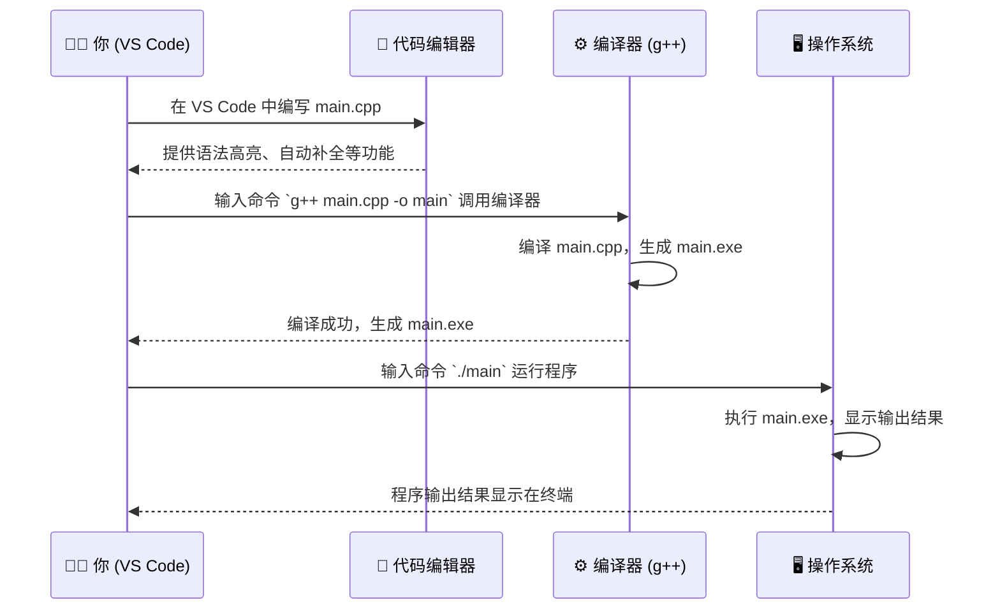
这里面具体涉及到了如下几个概念：

## 代码编辑器
代码编辑器是一个专门为编写代码设计的软件。它提供了语法高亮、自动补全、错误提示等功能，帮助程序员更高效地编写代码。常见的代码编辑器有 Visual Studio Code、Sublime Text、Atom 等。

这些编辑器本身并不包含编译器，它们只是提供了一个界面让你编写代码。因此需要与编译器配合使用。

这些软件大多具有很好的插件生态，是被推崇使用的一大重要原因。

## 编译器
编译器是一个将源代码（如 C++ 代码）翻译成机器语言的程序。它负责将你写的代码转换成计算机能够理解和执行的格式。

GNU Compiler Collection（GCC）是一个非常流行的开源编译器套件，其中 g++ 是专门用于编译 C++ 代码的部分。

:::note[g++]
g++ 是 GNU Compiler Collection 的 C++ 开源编译器，支持多种平台和操作系统。

g++ 可以将 C++ 代码编译成可执行文件，或者将其编译成目标文件以供链接器使用。它支持 C++11、C++14、C++17 等多个 C++ 标准，并且提供了丰富的编译选项和优化功能。
:::

## 集成开发环境 (IDE)
IDE 是一个集成了代码编辑器、编译器、调试器等工具的软件，提供了一个完整的开发环境。常见的 IDE 有 Dev-C++、CodeBlocks、Visual Studio 等。 这些 IDE 通常会自带一个编译器（比如 g++），但它们的编译器路径没有被添加到系统的环境变量中，因此只能在 IDE 内部使用。

这些软件虽然功能强大，但界面复杂，操作繁琐，存储占用臃肿，（大概）并不适合在比赛中使用。

知道了这些概念，问题的核心就变成了 如何让 VS Code 终端能够识别并使用 g++ 编译器。

针对这个问题，我们需要了解 Windows 的 path 环境变量是什么，以及如何配置它。

## path 环境变量

在 Windows 系统中，path 环境变量是一个包含了系统可执行文件路径的列表。当你在命令行中输入一个命令时，系统会在这些路径中查找对应的可执行文件并运行它。

因此，如果你想在命令行中使用 g++ 编译器，你需要确保 g++ 的可执行文件所在的路径已经被添加到 path 环境变量中。

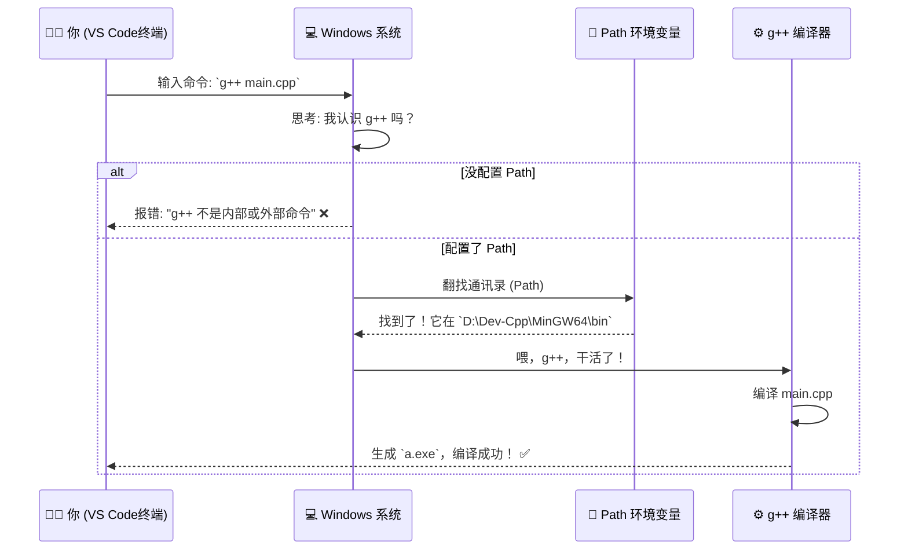

# 理论分析

基于上面的概念 我们来分析一下当前都有什么，应该如何调整：

我们有：
- 已经安装好的 Dev-C++ 或 CodeBlocks 等 IDE。
- 这些 IDE 自带了 g++ 编译器，但它们的路径没有被添加到 Windows 的 path 环境变量中，因此只可以在 IDE 内部使用。
- 一个 vscode 编辑器 但是无法用来编译和运行 C++ 代码。
- 一个渴望在 vscode 里使用 g++ 的，愿意折腾的你。

我们需要：
- 找到 g++ 编译器的路径。
- 将这个路径添加到 Windows 的 path 环境变量中。
- 重启 vscode 让它加载新的环境变量。
- 在 vscode 终端中畅快的使用 g++ 。

# 正式配置

## 1. 白嫖现成的 g++ 编译器

既然电脑里有 Dev-C++ 或 CodeBlocks，我们就直接“借用”它们自带的编译器，不需要重新下载！

1. 找到 Dev-C++ 或 CodeBlocks 的安装目录。

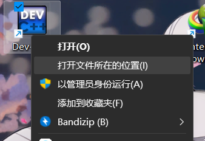

2. 顺藤摸瓜，找到名为 MinGW 或 MinGW64 的文件夹。

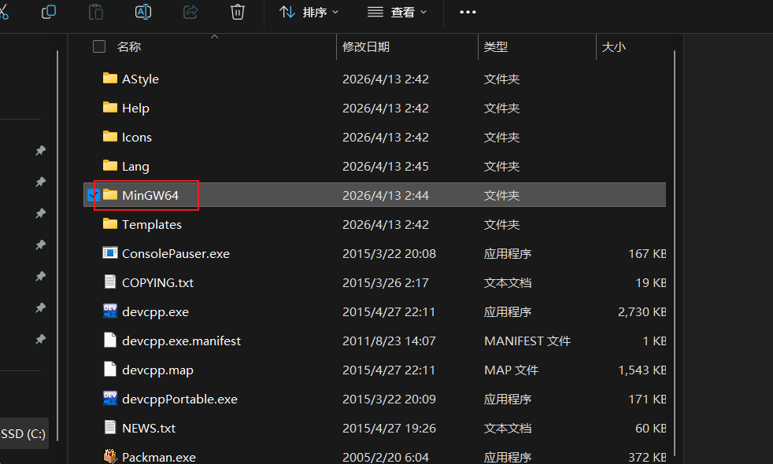

3. 一直点进去，直到看到一个名为 bin 的文件夹。

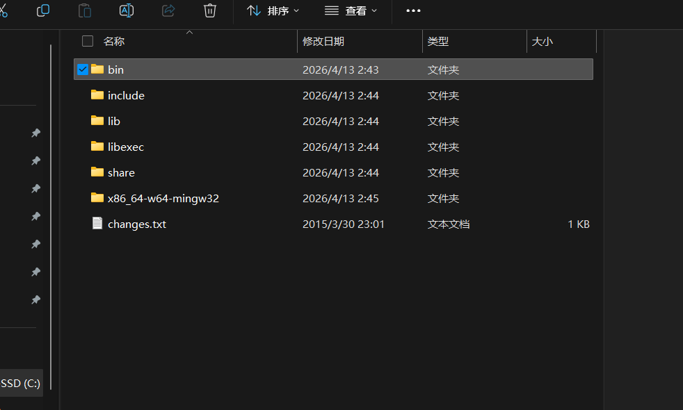

4. 打开 bin 文件夹，确认里面有 g++.exe。

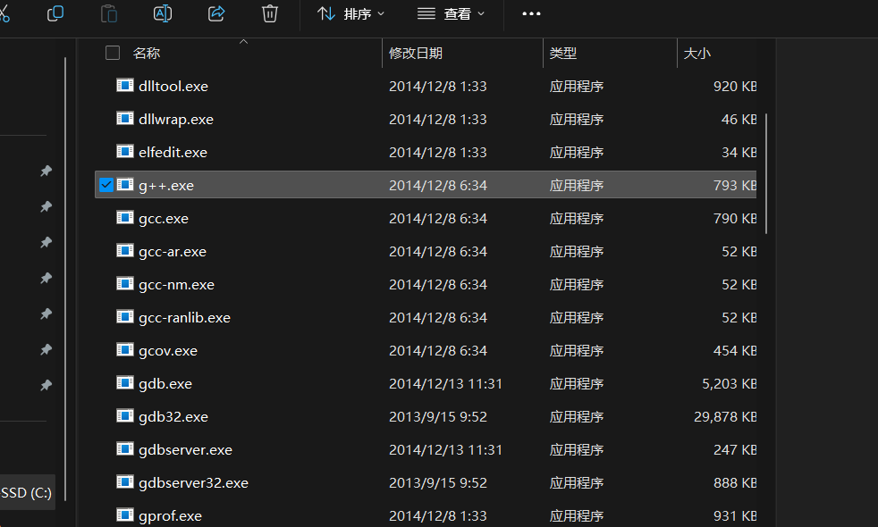

5. 复制当前的文件路径（例如：C:\Program Files (x86)\Dev-Cpp\MinGW64\bin）。

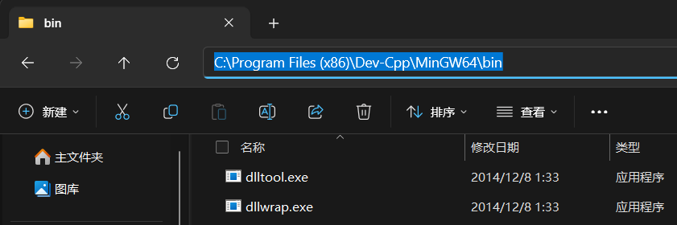

## 2. 将路径写入 Path 环境变量

1. 按下 Win 键，直接搜索 “编辑系统环境变量”，点击打开。

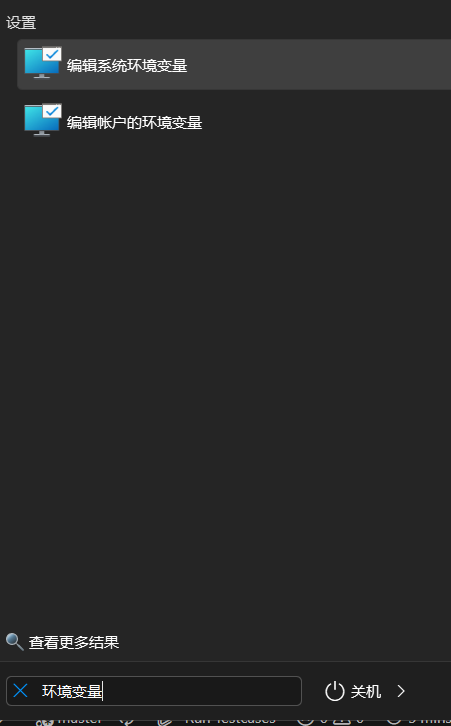

2. 在弹出的窗口右下角，点击 “环境变量(N)...”，在下半部分的“系统变量”中，找到叫 Path 的那一行，双击它。

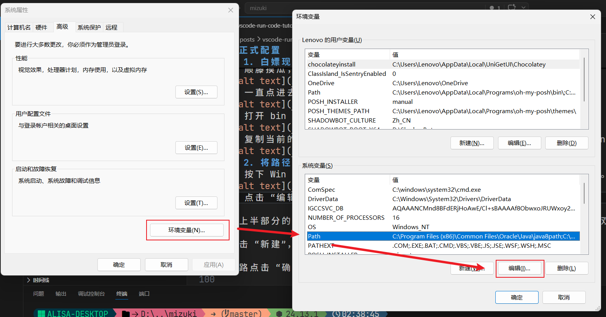

3. 点击 “新建”，把你刚才复制的 bin 文件夹路径粘贴进去。

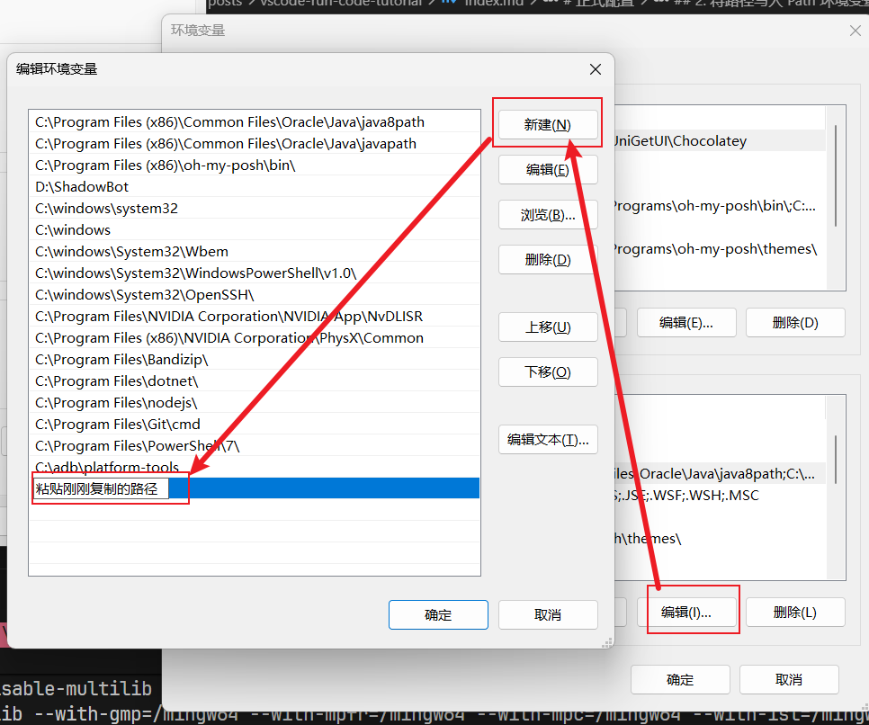

4. 一路点击 “确定” 保存退出。

## 3. 在 VS Code 中验证

配置完成后，我们需要测试一下是否成功。

- 重启 VS Code（必须重启，否则终端无法加载新的环境变量！）。

- 使用快捷键 Ctrl + ` 打开集成终端。

- 输入以下命令并回车：

```bash
g++ -v // 等效于 g++ --version 作用是查看 g++ 的版本信息
```
如果终端吐出了一大串包含 g++ (GCC) ... 的版本信息，恭喜你，配置大功告成！
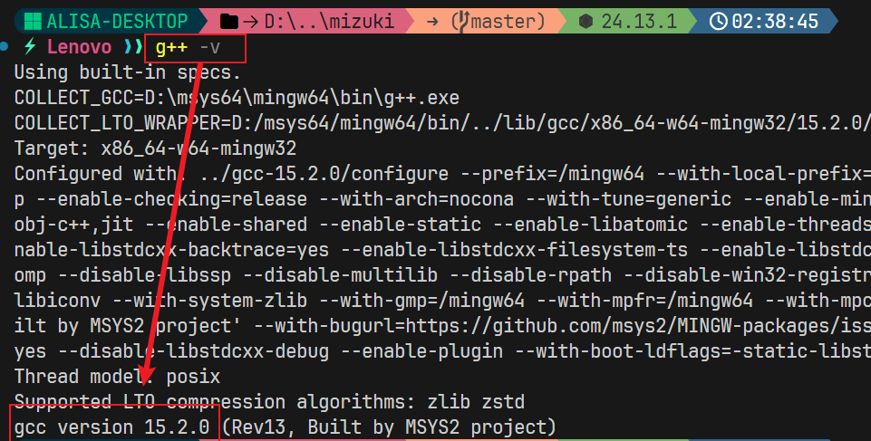

现在，你可以使用这个终端方便的完成编译和运行了。

# 如何使用

## 1. 最基础的编译

```bash
g++ main.cpp
```
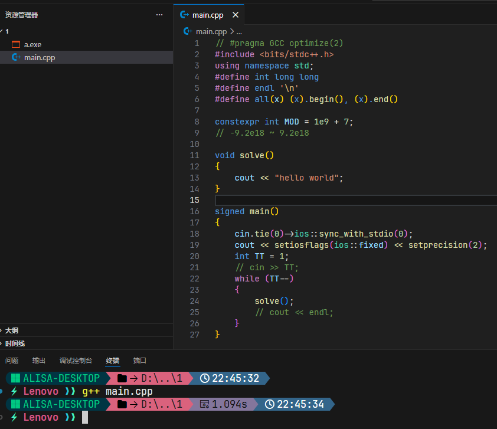
- 这是最简单的命令。它会把 main.cpp 编译成一个默认名为 a.exe（Windows）或 a.out（Linux/Mac）的可执行文件。

缺点：每次都生成 a.exe，如果你有多个源代码，会互相覆盖。

## 2. 指定输出文件名 (-o)

```bash
g++ main.cpp -o main
```
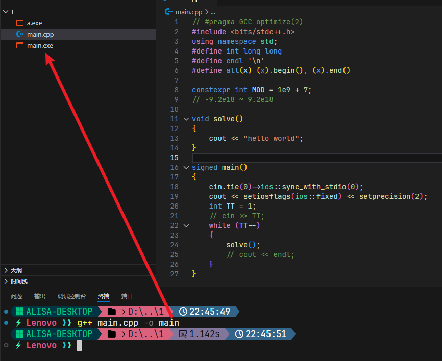
- -o 代表 Output。这条命令会把编译后的程序命名为 main.exe。

运行方式：输入 ./main 即可运行。

## 3. 开启标准警告 (-Wall)

```bash
g++ main.cpp -o main -Wall
```

- W 代表 Warning，all 代表 all。它会提醒你代码中潜在的问题（比如变量定义了但没使用、非 void 函数没写 return 等）。

:::tip
赛时建议全程开启，能帮你规避很多低级 Bug。
:::

## 4. 指定 C++ 标准

```bash
g++ main.cpp -o main -std=c++11
```

- 强制编译器使用特定的 C++ 版本。

为什么需要：有些现代语法在老版本编译器下会报错。

你知道的，:spoiler[蓝桥杯和哈理工的校赛只支持到 cpp11，我积累半生的语法糖全部！无法使用。]

## 5. 进阶

在命令行里，如果你想编译完立刻运行（如果编译失败则不运行），可以使用 && 符号连接指令：

```bash
g++ main.cpp -o main -Wall -std=c++11 && ./main
```

指令分解说明：

- `g++ main.cpp`: 呼叫g++，开始翻译代码。
- `-o main`: 把翻译好的程序取名为 main.exe。
- `-Wall`: 开启所有警告，检查代码细节。
- `-std=c++11`: 使用 C++11 标准编译。
- `&&`: 这是一个逻辑门。只有当前面的编译操作成功了，才会执行后面的指令。
- `./main`: 运行刚才生成的可执行程序。

