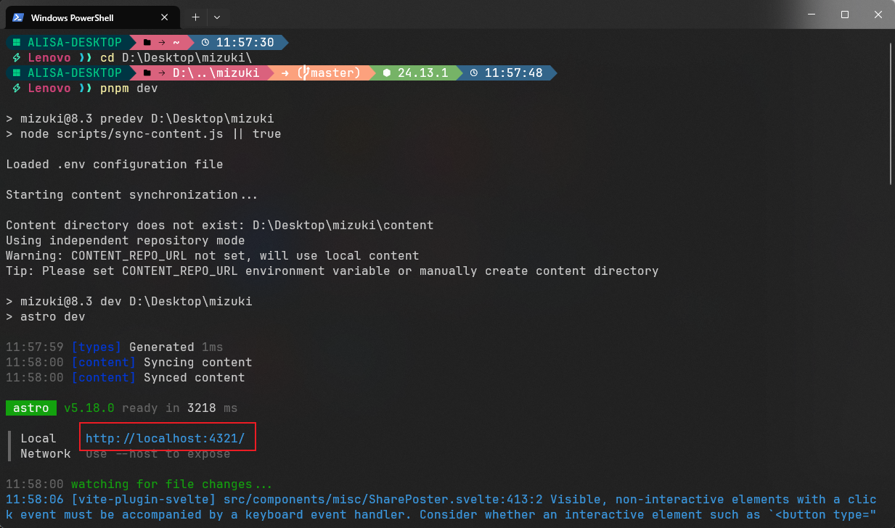
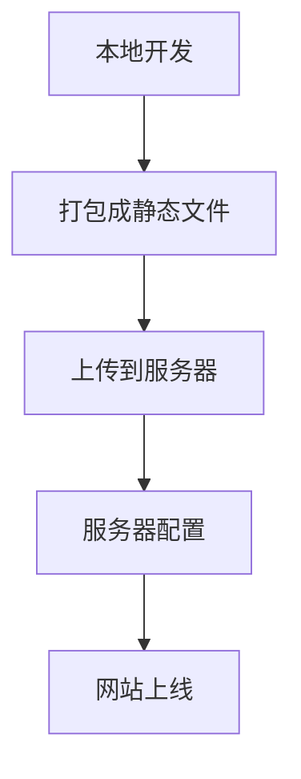
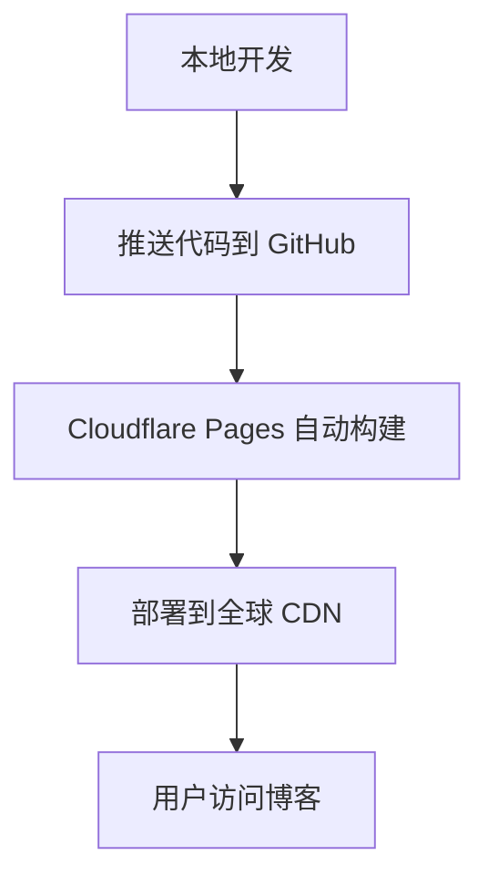
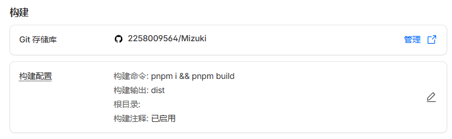
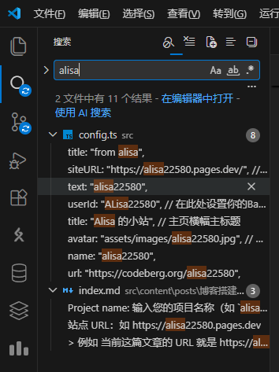
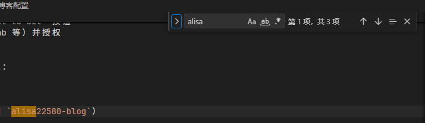

<!-- ---
title: "我的第一篇 Astro 博客"      # 文章标题
published: 2026-03-12            # 发布日期 (格式: YYYY-MM-DD)
description: "这是我使用 Mizuki 主题开启博客生涯的第一天。" # 简短摘要，显示在列表页
image: "./cover.webp"            # 文章封面图路径
tags: ["教程", "Astro"]          # 标签（用英文方括号包围，逗号分隔）
category: "技术"                  # 分类
pinned: true                     # 是否置顶 (true 或 false)
priority: 0                      # 置顶优先级，数字越小越靠前
draft: false                     # 是否为草稿（设为 true 则不会在正式网站显示）
--- -->

# 写在之前：
在此之前，我尝试过在github上部署过一个基于 `Quartz` 的 [静态知识库](https://2258009564.github.io/)，但由于 `Quartz` 的功能过于简单，无法满足我对博客的需求。再后来，我也尝试过使用 `Hexo` 和 `Hugo` 等静态博客生成器，但由于它们的配置较为复杂，且需要一定的前端知识，在对比好几个朋友的选择之后，我最终选择了 `Astro-theme-Mizuki` 作为我的博客框架，这是一个基于 `Astro` 的博客主题，具有简洁的设计和丰富的功能，而且上手非常容易，适合个人博客的搭建。

那么，接下来我将分享一下我捣鼓博客的过程，希望能给有需要的朋友提供帮助。

本教程力求在 [官方文档](https://docs.mizuki.mysqil.com/) 的基础上，结合我自己的经验，提供一个更为通俗、详细的指南，帮助大家顺利搭建自己的博客，毕竟先把东西跑起来，才有动力去研究官方文档以完善它。

当然，本教程不可能完全替代（完全不可能替代）[官方文档](https://docs.mizuki.mysqil.com/)。因此，建议搭配食用。

# 1. 环境讲解与配置
- 什么是 `Astro`？

它是一个现代化的静态网站生成器，支持多种前端框架（如 React、Vue、Svelte 等），并且具有出色的性能和灵活性。要搭建基于 `Astro` 的博客，您需要先安装 `Node.js` 和 `npm` 。

- 什么是 `Node.js`？

它是一个基于 `Chrome V8` 引擎的 `JavaScript` 运行环境，允许您在服务器端运行 `JavaScript` 代码。

- 什么是 `npm`? 

`npm` 是 `node package manager` 的缩写，是 `Node.js` 的包管理器，用于安装和管理项目所需的依赖包。

也就是说，我们通过 `Node.js` 来支持 `Astro` 生成器的运行，而 `npm` 则帮助我们安装和管理博客所需的各种依赖包。

- 什么是 `pnpm`?

`pnpm` 是 `performance npm` 的缩写，是一个快速、节省磁盘空间的包管理器。

与 `npm` 不同，`pnpm` 使用符号链接来共享依赖包，从而减少了磁盘空间的占用，并且在安装速度上也有显著提升。

知道了这些基础知识后，我们可以发现 搭建博客的第一步就是在电脑中安装这些基础工具：

1. 安装 `Node.js` 和 `npm`

   - 访问 [Node.js 官网](https://nodejs.org/) 下载并安装最新的 LTS 版本，这将同时安装 `Node.js` 和 `npm`。

   - 安装完成后，可以通过命令行输入以下命令来验证安装是否成功：

     ```bash
     node -v
     npm -v
     ```

    如果显示版本号，说明安装成功。

2. 安装 pnpm

    - 您可以通过 npm 来安装 pnpm，打开命令行输入以下命令：

      ```bash
      npm install -g pnpm
      ```
    - 安装完成后，可以通过以下命令来验证 pnpm 是否安装成功：
      ```bash
      pnpm -v
      ```
      如果显示版本号，说明安装成功。

此外，本博客的搭建还需要使用到 `Git` 和 `GitHub`。

- 什么是 Git?

Git 是一个分布式版本控制系统，用于跟踪文件的更改历史，协助多人协作开发项目。

- 什么是 GitHub?

GitHub 是一个基于 Git 的代码托管平台，提供了版本控制和协作功能，允许开发者在云端存储和管理他们的代码库。

也就是说，我们需要使用 Git 来管理博客的源代码，并将其托管在 GitHub 上，以便于后续的部署和管理。

3. 安装 Git
    - 访问 [Git 官网](https://git-scm.com/) 下载并安装 Git。
    - 安装完成后，可以通过命令行输入以下命令来验证安装是否成功：
      ```bash
      git --version
      ```
     如果显示版本号，说明安装成功。

# 2. 项目搭建
1. 克隆博客模板
    - 导航到您想要存放博客项目的目录，例如：我直接把整个项目放在桌面上，那么于我而言，就是进入桌面目录：
      ```bash
      cd D:/Desktop
      ```

    - 使用 Git 克隆 `Astro-theme-Mizuki` 的模板仓库：
      ```bash
      git clone https://github.com/matsuzaka-yuki/mizuki.git
      ```
    - 进入克隆的项目目录，下文的所有指令都需要在该目录中进行：
      ```bash
      cd Mizuki
      ```

2. 安装依赖
    - 使用 pnpm 安装项目所需的依赖包：
      ```bash
      pnpm install
      ```

3. 配置博客

    根据自己的需求配置您的博客，详细的配置教程将在下文介绍。

4. 本地预览
    - 使用以下命令启动本地开发服务器：
      ```bash
      pnpm dev
      ```
    - 打开浏览器，访问 `http://localhost:4321`，您应该能够看到博客的默认界面。
    

5. 打包网站
    - 运行以下命令将网站打包成静态文件，生成到 dist 目录中：
    ```bash
    pnpm build
    ```

    生成的 dist 目录后续将可以部署到您自己的服务器上。

# 3. 项目部署

在正式开始之前，我们有必要了解一下 一个本地项目是如何在网络上被看见的：

当我们在本地开发一个网站时，它只能在我们的计算机上访问，其他人无法看到它。

为了突破这个限制，我们需要将它部署到服务器上，这样它就可以通过互联网被访问了。

以下是一个简单的部署流程图：


- 本地开发：我们在本地计算机上开发和测试我们的网站。
- 打包成静态文件：我们使用构建工具将我们的项目打包成静态文件，这些文件可以被服务器直接提供给用户。
- 上传到服务器：我们将打包好的静态文件上传到服务器上，这可以通过 FTP、SSH 或者使用云服务提供的工具来完成。
- 服务器配置：我们需要在服务器上进行一些配置，例如设置域名、SSL 证书等，以确保我们的网站能够正常访问。
- 网站上线：完成以上步骤后，我们的网站就可以通过互联网访问了。

显然，上传、配置服务器对我来说太过困难。但我们有两位赛博义父： `Github` 和 `Cloudflare` 。
 
在本教程中，我们将使用 GitHub 来托管我们的博客源代码，并通过 Cloudflare Pages 来部署我们的博客，这是一个免费的静态网站托管平台，具有全球 CDN、自动部署和免费 SSL 证书等特性。每当我们将代码推送到 GitHub 仓库时，Cloudflare Pages 会自动构建并部署最新版本的网站，这样我们就可以轻松地管理和更新我们的博客了。



- 本地开发：我们在本地计算机上开发和测试我们的博客。
- 推送代码到 GitHub：我们将我们的代码推送到 GitHub 仓库中。
- Cloudflare Pages 自动构建：Cloudflare Pages 会自动检测到 GitHub 仓库的更新，并开始构建我们的博客。
- 部署到全球 CDN：构建完成后，Cloudflare Pages 会将我们的博客部署到全球的内容分发网络（CDN）上，以确保用户能够快速访问。
- 用户访问博客：用户通过互联网访问我们的博客，Cloudflare Pages 会从最近的 CDN 节点提供博客内容，确保访问速度和稳定性。

可以看出，这两尊大佛为我们减轻很多部署时候的障碍，让我们再次感谢它们。

1. 创建 GitHub 仓库
    - 登录到 [GitHub](https://github.com/) 并创建一个新的仓库。
    - 将本地项目与 GitHub 仓库关联：
      ```bash
      git remote add origin https://github.com/your-username/your-repo.git
      ```

    - 将代码推送到 GitHub：
      ```bash
        git add .
        git commit -m "提交信息"
        git push -u origin main
      ```

    > 有关 github 的使用，请参阅：（我也不知道参阅哪里 先搁置吧

2. 配置 Cloudflare Pages
    1. 登录 Cloudflare Pages
    访问 Cloudflare Dashboard，使用您的账号登录，然后选择 "Pages" 服务。
    当然 您可以在左下角找到更改语言的选项，切换到中文界面或许会更方便一些。
    2. 创建新项目
    点击 "Create a project" 或 "Connect to Git" 按钮
    选择您的 Git 提供商（GitHub、GitLab 等）并授权
    从列表中选择您的 Mizuki 项目仓库
    3. 配置构建设置
    在项目设置页面中，配置以下构建设置：

    基本设置

    Project name: 输入您的项目名称（如 `alisa22580-blog`）

    Production branch: 设置主分支（通常为 `main` 或 `master`）

    构建配置
    ```bash
    # 构建设置
    Build command: pnpm i && pnpm build
    Build output directory: dist
    Root directory: /
    ```
    参考如下：
    

    4. 部署项目
    配置完成后，点击 "Save and Deploy" 开始首次部署：

        1. Cloudflare Pages 会克隆您的仓库
        2. 安装依赖（pnpm i）
        3. 构建项目（pnpm build）
        4. 将 dist 目录部署到全球 CDN
        首次部署可能需要几分钟时间。

    5. 获取部署信息
    部署完成后，您将获得：

    站点 URL：如 https://alisa22580.pages.dev
    > URL: URL 是 Uniform Resource Locator 的缩写，中文通常翻译为统一资源定位符。它是互联网上资源的地址，用于指定和访问各种类型的资源，如网页、图片、视频等。URL 通常由以下几个部分组成：
    > - 协议（Protocol）：指定访问资源所使用的协议，如 http、https、ftp 等。
    > - 域名（Domain）：指定资源所在的服务器地址，如 www.example.com。
    > - 路径（Path）：指定资源在服务器上的具体位置，如 /blog/post1。
    > - 查询参数（Query Parameters）：用于传递额外的信息，如 ?id=123。
    > 例如 当前这篇文章的 URL 就是 https://alisa22580.pages.dev/posts/post1/#本博客的搭建教程

    自动生成的 SSL 证书
    > SSL: SSL 是 Secure Sockets Layer 的缩写，是一种安全协议，用于在互联网上加密数据传输，确保数据的机密性和完整性。SSL 证书是由受信任的证书颁发机构（CA）签发的数字证书，用于验证网站的身份并启用 HTTPS 协议。当用户访问启用了 SSL 的网站时，浏览器会显示一个锁形图标，表示连接是安全的。


    全球 CDN 分发
    > CDN: CDN 是 Content Delivery Network 的缩写，中文通常翻译为内容分发网络。CDN 是一种分布式的服务器网络，旨在通过将内容缓存到全球各地的服务器上来加速网站的加载速度。当用户访问一个启用了 CDN 的网站时，CDN 会根据用户的地理位置选择最近的服务器来提供内容，从而减少延迟和提高性能。CDN 还可以提供额外的安全功能，如 DDoS 防护和 Web 应用防火墙。


    现在，您可以通过站点 URL 访问您的博客了！每当您推送新的代码到 GitHub，Cloudflare Pages 都会自动重新构建和部署您的博客，确保您的内容始终是最新的。

    也就是说，我们以后的操作流程将是：
    ```mermaid
    graph TD
        A[本地开发] --> B[推送代码到 GitHub]
    ```
    就结束了，Github 和 Cloudflare 会帮我们完成剩下的工作。

# 4. 博客配置

完成了github和cloudflare的部署后，所有需要动脑的工作告一段落，接下来我们就可以专注于博客的内容和配置了。

博客的配置主要涉及到 `src/config.ts` 文件，这个文件包含了博客的全局设置，如站点标题、描述、作者信息、社交链接等。您可以根据自己的需求修改这些配置项来个性化您的博客。

有关博客各项配置已经在 [官方文档](https://docs.mizuki.mysqil.com/Basic-Layout/site-config/) 中有详细的介绍。

因此关于大多数常规设置，我就不在这里赘述了，这里只发表一些我自己的建议...

- 如果您使用vscode编辑项目，可以在左侧任务栏找到搜索框，输入关键词进行整个工作区目录下的相关查找。



- 也可以通过快捷键 `ctrl + f` 进行当前文件下的关键词查找。



持续更新中...

